# Community 0

> 254 nodes · cohesion 0.02

## Key Concepts

- [Organization](file:///E:/Non_Office/Dev_Space/vibe_skool/veltrics/src/backend/app/models/organization.py#L8) (199 connections)
- [Vehicle](file:///E:/Non_Office/Dev_Space/vibe_skool/veltrics/src/backend/app/models/vehicle.py#L20) (102 connections)
- [MaintenanceSchedule](file:///E:/Non_Office/Dev_Space/vibe_skool/veltrics/src/backend/app/models/maintenance.py#L7) (53 connections)
- [ServiceRecord](file:///E:/Non_Office/Dev_Space/vibe_skool/veltrics/src/backend/app/models/maintenance.py#L28) (40 connections)
- [AuditLog](file:///E:/Non_Office/Dev_Space/vibe_skool/veltrics/src/backend/app/models/audit_log.py#L5) (32 connections)
- [seed_database()](file:///E:/Non_Office/Dev_Space/vibe_skool/veltrics/src/backend/app/db/seed.py#L30) (23 connections)
- [Driver](file:///E:/Non_Office/Dev_Space/vibe_skool/veltrics/src/backend/app/models/driver.py#L7) (19 connections)
- [VehicleType](file:///E:/Non_Office/Dev_Space/vibe_skool/veltrics/src/backend/app/models/vehicle.py#L7) (19 connections)
- [ExpenseLog](file:///E:/Non_Office/Dev_Space/vibe_skool/veltrics/src/backend/app/models/expense_log.py#L6) (17 connections)
- [FuelLog](file:///E:/Non_Office/Dev_Space/vibe_skool/veltrics/src/backend/app/models/fuel_log.py#L6) (17 connections)
- **Base** (16 connections)
- [UC-025: List Organization Vehicles directory with status, search, fuel type, and](file:///E:/Non_Office/Dev_Space/vibe_skool/veltrics/src/backend/app/api/v1/vehicles.py#L152) (15 connections)
- [UC-024: Typeahead autocomplete lookup against seeded Vehicle Master Catalogue.](file:///E:/Non_Office/Dev_Space/vibe_skool/veltrics/src/backend/app/api/v1/vehicles.py#L19) (15 connections)
- [UC-026: View Vehicle Detailed Overview.     Enforces tenant isolation and retur](file:///E:/Non_Office/Dev_Space/vibe_skool/veltrics/src/backend/app/api/v1/vehicles.py#L199) (15 connections)
- [UC-026: Update Vehicle Status (ACTIVE, MAINTENANCE, INACTIVE).](file:///E:/Non_Office/Dev_Space/vibe_skool/veltrics/src/backend/app/api/v1/vehicles.py#L268) (15 connections)
- [UC-027: Update Vehicle Metadata & Specifications.     Validates organization ow](file:///E:/Non_Office/Dev_Space/vibe_skool/veltrics/src/backend/app/api/v1/vehicles.py#L307) (15 connections)
- [UC-024: Register New Vehicle with organization quota validation & duplicate VIN](file:///E:/Non_Office/Dev_Space/vibe_skool/veltrics/src/backend/app/api/v1/vehicles.py#L72) (15 connections)
- [test_maintenance_uc035.py](file:///E:/Non_Office/Dev_Space/vibe_skool/veltrics/src/tests/unit/test_maintenance_uc035.py#L1) (10 connections)
- [test_maintenance_uc036.py](file:///E:/Non_Office/Dev_Space/vibe_skool/veltrics/src/tests/unit/test_maintenance_uc036.py#L1) (9 connections)
- [test_maintenance_uc038.py](file:///E:/Non_Office/Dev_Space/vibe_skool/veltrics/src/tests/unit/test_maintenance_uc038.py#L1) (9 connections)
- [test_vehicles_uc024.py](file:///E:/Non_Office/Dev_Space/vibe_skool/veltrics/src/tests/unit/test_vehicles_uc024.py#L1) (9 connections)
- [test_vehicles_uc027.py](file:///E:/Non_Office/Dev_Space/vibe_skool/veltrics/src/tests/unit/test_vehicles_uc027.py#L1) (9 connections)
- [VehicleDetailResponse](file:///E:/Non_Office/Dev_Space/vibe_skool/veltrics/src/backend/app/schemas/vehicle.py#L68) (9 connections)
- [VehicleResponse](file:///E:/Non_Office/Dev_Space/vibe_skool/veltrics/src/backend/app/schemas/vehicle.py#L46) (9 connections)
- [test_dashboard_uc064.py](file:///E:/Non_Office/Dev_Space/vibe_skool/veltrics/src/tests/unit/test_dashboard_uc064.py#L1) (8 connections)
- *... and 229 more nodes in this community*

## Class Diagram

```mermaid
classDiagram
    class AuditLog {
        +audit_log.py()
    }
    class DashboardSummaryResponse {
        +dashboard.py()
    }
    class Driver {
        +driver.py()
    }
    class ExpenseLog {
        +expense_log.py()
    }
    class FuelLog {
        +fuel_log.py()
    }
    class MaintenanceSchedule {
        +maintenance.py()
    }
    class ServiceRecord {
        +maintenance.py()
    }
    class AppNotification {
        +notification.py()
    }
    class Organization {
        +organization.py()
    }
    class Vehicle {
        +vehicle.py()
    }
    class VehicleCreateRequest {
        +vehicle.py()
    }
    class VehicleDetailResponse {
        +vehicle.py()
    }
    class VehicleResponse {
        +vehicle.py()
    }
    class VehicleStatusUpdateRequest {
        +vehicle.py()
    }
    class VehicleType {
        +vehicle.py()
    }
    class VehicleTypeResponse {
        +vehicle.py()
    }
    class VehicleUpdateRequest {
        +vehicle.py()
    }
    VehicleResponse <|-- VehicleDetailResponse
    VehicleDetailResponse <|-- VehicleResponse
```

## Relationships

- [[Community 1]] (42 shared connections)
- [[Community 16]] (15 shared connections)
- [[Community 17]] (12 shared connections)
- [[Community 4]] (10 shared connections)
- [[Community 7]] (9 shared connections)
- [[Community 8]] (8 shared connections)
- [[Community 20]] (6 shared connections)
- [[Community 13]] (6 shared connections)
- [[Community 19]] (4 shared connections)
- [[Community 18]] (4 shared connections)
- [[Community 21]] (3 shared connections)
- [[Community 23]] (2 shared connections)

## Source Files

- [E:\Non_Office\Dev_Space\vibe_skool\veltrics\src\backend\app\api\v1\dashboard.py](file:///E:/Non_Office/Dev_Space/vibe_skool/veltrics/src/backend/app/api/v1/dashboard.py)
- [E:\Non_Office\Dev_Space\vibe_skool\veltrics\src\backend\app\api\v1\vehicles.py](file:///E:/Non_Office/Dev_Space/vibe_skool/veltrics/src/backend/app/api/v1/vehicles.py)
- [E:\Non_Office\Dev_Space\vibe_skool\veltrics\src\backend\app\db\seed.py](file:///E:/Non_Office/Dev_Space/vibe_skool/veltrics/src/backend/app/db/seed.py)
- [E:\Non_Office\Dev_Space\vibe_skool\veltrics\src\backend\app\models\audit_log.py](file:///E:/Non_Office/Dev_Space/vibe_skool/veltrics/src/backend/app/models/audit_log.py)
- [E:\Non_Office\Dev_Space\vibe_skool\veltrics\src\backend\app\models\driver.py](file:///E:/Non_Office/Dev_Space/vibe_skool/veltrics/src/backend/app/models/driver.py)
- [E:\Non_Office\Dev_Space\vibe_skool\veltrics\src\backend\app\models\expense_log.py](file:///E:/Non_Office/Dev_Space/vibe_skool/veltrics/src/backend/app/models/expense_log.py)
- [E:\Non_Office\Dev_Space\vibe_skool\veltrics\src\backend\app\models\fuel_log.py](file:///E:/Non_Office/Dev_Space/vibe_skool/veltrics/src/backend/app/models/fuel_log.py)
- [E:\Non_Office\Dev_Space\vibe_skool\veltrics\src\backend\app\models\maintenance.py](file:///E:/Non_Office/Dev_Space/vibe_skool/veltrics/src/backend/app/models/maintenance.py)
- [E:\Non_Office\Dev_Space\vibe_skool\veltrics\src\backend\app\models\notification.py](file:///E:/Non_Office/Dev_Space/vibe_skool/veltrics/src/backend/app/models/notification.py)
- [E:\Non_Office\Dev_Space\vibe_skool\veltrics\src\backend\app\models\organization.py](file:///E:/Non_Office/Dev_Space/vibe_skool/veltrics/src/backend/app/models/organization.py)
- [E:\Non_Office\Dev_Space\vibe_skool\veltrics\src\backend\app\models\vehicle.py](file:///E:/Non_Office/Dev_Space/vibe_skool/veltrics/src/backend/app/models/vehicle.py)
- [E:\Non_Office\Dev_Space\vibe_skool\veltrics\src\backend\app\schemas\dashboard.py](file:///E:/Non_Office/Dev_Space/vibe_skool/veltrics/src/backend/app/schemas/dashboard.py)
- [E:\Non_Office\Dev_Space\vibe_skool\veltrics\src\backend\app\schemas\vehicle.py](file:///E:/Non_Office/Dev_Space/vibe_skool/veltrics/src/backend/app/schemas/vehicle.py)
- [E:\Non_Office\Dev_Space\vibe_skool\veltrics\src\backend\app\services\audit_service.py](file:///E:/Non_Office/Dev_Space/vibe_skool/veltrics/src/backend/app/services/audit_service.py)
- [E:\Non_Office\Dev_Space\vibe_skool\veltrics\src\backend\app\services\fuel_service.py](file:///E:/Non_Office/Dev_Space/vibe_skool/veltrics/src/backend/app/services/fuel_service.py)
- [E:\Non_Office\Dev_Space\vibe_skool\veltrics\src\tests\unit\test_cost_breakdown_uc065.py](file:///E:/Non_Office/Dev_Space/vibe_skool/veltrics/src/tests/unit/test_cost_breakdown_uc065.py)
- [E:\Non_Office\Dev_Space\vibe_skool\veltrics\src\tests\unit\test_dashboard_uc064.py](file:///E:/Non_Office/Dev_Space/vibe_skool/veltrics/src/tests/unit/test_dashboard_uc064.py)
- [E:\Non_Office\Dev_Space\vibe_skool\veltrics\src\tests\unit\test_db_seeding_uc118.py](file:///E:/Non_Office/Dev_Space/vibe_skool/veltrics/src/tests/unit/test_db_seeding_uc118.py)
- [E:\Non_Office\Dev_Space\vibe_skool\veltrics\src\tests\unit\test_expense_uc058.py](file:///E:/Non_Office/Dev_Space/vibe_skool/veltrics/src/tests/unit/test_expense_uc058.py)
- [E:\Non_Office\Dev_Space\vibe_skool\veltrics\src\tests\unit\test_expense_uc059.py](file:///E:/Non_Office/Dev_Space/vibe_skool/veltrics/src/tests/unit/test_expense_uc059.py)

## Audit Trail

- EXTRACTED: 473 (33%)
- INFERRED: 956 (67%)
- AMBIGUOUS: 0 (0%)

---

*Part of the graphify knowledge wiki. See [[index]] to navigate.*