# Community 1

> 203 nodes · cohesion 0.03

## Key Concepts

- [Organization](file:///E:/Non_Office/Dev_Space/vibe_skool/veltrics/src/backend/app/models/organization.py#L8) (215 connections)
- [User](file:///E:/Non_Office/Dev_Space/vibe_skool/veltrics/src/backend/app/models/user.py#L13) (131 connections)
- [AuditLog](file:///E:/Non_Office/Dev_Space/vibe_skool/veltrics/src/backend/app/models/audit_log.py#L5) (54 connections)
- [OrganizationInvitation](file:///E:/Non_Office/Dev_Space/vibe_skool/veltrics/src/backend/app/models/organization_invitation.py#L6) (34 connections)
- [ExpenseLog](file:///E:/Non_Office/Dev_Space/vibe_skool/veltrics/src/backend/app/models/expense_log.py#L6) (29 connections)
- [FuelLog](file:///E:/Non_Office/Dev_Space/vibe_skool/veltrics/src/backend/app/models/fuel_log.py#L6) (29 connections)
- [UserOrganization](file:///E:/Non_Office/Dev_Space/vibe_skool/veltrics/src/backend/app/models/user_organization.py#L8) (29 connections)
- [OrganizationInvitationResponse](file:///E:/Non_Office/Dev_Space/vibe_skool/veltrics/src/backend/app/schemas/organization_invitation.py#L45) (25 connections)
- [SwitchOrganizationResponse](file:///E:/Non_Office/Dev_Space/vibe_skool/veltrics/src/backend/app/schemas/organization.py#L67) (23 connections)
- [OrganizationInvitationCreate](file:///E:/Non_Office/Dev_Space/vibe_skool/veltrics/src/backend/app/schemas/organization_invitation.py#L8) (22 connections)
- [OrganizationCreate](file:///E:/Non_Office/Dev_Space/vibe_skool/veltrics/src/backend/app/schemas/organization.py#L7) (22 connections)
- [OrganizationResponse](file:///E:/Non_Office/Dev_Space/vibe_skool/veltrics/src/backend/app/schemas/organization.py#L45) (22 connections)
- [PersonalOrganizationCreate](file:///E:/Non_Office/Dev_Space/vibe_skool/veltrics/src/backend/app/schemas/organization.py#L41) (22 connections)
- [SwitchOrganizationRequest](file:///E:/Non_Office/Dev_Space/vibe_skool/veltrics/src/backend/app/schemas/organization.py#L63) (22 connections)
- [Retrieve organizations list.](file:///E:/Non_Office/Dev_Space/vibe_skool/veltrics/src/backend/app/api/v1/organizations.py#L146) (21 connections)
- [UC-015: Switch active organization context for user.](file:///E:/Non_Office/Dev_Space/vibe_skool/veltrics/src/backend/app/api/v1/organizations.py#L163) (21 connections)
- [UC-015: Get active organization for user.](file:///E:/Non_Office/Dev_Space/vibe_skool/veltrics/src/backend/app/api/v1/organizations.py#L209) (21 connections)
- [Retrieve organization details by ID.](file:///E:/Non_Office/Dev_Space/vibe_skool/veltrics/src/backend/app/api/v1/organizations.py#L249) (21 connections)
- [UC-017: Edit Organization Profile Details.     Enforces ISO 4217 currency valida](file:///E:/Non_Office/Dev_Space/vibe_skool/veltrics/src/backend/app/api/v1/organizations.py#L272) (21 connections)
- [UC-018: Invite Driver / Manager via Email or Phone.     Generates a secure 64-ch](file:///E:/Non_Office/Dev_Space/vibe_skool/veltrics/src/backend/app/api/v1/organizations.py#L319) (21 connections)
- [UC-018: List pending organization invitations.](file:///E:/Non_Office/Dev_Space/vibe_skool/veltrics/src/backend/app/api/v1/organizations.py#L401) (21 connections)
- [UC-021: Remove Member from Organization.     Prevents owner removal. Unassigns u](file:///E:/Non_Office/Dev_Space/vibe_skool/veltrics/src/backend/app/api/v1/organizations.py#L434) (21 connections)
- [UC-022: Cancel Pending Member Invitation.](file:///E:/Non_Office/Dev_Space/vibe_skool/veltrics/src/backend/app/api/v1/organizations.py#L507) (21 connections)
- [UC-014: Provision commercial or custom organization.](file:///E:/Non_Office/Dev_Space/vibe_skool/veltrics/src/backend/app/api/v1/organizations.py#L55) (21 connections)
- [UC-023: Soft Delete Organization & Child Entities.     Rejects personal org dele](file:///E:/Non_Office/Dev_Space/vibe_skool/veltrics/src/backend/app/api/v1/organizations.py#L558) (21 connections)
- *... and 178 more nodes in this community*

## Class Diagram

```mermaid
classDiagram
    class AuditLog {
        +audit_log.py()
    }
    class AuditService {
        +audit_service.py()
    }
    class ExpenseLog {
        +expense_log.py()
    }
    class FuelLog {
        +fuel_log.py()
    }
    class AppNotification {
        +notification.py()
    }
    class OrganizationInvitation {
        +organization_invitation.py()
    }
    class OrganizationInvitationCreate {
        +organization_invitation.py()
    }
    class OrganizationInvitationRedeem {
        +organization_invitation.py()
    }
    class OrganizationInvitationResponse {
        +organization_invitation.py()
    }
    class RedeemInvitationResponse {
        +organization_invitation.py()
    }
    class Organization {
        +organization.py()
    }
    class OrganizationCreate {
        +organization.py()
    }
    class OrganizationResponse {
        +organization.py()
    }
    class OrganizationUpdate {
        +organization.py()
    }
    class PersonalOrganizationCreate {
        +organization.py()
    }
    class SwitchOrganizationRequest {
        +organization.py()
    }
    class SwitchOrganizationResponse {
        +organization.py()
    }
    class Trip {
        +trip.py()
    }
    class UserOrganization {
        +user_organization.py()
    }
    class User {
        +user.py()
    }
    AuditLog --> AuditService
    AuditService --> AuditLog
```

## Relationships

- [[Community 0]] (117 shared connections)
- [[Community 17]] (24 shared connections)
- [[Community 4]] (21 shared connections)
- [[Community 20]] (13 shared connections)
- [[Community 7]] (9 shared connections)
- [[Community 19]] (8 shared connections)
- [[Community 8]] (8 shared connections)
- [[Community 18]] (8 shared connections)
- [[Community 13]] (6 shared connections)
- [[Community 21]] (6 shared connections)
- [[Community 23]] (4 shared connections)

## Source Files

- [E:\Non_Office\Dev_Space\vibe_skool\veltrics\src\backend\app\api\v1\invitations.py](file:///E:/Non_Office/Dev_Space/vibe_skool/veltrics/src/backend/app/api/v1/invitations.py)
- [E:\Non_Office\Dev_Space\vibe_skool\veltrics\src\backend\app\api\v1\organizations.py](file:///E:/Non_Office/Dev_Space/vibe_skool/veltrics/src/backend/app/api/v1/organizations.py)
- [E:\Non_Office\Dev_Space\vibe_skool\veltrics\src\backend\app\models\audit_log.py](file:///E:/Non_Office/Dev_Space/vibe_skool/veltrics/src/backend/app/models/audit_log.py)
- [E:\Non_Office\Dev_Space\vibe_skool\veltrics\src\backend\app\models\expense_log.py](file:///E:/Non_Office/Dev_Space/vibe_skool/veltrics/src/backend/app/models/expense_log.py)
- [E:\Non_Office\Dev_Space\vibe_skool\veltrics\src\backend\app\models\fuel_log.py](file:///E:/Non_Office/Dev_Space/vibe_skool/veltrics/src/backend/app/models/fuel_log.py)
- [E:\Non_Office\Dev_Space\vibe_skool\veltrics\src\backend\app\models\notification.py](file:///E:/Non_Office/Dev_Space/vibe_skool/veltrics/src/backend/app/models/notification.py)
- [E:\Non_Office\Dev_Space\vibe_skool\veltrics\src\backend\app\models\organization.py](file:///E:/Non_Office/Dev_Space/vibe_skool/veltrics/src/backend/app/models/organization.py)
- [E:\Non_Office\Dev_Space\vibe_skool\veltrics\src\backend\app\models\organization_invitation.py](file:///E:/Non_Office/Dev_Space/vibe_skool/veltrics/src/backend/app/models/organization_invitation.py)
- [E:\Non_Office\Dev_Space\vibe_skool\veltrics\src\backend\app\models\trip.py](file:///E:/Non_Office/Dev_Space/vibe_skool/veltrics/src/backend/app/models/trip.py)
- [E:\Non_Office\Dev_Space\vibe_skool\veltrics\src\backend\app\models\user.py](file:///E:/Non_Office/Dev_Space/vibe_skool/veltrics/src/backend/app/models/user.py)
- [E:\Non_Office\Dev_Space\vibe_skool\veltrics\src\backend\app\models\user_organization.py](file:///E:/Non_Office/Dev_Space/vibe_skool/veltrics/src/backend/app/models/user_organization.py)
- [E:\Non_Office\Dev_Space\vibe_skool\veltrics\src\backend\app\schemas\organization.py](file:///E:/Non_Office/Dev_Space/vibe_skool/veltrics/src/backend/app/schemas/organization.py)
- [E:\Non_Office\Dev_Space\vibe_skool\veltrics\src\backend\app\schemas\organization_invitation.py](file:///E:/Non_Office/Dev_Space/vibe_skool/veltrics/src/backend/app/schemas/organization_invitation.py)
- [E:\Non_Office\Dev_Space\vibe_skool\veltrics\src\backend\app\services\audit_service.py](file:///E:/Non_Office/Dev_Space/vibe_skool/veltrics/src/backend/app/services/audit_service.py)
- [E:\Non_Office\Dev_Space\vibe_skool\veltrics\src\backend\app\services\fuel_service.py](file:///E:/Non_Office/Dev_Space/vibe_skool/veltrics/src/backend/app/services/fuel_service.py)
- [E:\Non_Office\Dev_Space\vibe_skool\veltrics\src\tests\unit\test_auth_uc001.py](file:///E:/Non_Office/Dev_Space/vibe_skool/veltrics/src/tests/unit/test_auth_uc001.py)
- [E:\Non_Office\Dev_Space\vibe_skool\veltrics\src\tests\unit\test_auth_uc002.py](file:///E:/Non_Office/Dev_Space/vibe_skool/veltrics/src/tests/unit/test_auth_uc002.py)
- [E:\Non_Office\Dev_Space\vibe_skool\veltrics\src\tests\unit\test_auth_uc003.py](file:///E:/Non_Office/Dev_Space/vibe_skool/veltrics/src/tests/unit/test_auth_uc003.py)
- [E:\Non_Office\Dev_Space\vibe_skool\veltrics\src\tests\unit\test_auth_uc004.py](file:///E:/Non_Office/Dev_Space/vibe_skool/veltrics/src/tests/unit/test_auth_uc004.py)
- [E:\Non_Office\Dev_Space\vibe_skool\veltrics\src\tests\unit\test_auth_uc005.py](file:///E:/Non_Office/Dev_Space/vibe_skool/veltrics/src/tests/unit/test_auth_uc005.py)

## Audit Trail

- EXTRACTED: 361 (22%)
- INFERRED: 1267 (78%)
- AMBIGUOUS: 0 (0%)

---

*Part of the graphify knowledge wiki. See [[index]] to navigate.*