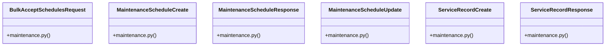

# Community 16

> 23 nodes · cohesion 0.23

## Key Concepts

- [UC-035: Create custom maintenance schedule task item for a vehicle.](file:///E:/Non_Office/Dev_Space/vibe_skool/veltrics/src/backend/app/api/v1/maintenance.py#L160) (10 connections)
- [UC-035: Update schedule parameters (intervals, task name, active status) and rec](file:///E:/Non_Office/Dev_Space/vibe_skool/veltrics/src/backend/app/api/v1/maintenance.py#L207) (10 connections)
- [UC-035: Soft-delete schedule item.](file:///E:/Non_Office/Dev_Space/vibe_skool/veltrics/src/backend/app/api/v1/maintenance.py#L255) (10 connections)
- [UC-037: Retrieve chronological service records for a vehicle within the active o](file:///E:/Non_Office/Dev_Space/vibe_skool/veltrics/src/backend/app/api/v1/maintenance.py#L285) (10 connections)
- [UC-038: Bulk accept/acknowledge default maintenance schedules for a vehicle.](file:///E:/Non_Office/Dev_Space/vibe_skool/veltrics/src/backend/app/api/v1/maintenance.py#L320) (10 connections)
- [maintenance.py](file:///E:/Non_Office/Dev_Space/vibe_skool/veltrics/src/backend/app/api/v1/maintenance.py#L1) (8 connections)
- [maintenance.py](file:///E:/Non_Office/Dev_Space/vibe_skool/veltrics/src/backend/app/schemas/maintenance.py#L1) (8 connections)
- [verify_organization_header()](file:///E:/Non_Office/Dev_Space/vibe_skool/veltrics/src/backend/app/api/v1/maintenance.py#L22) (8 connections)
- [BulkAcceptSchedulesRequest](file:///E:/Non_Office/Dev_Space/vibe_skool/veltrics/src/backend/app/schemas/maintenance.py#L54) (7 connections)
- [MaintenanceScheduleCreate](file:///E:/Non_Office/Dev_Space/vibe_skool/veltrics/src/backend/app/schemas/maintenance.py#L22) (7 connections)
- [MaintenanceScheduleResponse](file:///E:/Non_Office/Dev_Space/vibe_skool/veltrics/src/backend/app/schemas/maintenance.py#L5) (7 connections)
- [MaintenanceScheduleUpdate](file:///E:/Non_Office/Dev_Space/vibe_skool/veltrics/src/backend/app/schemas/maintenance.py#L38) (7 connections)
- [ServiceRecordCreate](file:///E:/Non_Office/Dev_Space/vibe_skool/veltrics/src/backend/app/schemas/maintenance.py#L59) (7 connections)
- [ServiceRecordResponse](file:///E:/Non_Office/Dev_Space/vibe_skool/veltrics/src/backend/app/schemas/maintenance.py#L78) (7 connections)
- [bulk_accept_maintenance_schedules()](file:///E:/Non_Office/Dev_Space/vibe_skool/veltrics/src/backend/app/api/v1/maintenance.py#L315) (4 connections)
- [create_maintenance_schedule()](file:///E:/Non_Office/Dev_Space/vibe_skool/veltrics/src/backend/app/api/v1/maintenance.py#L155) (4 connections)
- [delete_maintenance_schedule()](file:///E:/Non_Office/Dev_Space/vibe_skool/veltrics/src/backend/app/api/v1/maintenance.py#L250) (4 connections)
- [get_maintenance_schedules()](file:///E:/Non_Office/Dev_Space/vibe_skool/veltrics/src/backend/app/api/v1/maintenance.py#L31) (3 connections)
- [get_service_history()](file:///E:/Non_Office/Dev_Space/vibe_skool/veltrics/src/backend/app/api/v1/maintenance.py#L278) (3 connections)
- [log_maintenance_task()](file:///E:/Non_Office/Dev_Space/vibe_skool/veltrics/src/backend/app/api/v1/maintenance.py#L85) (3 connections)
- [update_maintenance_schedule()](file:///E:/Non_Office/Dev_Space/vibe_skool/veltrics/src/backend/app/api/v1/maintenance.py#L201) (3 connections)
- [validate_service_type()](file:///E:/Non_Office/Dev_Space/vibe_skool/veltrics/src/backend/app/schemas/maintenance.py#L72) (1 connections)
- [validate_task_name()](file:///E:/Non_Office/Dev_Space/vibe_skool/veltrics/src/backend/app/schemas/maintenance.py#L32) (1 connections)

## Class Diagram

## Relationships

- No strong cross-community connections detected

## Source Files

- [E:\Non_Office\Dev_Space\vibe_skool\veltrics\src\backend\app\api\v1\maintenance.py](file:///E:/Non_Office/Dev_Space/vibe_skool/veltrics/src/backend/app/api/v1/maintenance.py)
- [E:\Non_Office\Dev_Space\vibe_skool\veltrics\src\backend\app\schemas\maintenance.py](file:///E:/Non_Office/Dev_Space/vibe_skool/veltrics/src/backend/app/schemas/maintenance.py)

## Audit Trail

- EXTRACTED: 62 (44%)
- INFERRED: 80 (56%)
- AMBIGUOUS: 0 (0%)

---

*Part of the graphify knowledge wiki. See [[index]] to navigate.*