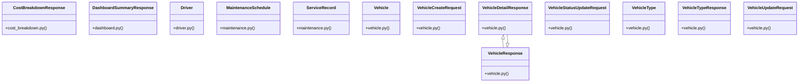

# Community 2

> 180 nodes · cohesion 0.02

## Key Concepts

- [Vehicle](file:///E:/Non_Office/Dev_Space/vibe_skool/veltrics/src/backend/app/models/vehicle.py#L20) (115 connections)
- [MaintenanceSchedule](file:///E:/Non_Office/Dev_Space/vibe_skool/veltrics/src/backend/app/models/maintenance.py#L7) (65 connections)
- [ServiceRecord](file:///E:/Non_Office/Dev_Space/vibe_skool/veltrics/src/backend/app/models/maintenance.py#L28) (52 connections)
- [Driver](file:///E:/Non_Office/Dev_Space/vibe_skool/veltrics/src/backend/app/models/driver.py#L7) (31 connections)
- [seed_database()](file:///E:/Non_Office/Dev_Space/vibe_skool/veltrics/src/backend/app/db/seed.py#L30) (23 connections)
- [VehicleType](file:///E:/Non_Office/Dev_Space/vibe_skool/veltrics/src/backend/app/models/vehicle.py#L7) (19 connections)
- [UC-025: List Organization Vehicles directory with status, search, fuel type, and](file:///E:/Non_Office/Dev_Space/vibe_skool/veltrics/src/backend/app/api/v1/vehicles.py#L152) (15 connections)
- [UC-024: Typeahead autocomplete lookup against seeded Vehicle Master Catalogue.](file:///E:/Non_Office/Dev_Space/vibe_skool/veltrics/src/backend/app/api/v1/vehicles.py#L19) (15 connections)
- [UC-026: View Vehicle Detailed Overview.     Enforces tenant isolation and retur](file:///E:/Non_Office/Dev_Space/vibe_skool/veltrics/src/backend/app/api/v1/vehicles.py#L199) (15 connections)
- [UC-026: Update Vehicle Status (ACTIVE, MAINTENANCE, INACTIVE).](file:///E:/Non_Office/Dev_Space/vibe_skool/veltrics/src/backend/app/api/v1/vehicles.py#L268) (15 connections)
- [UC-027: Update Vehicle Metadata & Specifications.     Validates organization ow](file:///E:/Non_Office/Dev_Space/vibe_skool/veltrics/src/backend/app/api/v1/vehicles.py#L307) (15 connections)
- [UC-024: Register New Vehicle with organization quota validation & duplicate VIN](file:///E:/Non_Office/Dev_Space/vibe_skool/veltrics/src/backend/app/api/v1/vehicles.py#L72) (15 connections)
- [test_maintenance_uc035.py](file:///E:/Non_Office/Dev_Space/vibe_skool/veltrics/src/tests/unit/test_maintenance_uc035.py#L1) (10 connections)
- [test_maintenance_uc036.py](file:///E:/Non_Office/Dev_Space/vibe_skool/veltrics/src/tests/unit/test_maintenance_uc036.py#L1) (9 connections)
- [test_maintenance_uc038.py](file:///E:/Non_Office/Dev_Space/vibe_skool/veltrics/src/tests/unit/test_maintenance_uc038.py#L1) (9 connections)
- [test_vehicles_uc024.py](file:///E:/Non_Office/Dev_Space/vibe_skool/veltrics/src/tests/unit/test_vehicles_uc024.py#L1) (9 connections)
- [VehicleDetailResponse](file:///E:/Non_Office/Dev_Space/vibe_skool/veltrics/src/backend/app/schemas/vehicle.py#L68) (9 connections)
- [VehicleResponse](file:///E:/Non_Office/Dev_Space/vibe_skool/veltrics/src/backend/app/schemas/vehicle.py#L46) (9 connections)
- [test_dashboard_uc064.py](file:///E:/Non_Office/Dev_Space/vibe_skool/veltrics/src/tests/unit/test_dashboard_uc064.py#L1) (8 connections)
- [test_maintenance_uc034.py](file:///E:/Non_Office/Dev_Space/vibe_skool/veltrics/src/tests/unit/test_maintenance_uc034.py#L1) (8 connections)
- [test_maintenance_uc037.py](file:///E:/Non_Office/Dev_Space/vibe_skool/veltrics/src/tests/unit/test_maintenance_uc037.py#L1) (8 connections)
- [test_vehicles_uc026.py](file:///E:/Non_Office/Dev_Space/vibe_skool/veltrics/src/tests/unit/test_vehicles_uc026.py#L1) (8 connections)
- [Test 2: Verify database seeding populates master vehicle catalogue idempotently.](file:///E:/Non_Office/Dev_Space/vibe_skool/veltrics/src/tests/unit/test_db_seeding_uc118.py#L107) (8 connections)
- [Test 3: Verify POST /api/v1/admin/seed endpoint.](file:///E:/Non_Office/Dev_Space/vibe_skool/veltrics/src/tests/unit/test_db_seeding_uc118.py#L131) (8 connections)
- [Test 1: Verify all 7 core data models instantiate clean database tables.](file:///E:/Non_Office/Dev_Space/vibe_skool/veltrics/src/tests/unit/test_db_seeding_uc118.py#L47) (8 connections)
- *... and 155 more nodes in this community*

## Class Diagram

## Relationships

- [[Community 0]] (258 shared connections)
- [[Community 16]] (15 shared connections)
- [[Community 41]] (1 shared connections)

## Source Files

- [E:\Non_Office\Dev_Space\vibe_skool\veltrics\src\backend\app\api\v1\dashboard.py](file:///E:/Non_Office/Dev_Space/vibe_skool/veltrics/src/backend/app/api/v1/dashboard.py)
- [E:\Non_Office\Dev_Space\vibe_skool\veltrics\src\backend\app\api\v1\seed.py](file:///E:/Non_Office/Dev_Space/vibe_skool/veltrics/src/backend/app/api/v1/seed.py)
- [E:\Non_Office\Dev_Space\vibe_skool\veltrics\src\backend\app\api\v1\vehicles.py](file:///E:/Non_Office/Dev_Space/vibe_skool/veltrics/src/backend/app/api/v1/vehicles.py)
- [E:\Non_Office\Dev_Space\vibe_skool\veltrics\src\backend\app\db\seed.py](file:///E:/Non_Office/Dev_Space/vibe_skool/veltrics/src/backend/app/db/seed.py)
- [E:\Non_Office\Dev_Space\vibe_skool\veltrics\src\backend\app\models\driver.py](file:///E:/Non_Office/Dev_Space/vibe_skool/veltrics/src/backend/app/models/driver.py)
- [E:\Non_Office\Dev_Space\vibe_skool\veltrics\src\backend\app\models\maintenance.py](file:///E:/Non_Office/Dev_Space/vibe_skool/veltrics/src/backend/app/models/maintenance.py)
- [E:\Non_Office\Dev_Space\vibe_skool\veltrics\src\backend\app\models\vehicle.py](file:///E:/Non_Office/Dev_Space/vibe_skool/veltrics/src/backend/app/models/vehicle.py)
- [E:\Non_Office\Dev_Space\vibe_skool\veltrics\src\backend\app\schemas\cost_breakdown.py](file:///E:/Non_Office/Dev_Space/vibe_skool/veltrics/src/backend/app/schemas/cost_breakdown.py)
- [E:\Non_Office\Dev_Space\vibe_skool\veltrics\src\backend\app\schemas\dashboard.py](file:///E:/Non_Office/Dev_Space/vibe_skool/veltrics/src/backend/app/schemas/dashboard.py)
- [E:\Non_Office\Dev_Space\vibe_skool\veltrics\src\backend\app\schemas\vehicle.py](file:///E:/Non_Office/Dev_Space/vibe_skool/veltrics/src/backend/app/schemas/vehicle.py)
- [E:\Non_Office\Dev_Space\vibe_skool\veltrics\src\tests\unit\test_dashboard_uc064.py](file:///E:/Non_Office/Dev_Space/vibe_skool/veltrics/src/tests/unit/test_dashboard_uc064.py)
- [E:\Non_Office\Dev_Space\vibe_skool\veltrics\src\tests\unit\test_db_seeding_uc118.py](file:///E:/Non_Office/Dev_Space/vibe_skool/veltrics/src/tests/unit/test_db_seeding_uc118.py)
- [E:\Non_Office\Dev_Space\vibe_skool\veltrics\src\tests\unit\test_maintenance_uc034.py](file:///E:/Non_Office/Dev_Space/vibe_skool/veltrics/src/tests/unit/test_maintenance_uc034.py)
- [E:\Non_Office\Dev_Space\vibe_skool\veltrics\src\tests\unit\test_maintenance_uc035.py](file:///E:/Non_Office/Dev_Space/vibe_skool/veltrics/src/tests/unit/test_maintenance_uc035.py)
- [E:\Non_Office\Dev_Space\vibe_skool\veltrics\src\tests\unit\test_maintenance_uc036.py](file:///E:/Non_Office/Dev_Space/vibe_skool/veltrics/src/tests/unit/test_maintenance_uc036.py)
- [E:\Non_Office\Dev_Space\vibe_skool\veltrics\src\tests\unit\test_maintenance_uc037.py](file:///E:/Non_Office/Dev_Space/vibe_skool/veltrics/src/tests/unit/test_maintenance_uc037.py)
- [E:\Non_Office\Dev_Space\vibe_skool\veltrics\src\tests\unit\test_maintenance_uc038.py](file:///E:/Non_Office/Dev_Space/vibe_skool/veltrics/src/tests/unit/test_maintenance_uc038.py)
- [E:\Non_Office\Dev_Space\vibe_skool\veltrics\src\tests\unit\test_organizations_uc016.py](file:///E:/Non_Office/Dev_Space/vibe_skool/veltrics/src/tests/unit/test_organizations_uc016.py)
- [E:\Non_Office\Dev_Space\vibe_skool\veltrics\src\tests\unit\test_vehicles_uc024.py](file:///E:/Non_Office/Dev_Space/vibe_skool/veltrics/src/tests/unit/test_vehicles_uc024.py)
- [E:\Non_Office\Dev_Space\vibe_skool\veltrics\src\tests\unit\test_vehicles_uc025.py](file:///E:/Non_Office/Dev_Space/vibe_skool/veltrics/src/tests/unit/test_vehicles_uc025.py)

## Audit Trail

- EXTRACTED: 338 (35%)
- INFERRED: 640 (65%)
- AMBIGUOUS: 0 (0%)

---

*Part of the graphify knowledge wiki. See [[index]] to navigate.*