# Community 3

> 93 nodes · cohesion 0.07

## Key Concepts

- **BaseModel** (69 connections)
- [AuthService](file:///E:/Non_Office/Dev_Space/vibe_skool/veltrics/src/backend/app/services/auth_service.py#L57) (35 connections)
- [UC-011: Account Deletion (GDPR Right to be Forgotten)         Soft-deletes user](file:///E:/Non_Office/Dev_Space/vibe_skool/veltrics/src/backend/app/services/auth_service.py#L556) (21 connections)
- [AuthSessionDTO](file:///E:/Non_Office/Dev_Space/vibe_skool/veltrics/src/backend/app/schemas/auth.py#L49) (20 connections)
- [auth_service.py](file:///E:/Non_Office/Dev_Space/vibe_skool/veltrics/src/backend/app/services/auth_service.py#L1) (16 connections)
- [SessionRevokeResponse](file:///E:/Non_Office/Dev_Space/vibe_skool/veltrics/src/backend/app/schemas/session.py#L19) (14 connections)
- [OrganizationDTO](file:///E:/Non_Office/Dev_Space/vibe_skool/veltrics/src/backend/app/schemas/auth.py#L39) (13 connections)
- [UC-004: User Password Authentication & Session Initiation     Authenticates reg](file:///E:/Non_Office/Dev_Space/vibe_skool/veltrics/src/backend/app/api/v1/auth.py#L24) (13 connections)
- [UC-006: Forgot Password Request     Issues a password reset JWT token with 5-mi](file:///E:/Non_Office/Dev_Space/vibe_skool/veltrics/src/backend/app/api/v1/auth.py#L33) (13 connections)
- [UC-006: Password Reset Execution     Verifies reset token, validates password p](file:///E:/Non_Office/Dev_Space/vibe_skool/veltrics/src/backend/app/api/v1/auth.py#L41) (13 connections)
- [UC-009: Session Refresh & Access Token Renewal     Validates active refresh tok](file:///E:/Non_Office/Dev_Space/vibe_skool/veltrics/src/backend/app/api/v1/auth.py#L49) (13 connections)
- [UC-010: User Sign Out & Token Revocation     Revokes the provided refresh token](file:///E:/Non_Office/Dev_Space/vibe_skool/veltrics/src/backend/app/api/v1/auth.py#L57) (13 connections)
- [UserDTO](file:///E:/Non_Office/Dev_Space/vibe_skool/veltrics/src/backend/app/schemas/auth.py#L22) (13 connections)
- [auth.py](file:///E:/Non_Office/Dev_Space/vibe_skool/veltrics/src/backend/app/schemas/auth.py#L1) (13 connections)
- [UserSessionDTO](file:///E:/Non_Office/Dev_Space/vibe_skool/veltrics/src/backend/app/schemas/session.py#L5) (13 connections)
- [UserProfileResponse](file:///E:/Non_Office/Dev_Space/vibe_skool/veltrics/src/backend/app/schemas/user.py#L39) (12 connections)
- [UC-007: Multi-tenant authorization boundary verification endpoint.](file:///E:/Non_Office/Dev_Space/vibe_skool/veltrics/src/backend/app/api/v1/users.py#L166) (12 connections)
- [UC-011: Account Deletion (GDPR Right to be Forgotten).     Soft-deletes user re](file:///E:/Non_Office/Dev_Space/vibe_skool/veltrics/src/backend/app/api/v1/users.py#L182) (12 connections)
- [UC-013: Active Session Management & Device Tracking     Returns list of active](file:///E:/Non_Office/Dev_Space/vibe_skool/veltrics/src/backend/app/api/v1/users.py#L193) (12 connections)
- [UC-013: Revoke Specific Device Session     Revokes the specified refresh token](file:///E:/Non_Office/Dev_Space/vibe_skool/veltrics/src/backend/app/api/v1/users.py#L205) (12 connections)
- [UC-007: Fetch current user profile details.](file:///E:/Non_Office/Dev_Space/vibe_skool/veltrics/src/backend/app/api/v1/users.py#L21) (12 connections)
- [UC-013 Alternate Flow A1: Revoke All Other Sessions     Revokes all active sess](file:///E:/Non_Office/Dev_Space/vibe_skool/veltrics/src/backend/app/api/v1/users.py#L216) (12 connections)
- [UC-007: Update current user profile (full name, phone, city, job role, avatar).](file:///E:/Non_Office/Dev_Space/vibe_skool/veltrics/src/backend/app/api/v1/users.py#L47) (12 connections)
- [UC-007: Complete profile onboarding (SCR-AUTH-007) and return updated AuthSessio](file:///E:/Non_Office/Dev_Space/vibe_skool/veltrics/src/backend/app/api/v1/users.py#L89) (12 connections)
- [log_event()](file:///E:/Non_Office/Dev_Space/vibe_skool/veltrics/src/backend/app/services/audit_service.py#L12) (11 connections)
- *... and 68 more nodes in this community*

## Class Diagram

```mermaid
classDiagram
    class AuthSessionDTO {
        +auth.py()
    }
    class ForgotPasswordRequest {
        +auth.py()
    }
    class ForgotPasswordResponse {
        +auth.py()
    }
    class LoginRequest {
        +auth.py()
    }
    class LogoutRequest {
        +auth.py()
    }
    class LogoutResponse {
        +auth.py()
    }
    class OrganizationDTO {
        +auth.py()
    }
    class RefreshTokenRequest {
        +auth.py()
    }
    class RefreshTokenResponse {
        +auth.py()
    }
    class RegisterRequest {
        +auth.py()
    }
    class ResetPasswordRequest {
        +auth.py()
    }
    class ResetPasswordResponse {
        +auth.py()
    }
    class AuthService {
        +auth_service.py()
    }
    class UserDTO {
        +auth.py()
    }
    class CostBreakdownItem {
        +cost_breakdown.py()
    }
    class Config {
        +session.py()
    }
    class SessionRevokeResponse {
        +session.py()
    }
    class UserSessionDTO {
        +session.py()
    }
    class ProfileCompletionRequest {
        +user.py()
    }
    class UserSession {
        +user_session.py()
    }
    class UserProfileResponse {
        +user.py()
    }
    class UserProfileUpdate {
        +user.py()
    }
    AuthSessionDTO --> AuthService
    ForgotPasswordRequest --> AuthService
    ForgotPasswordResponse --> AuthService
    LoginRequest --> AuthService
    LogoutRequest --> AuthService
    LogoutResponse --> AuthService
    OrganizationDTO --> AuthService
    RefreshTokenRequest --> AuthService
    RefreshTokenResponse --> AuthService
    RegisterRequest --> AuthService
    ResetPasswordRequest --> AuthService
    ResetPasswordResponse --> AuthService
    AuthService --> UserSession
    AuthService --> RegisterRequest
    AuthService --> LoginRequest
    AuthService --> UserDTO
    AuthService --> OrganizationDTO
    AuthService --> AuthSessionDTO
    AuthService --> ForgotPasswordRequest
    AuthService --> ForgotPasswordResponse
    AuthService --> ResetPasswordRequest
    AuthService --> ResetPasswordResponse
    AuthService --> RefreshTokenRequest
    AuthService --> RefreshTokenResponse
    AuthService --> LogoutRequest
    AuthService --> LogoutResponse
    AuthService --> UserSessionDTO
    AuthService --> SessionRevokeResponse
    UserDTO --> AuthService
    SessionRevokeResponse --> AuthService
    UserSessionDTO --> AuthService
    UserSession --> AuthService
```

## Relationships

- [[Community 4]] (162 shared connections)
- [[Community 1]] (8 shared connections)

## Source Files

- [E:\Non_Office\Dev_Space\vibe_skool\veltrics\src\backend\app\api\v1\auth.py](file:///E:/Non_Office/Dev_Space/vibe_skool/veltrics/src/backend/app/api/v1/auth.py)
- [E:\Non_Office\Dev_Space\vibe_skool\veltrics\src\backend\app\api\v1\users.py](file:///E:/Non_Office/Dev_Space/vibe_skool/veltrics/src/backend/app/api/v1/users.py)
- [E:\Non_Office\Dev_Space\vibe_skool\veltrics\src\backend\app\models\user.py](file:///E:/Non_Office/Dev_Space/vibe_skool/veltrics/src/backend/app/models/user.py)
- [E:\Non_Office\Dev_Space\vibe_skool\veltrics\src\backend\app\models\user_session.py](file:///E:/Non_Office/Dev_Space/vibe_skool/veltrics/src/backend/app/models/user_session.py)
- [E:\Non_Office\Dev_Space\vibe_skool\veltrics\src\backend\app\schemas\auth.py](file:///E:/Non_Office/Dev_Space/vibe_skool/veltrics/src/backend/app/schemas/auth.py)
- [E:\Non_Office\Dev_Space\vibe_skool\veltrics\src\backend\app\schemas\cost_breakdown.py](file:///E:/Non_Office/Dev_Space/vibe_skool/veltrics/src/backend/app/schemas/cost_breakdown.py)
- [E:\Non_Office\Dev_Space\vibe_skool\veltrics\src\backend\app\schemas\session.py](file:///E:/Non_Office/Dev_Space/vibe_skool/veltrics/src/backend/app/schemas/session.py)
- [E:\Non_Office\Dev_Space\vibe_skool\veltrics\src\backend\app\schemas\user.py](file:///E:/Non_Office/Dev_Space/vibe_skool/veltrics/src/backend/app/schemas/user.py)
- [E:\Non_Office\Dev_Space\vibe_skool\veltrics\src\backend\app\services\audit_service.py](file:///E:/Non_Office/Dev_Space/vibe_skool/veltrics/src/backend/app/services/audit_service.py)
- [E:\Non_Office\Dev_Space\vibe_skool\veltrics\src\backend\app\services\auth_service.py](file:///E:/Non_Office/Dev_Space/vibe_skool/veltrics/src/backend/app/services/auth_service.py)
- [E:\Non_Office\Dev_Space\vibe_skool\veltrics\src\tests\unit\test_auth_uc013.py](file:///E:/Non_Office/Dev_Space/vibe_skool/veltrics/src/tests/unit/test_auth_uc013.py)

## Audit Trail

- EXTRACTED: 274 (39%)
- INFERRED: 435 (61%)
- AMBIGUOUS: 0 (0%)

---

*Part of the graphify knowledge wiki. See [[index]] to navigate.*