# Knowledge Graph Index

> Auto-generated by graphify. Start here — read community articles for context, then drill into god nodes for detail.

**1621 nodes · 3049 edges · 196 communities**

---

## System Architecture Flowchart

```mermaid
flowchart TD
    C0["Community 0 (228 nodes)"]
    C1["Community 1 (203 nodes)"]
    C2["Community 2 (180 nodes)"]
    C3["Community 3 (93 nodes)"]
    C4["Community 4 (71 nodes)"]
    C5["Community 5 (46 nodes)"]
    C6["Community 6 (43 nodes)"]
    C7["Community 7 (43 nodes)"]
    C8["Community 8 (41 nodes)"]
    C9["Community 9 (40 nodes)"]
    C10["Community 10 (34 nodes)"]
    C11["Community 11 (30 nodes)"]
    C12["Community 12 (29 nodes)"]
    C13["Community 13 (26 nodes)"]
    C14["Community 14 (26 nodes)"]
    C15["Community 15 (25 nodes)"]
    C16["Community 16 (23 nodes)"]
    C17["Community 17 (22 nodes)"]
    C18["Community 18 (18 nodes)"]
    C19["Community 19 (15 nodes)"]
    C20["Community 20 (14 nodes)"]
    C21["Community 21 (12 nodes)"]
    C22["Community 22 (12 nodes)"]
    C23["Community 23 (11 nodes)"]
    C24["Community 24 (11 nodes)"]
    C25["unknown (9 nodes)"]
    C26["unknown (9 nodes)"]
    C27["unknown (8 nodes)"]
    C28["unknown (8 nodes)"]
    C29["unknown (8 nodes)"]
    C30["unknown (8 nodes)"]
    C31["unknown (8 nodes)"]
    C32["unknown (8 nodes)"]
    C33["unknown (8 nodes)"]
    C34["unknown (8 nodes)"]
    C35["unknown (7 nodes)"]
    C36["Community 36 (7 nodes)"]
    C37["Community 37 (7 nodes)"]
    C38["Community 38 (7 nodes)"]
    C39["Community 39 (7 nodes)"]
    C40["unknown (6 nodes)"]
    C41["Community 41 (6 nodes)"]
    C42["Community 42 (6 nodes)"]
    C43["Community 43 (5 nodes)"]
    C44["Plugin registration (4 nodes)"]
    C45["Community 45 (4 nodes)"]
    C46["Community 46 (4 nodes)"]
    C47["Community 47 (3 nodes)"]
    C48["Community 48 (3 nodes)"]
    C49["unknown (3 nodes)"]
    C50["unknown (3 nodes)"]
    C51["unknown (3 nodes)"]
    C52["User Interface (3 nodes)"]
    C53["Community 53 (3 nodes)"]
    C54["Community 54 (3 nodes)"]
    C55["Community 55 (3 nodes)"]
    C56["unknown (2 nodes)"]
    C57["unknown (2 nodes)"]
    C58["unknown (2 nodes)"]
    C59["unknown (2 nodes)"]
    C60["Community 60 (2 nodes)"]
    C61["Community 61 (2 nodes)"]
    C62["Community 62 (1 nodes)"]
    C63["Community 63 (1 nodes)"]
    C64["Community 64 (1 nodes)"]
    C65["Community 65 (1 nodes)"]
    C66["Community 66 (1 nodes)"]
    C67["Community 67 (1 nodes)"]
    C68["Community 68 (1 nodes)"]
    C69["Community 69 (1 nodes)"]
    C70["Community 70 (1 nodes)"]
    C71["Community 71 (1 nodes)"]
    C72["Community 72 (1 nodes)"]
    C73["Community 73 (1 nodes)"]
    C74["Community 74 (1 nodes)"]
    C75["Community 75 (1 nodes)"]
    C76["Community 76 (1 nodes)"]
    C77["Community 77 (1 nodes)"]
    C78["Community 78 (1 nodes)"]
    C79["Community 79 (1 nodes)"]
    C80["Community 80 (1 nodes)"]
    C81["Community 81 (1 nodes)"]
    C82["Community 82 (1 nodes)"]
    C83["Community 83 (1 nodes)"]
    C84["Community 84 (1 nodes)"]
    C85["Community 85 (1 nodes)"]
    C86["Community 86 (1 nodes)"]
    C87["Community 87 (1 nodes)"]
    C88["Community 88 (1 nodes)"]
    C89["Community 89 (1 nodes)"]
    C90["Community 90 (1 nodes)"]
    C91["Community 91 (1 nodes)"]
    C92["Community 92 (1 nodes)"]
    C93["Community 93 (1 nodes)"]
    C94["Community 94 (1 nodes)"]
    C95["Community 95 (1 nodes)"]
    C96["Community 96 (1 nodes)"]
    C97["Community 97 (1 nodes)"]
    C98["Community 98 (1 nodes)"]
    C99["Community 99 (1 nodes)"]
    C100["Community 100 (1 nodes)"]
    C101["Community 101 (1 nodes)"]
    C102["Community 102 (1 nodes)"]
    C103["Community 103 (1 nodes)"]
    C104["Community 104 (1 nodes)"]
    C105["Community 105 (1 nodes)"]
    C106["Community 106 (1 nodes)"]
    C107["Community 107 (1 nodes)"]
    C108["Community 108 (1 nodes)"]
    C109["Community 109 (1 nodes)"]
    C110["Community 110 (1 nodes)"]
    C111["Community 111 (1 nodes)"]
    C112["Community 112 (1 nodes)"]
    C113["Community 113 (1 nodes)"]
    C114["Community 114 (1 nodes)"]
    C115["Community 115 (1 nodes)"]
    C116["Community 116 (1 nodes)"]
    C117["Community 117 (1 nodes)"]
    C118["Community 118 (1 nodes)"]
    C119["Community 119 (1 nodes)"]
    C120["Community 120 (1 nodes)"]
    C121["Community 121 (1 nodes)"]
    C122["Community 122 (1 nodes)"]
    C123["Community 123 (1 nodes)"]
    C124["Community 124 (1 nodes)"]
    C125["Community 125 (1 nodes)"]
    C126["Community 126 (1 nodes)"]
    C127["Community 127 (1 nodes)"]
    C128["Community 128 (1 nodes)"]
    C129["Community 129 (1 nodes)"]
    C130["Community 130 (1 nodes)"]
    C131["Community 131 (1 nodes)"]
    C132["Community 132 (1 nodes)"]
    C133["Community 133 (1 nodes)"]
    C134["Community 134 (1 nodes)"]
    C135["Community 135 (1 nodes)"]
    C136["Community 136 (1 nodes)"]
    C137["Community 137 (1 nodes)"]
    C138["Community 138 (1 nodes)"]
    C139["Community 139 (1 nodes)"]
    C140["Community 140 (1 nodes)"]
    C141["Community 141 (1 nodes)"]
    C142["Community 142 (1 nodes)"]
    C143["Community 143 (1 nodes)"]
    C144["Community 144 (1 nodes)"]
    C145["Community 145 (1 nodes)"]
    C146["Community 146 (1 nodes)"]
    C147["Community 147 (1 nodes)"]
    C148["Community 148 (1 nodes)"]
    C149["Community 149 (1 nodes)"]
    C150["Community 150 (1 nodes)"]
    C151["Community 151 (1 nodes)"]
    C152["Community 152 (1 nodes)"]
    C153["Community 153 (1 nodes)"]
    C154["Community 154 (1 nodes)"]
    C155["Community 155 (1 nodes)"]
    C156["Community 156 (1 nodes)"]
    C157["Community 157 (1 nodes)"]
    C158["Community 158 (1 nodes)"]
    C159["Community 159 (1 nodes)"]
    C160["Community 160 (1 nodes)"]
    C161["Community 161 (1 nodes)"]
    C162["Community 162 (1 nodes)"]
    C163["Community 163 (1 nodes)"]
    C164["Community 164 (1 nodes)"]
    C165["Community 165 (1 nodes)"]
    C166["Community 166 (1 nodes)"]
    C167["Community 167 (1 nodes)"]
    C168["Community 168 (1 nodes)"]
    C169["Community 169 (1 nodes)"]
    C170["Community 170 (1 nodes)"]
    C171["Community 171 (1 nodes)"]
    C172["Community 172 (1 nodes)"]
    C173["Community 173 (1 nodes)"]
    C174["Community 174 (1 nodes)"]
    C175["Community 175 (1 nodes)"]
    C176["Community 176 (1 nodes)"]
    C177["Community 177 (1 nodes)"]
    C178["Community 178 (1 nodes)"]
    C179["Community 179 (1 nodes)"]
    C180["Community 180 (1 nodes)"]
    C181["Community 181 (1 nodes)"]
    C182["Community 182 (1 nodes)"]
    C183["Community 183 (1 nodes)"]
    C184["Community 184 (1 nodes)"]
    C185["Community 185 (1 nodes)"]
    C186["Community 186 (1 nodes)"]
    C187["Community 187 (1 nodes)"]
    C188["Community 188 (1 nodes)"]
    C189["Community 189 (1 nodes)"]
    C190["Community 190 (1 nodes)"]
    C191["Community 191 (1 nodes)"]
    C192["Community 192 (1 nodes)"]
    C193["Community 193 (1 nodes)"]
    C194["Community 194 (1 nodes)"]
    C195["Community 195 (1 nodes)"]
    C1 -->|115 edges| C2
    C2 -->|38 edges| C1
    C3 -->|29 edges| C1
    C1 -->|21 edges| C3
    C16 -->|19 edges| C2
    C1 -->|11 edges| C19
    C13 -->|11 edges| C1
    C6 -->|10 edges| C1
    C8 -->|9 edges| C1
    C3 -->|9 edges| C8
    C0 -->|8 edges| C5
    C3 -->|8 edges| C2
    C2 -->|7 edges| C19
    C3 -->|7 edges| C6
    C0 -->|6 edges| C10
    C0 -->|6 edges| C7
    C0 -->|6 edges| C9
    C12 -->|6 edges| C1
    C2 -->|6 edges| C13
    C3 -->|6 edges| C12
    C3 -->|6 edges| C16
    C23 -->|6 edges| C1
    C0 -->|5 edges| C15
    C1 -->|5 edges| C24
    C1 -->|5 edges| C20
    C3 -->|5 edges| C14
    C0 -->|4 edges| C11
    C0 -->|4 edges| C17
    C2 -->|4 edges| C24
    C1 -->|4 edges| C21
    C1 -->|4 edges| C22
    C27 -->|4 edges| C1
    C28 -->|4 edges| C1
    C29 -->|4 edges| C1
    C1 -->|3 edges| C13
    C1 -->|3 edges| C8
    C35 -->|3 edges| C1
    C41 -->|3 edges| C1
    C1 -->|2 edges| C12
    C40 -->|2 edges| C1
    C4 -->|1 edges| C0
    C0 -->|1 edges| C4
    C16 -->|1 edges| C3
    C1 -->|1 edges| C14
    C14 -->|1 edges| C1
    C1 -->|1 edges| C30
    C1 -->|1 edges| C36
    C1 -->|1 edges| C31
    C1 -->|1 edges| C38
    C1 -->|1 edges| C32
    C1 -->|1 edges| C26
    C1 -->|1 edges| C33
    C1 -->|1 edges| C34
    C1 -->|1 edges| C39
    C1 -->|1 edges| C18
    C2 -->|1 edges| C30
    C2 -->|1 edges| C36
    C2 -->|1 edges| C31
    C2 -->|1 edges| C38
    C2 -->|1 edges| C32
    C2 -->|1 edges| C26
    C2 -->|1 edges| C33
    C2 -->|1 edges| C34
    C2 -->|1 edges| C39
    C3 -->|1 edges| C23
    C9 -->|1 edges| C0
    C0 -->|1 edges| C23
    C42 -->|1 edges| C1
    C37 -->|1 edges| C1
    C25 -->|1 edges| C1
    C18 -->|1 edges| C1
```

## Communities
(sorted by size, largest first)

- [[Community 0]] — 228 nodes
- [[Community 1]] — 203 nodes
- [[Community 2]] — 180 nodes
- [[Community 3]] — 93 nodes
- [[Community 4]] — 71 nodes
- [[Community 5]] — 46 nodes
- [[Community 6]] — 43 nodes
- [[Community 7]] — 43 nodes
- [[Community 8]] — 41 nodes
- [[Community 9]] — 40 nodes
- [[Community 10]] — 34 nodes
- [[Community 11]] — 30 nodes
- [[Community 12]] — 29 nodes
- [[Community 13]] — 26 nodes
- [[Community 14]] — 26 nodes
- [[Community 15]] — 25 nodes
- [[Community 16]] — 23 nodes
- [[Community 17]] — 22 nodes
- [[Community 18]] — 18 nodes
- [[Community 19]] — 15 nodes
- [[Community 20]] — 14 nodes
- [[Community 21]] — 12 nodes
- [[Community 22]] — 12 nodes
- [[Community 23]] — 11 nodes
- [[Community 24]] — 11 nodes
- [[unknown]] — 9 nodes
- [[unknown]] — 9 nodes
- [[unknown]] — 8 nodes
- [[unknown]] — 8 nodes
- [[unknown]] — 8 nodes
- [[unknown]] — 8 nodes
- [[unknown]] — 8 nodes
- [[unknown]] — 8 nodes
- [[unknown]] — 8 nodes
- [[unknown]] — 8 nodes
- [[unknown]] — 7 nodes
- [[Community 36]] — 7 nodes
- [[Community 37]] — 7 nodes
- [[Community 38]] — 7 nodes
- [[Community 39]] — 7 nodes
- [[unknown]] — 6 nodes
- [[Community 41]] — 6 nodes
- [[Community 42]] — 6 nodes
- [[Community 43]] — 5 nodes
- [[Plugin registration]] — 4 nodes
- [[Community 45]] — 4 nodes
- [[Community 46]] — 4 nodes
- [[Community 47]] — 3 nodes
- [[Community 48]] — 3 nodes
- [[unknown]] — 3 nodes
- [[unknown]] — 3 nodes
- [[unknown]] — 3 nodes
- [[User Interface]] — 3 nodes
- [[Community 53]] — 3 nodes
- [[Community 54]] — 3 nodes
- [[Community 55]] — 3 nodes
- [[unknown]] — 2 nodes
- [[unknown]] — 2 nodes
- [[unknown]] — 2 nodes
- [[unknown]] — 2 nodes
- [[Community 60]] — 2 nodes
- [[Community 61]] — 2 nodes
- [[Community 62]] — 1 nodes
- [[Community 63]] — 1 nodes
- [[Community 64]] — 1 nodes
- [[Community 65]] — 1 nodes
- [[Community 66]] — 1 nodes
- [[Community 67]] — 1 nodes
- [[Community 68]] — 1 nodes
- [[Community 69]] — 1 nodes
- [[Community 70]] — 1 nodes
- [[Community 71]] — 1 nodes
- [[Community 72]] — 1 nodes
- [[Community 73]] — 1 nodes
- [[Community 74]] — 1 nodes
- [[Community 75]] — 1 nodes
- [[Community 76]] — 1 nodes
- [[Community 77]] — 1 nodes
- [[Community 78]] — 1 nodes
- [[Community 79]] — 1 nodes
- [[Community 80]] — 1 nodes
- [[Community 81]] — 1 nodes
- [[Community 82]] — 1 nodes
- [[Community 83]] — 1 nodes
- [[Community 84]] — 1 nodes
- [[Community 85]] — 1 nodes
- [[Community 86]] — 1 nodes
- [[Community 87]] — 1 nodes
- [[Community 88]] — 1 nodes
- [[Community 89]] — 1 nodes
- [[Community 90]] — 1 nodes
- [[Community 91]] — 1 nodes
- [[Community 92]] — 1 nodes
- [[Community 93]] — 1 nodes
- [[Community 94]] — 1 nodes
- [[Community 95]] — 1 nodes
- [[Community 96]] — 1 nodes
- [[Community 97]] — 1 nodes
- [[Community 98]] — 1 nodes
- [[Community 99]] — 1 nodes
- [[Community 100]] — 1 nodes
- [[Community 101]] — 1 nodes
- [[Community 102]] — 1 nodes
- [[Community 103]] — 1 nodes
- [[Community 104]] — 1 nodes
- [[Community 105]] — 1 nodes
- [[Community 106]] — 1 nodes
- [[Community 107]] — 1 nodes
- [[Community 108]] — 1 nodes
- [[Community 109]] — 1 nodes
- [[Community 110]] — 1 nodes
- [[Community 111]] — 1 nodes
- [[Community 112]] — 1 nodes
- [[Community 113]] — 1 nodes
- [[Community 114]] — 1 nodes
- [[Community 115]] — 1 nodes
- [[Community 116]] — 1 nodes
- [[Community 117]] — 1 nodes
- [[Community 118]] — 1 nodes
- [[Community 119]] — 1 nodes
- [[Community 120]] — 1 nodes
- [[Community 121]] — 1 nodes
- [[Community 122]] — 1 nodes
- [[Community 123]] — 1 nodes
- [[Community 124]] — 1 nodes
- [[Community 125]] — 1 nodes
- [[Community 126]] — 1 nodes
- [[Community 127]] — 1 nodes
- [[Community 128]] — 1 nodes
- [[Community 129]] — 1 nodes
- [[Community 130]] — 1 nodes
- [[Community 131]] — 1 nodes
- [[Community 132]] — 1 nodes
- [[Community 133]] — 1 nodes
- [[Community 134]] — 1 nodes
- [[Community 135]] — 1 nodes
- [[Community 136]] — 1 nodes
- [[Community 137]] — 1 nodes
- [[Community 138]] — 1 nodes
- [[Community 139]] — 1 nodes
- [[Community 140]] — 1 nodes
- [[Community 141]] — 1 nodes
- [[Community 142]] — 1 nodes
- [[Community 143]] — 1 nodes
- [[Community 144]] — 1 nodes
- [[Community 145]] — 1 nodes
- [[Community 146]] — 1 nodes
- [[Community 147]] — 1 nodes
- [[Community 148]] — 1 nodes
- [[Community 149]] — 1 nodes
- [[Community 150]] — 1 nodes
- [[Community 151]] — 1 nodes
- [[Community 152]] — 1 nodes
- [[Community 153]] — 1 nodes
- [[Community 154]] — 1 nodes
- [[Community 155]] — 1 nodes
- [[Community 156]] — 1 nodes
- [[Community 157]] — 1 nodes
- [[Community 158]] — 1 nodes
- [[Community 159]] — 1 nodes
- [[Community 160]] — 1 nodes
- [[Community 161]] — 1 nodes
- [[Community 162]] — 1 nodes
- [[Community 163]] — 1 nodes
- [[Community 164]] — 1 nodes
- [[Community 165]] — 1 nodes
- [[Community 166]] — 1 nodes
- [[Community 167]] — 1 nodes
- [[Community 168]] — 1 nodes
- [[Community 169]] — 1 nodes
- [[Community 170]] — 1 nodes
- [[Community 171]] — 1 nodes
- [[Community 172]] — 1 nodes
- [[Community 173]] — 1 nodes
- [[Community 174]] — 1 nodes
- [[Community 175]] — 1 nodes
- [[Community 176]] — 1 nodes
- [[Community 177]] — 1 nodes
- [[Community 178]] — 1 nodes
- [[Community 179]] — 1 nodes
- [[Community 180]] — 1 nodes
- [[Community 181]] — 1 nodes
- [[Community 182]] — 1 nodes
- [[Community 183]] — 1 nodes
- [[Community 184]] — 1 nodes
- [[Community 185]] — 1 nodes
- [[Community 186]] — 1 nodes
- [[Community 187]] — 1 nodes
- [[Community 188]] — 1 nodes
- [[Community 189]] — 1 nodes
- [[Community 190]] — 1 nodes
- [[Community 191]] — 1 nodes
- [[Community 192]] — 1 nodes
- [[Community 193]] — 1 nodes
- [[Community 194]] — 1 nodes
- [[Community 195]] — 1 nodes

## God Nodes
(most connected concepts — the load-bearing abstractions)

- [[Organization]] — 215 connections
- [[User]] — 131 connections
- [[Vehicle]] — 115 connections
- [[MaintenanceSchedule]] — 65 connections
- [[AuditLog]] — 54 connections
- [[ServiceRecord]] — 52 connections
- [[AuthService]] — 35 connections
- [[OrganizationInvitation]] — 34 connections
- [[package:flutter/material.dart]] — 33 connections
- [[Driver]] — 31 connections

---

*Generated by [graphify](https://github.com/safishamsi/graphify)*