# seed_database()

> God node · 23 connections · [E:\Non_Office\Dev_Space\vibe_skool\veltrics\src\backend\app\db\seed.py](file:///E:/Non_Office/Dev_Space/vibe_skool/veltrics/src/backend/app/db/seed.py#L30)

## Call Trace Diagram

```mermaid
sequenceDiagram
    participant P0 as seed_database()
    participant P1 as VehicleType
    participant P2 as UC-024: Typeahead autocomplete lookup against seeded Vehicle Master Catalogue.
    participant P3 as Organization
    participant P4 as User
    participant P5 as Vehicle
    participant P6 as MaintenanceSchedule
    participant P7 as ServiceRecord
    participant P8 as AuditLog
    participant P9 as Driver
    participant P10 as VehicleResponse
    participant P11 as VehicleDetailResponse
    participant P12 as VehicleCreateRequest
    participant P13 as VehicleTypeResponse
    participant P14 as VehicleStatusUpdateRequest
    participant P15 as VehicleUpdateRequest
    participant P16 as UC-024: Register New Vehicle with organization quota validation & duplicate VIN
    participant P17 as UC-025: List Organization Vehicles directory with status, search, fuel type, and
    participant P18 as UC-026: View Vehicle Detailed Overview.     Enforces tenant isolation and retur
    participant P19 as UC-026: Update Vehicle Status (ACTIVE, MAINTENANCE, INACTIVE).
    participant P20 as UC-027: Update Vehicle Metadata & Specifications.     Validates organization ow
    participant P21 as Test 1: Verify all 7 core data models instantiate clean database tables.
    participant P22 as Test 2: Verify database seeding populates master vehicle catalogue idempotently.
    participant P23 as Test 3: Verify POST /api/v1/admin/seed endpoint.
    participant P24 as Test 1: Verify GET /api/v1/vehicles/types?q=Toyota returns seeded Toyota models.
    participant P25 as Test 2: Verify POST /api/v1/vehicles registers new vehicle with tenant organizat
    participant P26 as Test 3: Verify duplicate VIN within same organization returns HTTP 409 Conflict.
    participant P27 as Test 4: Verify exceeding max_vehicles quota (max=2 for sample_org) returns HTTP
    participant P28 as Test 5: Verify custom make/model is dynamically indexed into VehicleType catalog
    participant P29 as create_vehicle()
    participant P30 as Idempotent seeding script for Vehicle Master Catalogue and Default Maintenance T
    participant P31 as trigger_seed_database()
    participant P32 as get_vehicle_types()
    participant P33 as test_uc118_idempotent_database_seeding()
    participant P34 as setup_db()
    participant P35 as setup_db()
    participant P36 as setup_db()
    participant P37 as setup_db()
    participant P38 as setup_db()
    participant P39 as setup_db()
    participant P40 as setup_db()
    participant P41 as setup_db()
    participant P42 as setup_db()
    participant P43 as setup_db()
    participant P44 as setup_db()
    participant P45 as setup_db()
    participant P46 as setup_db()
    participant P47 as setup_db()
    participant P48 as setup_db()
    participant P49 as setup_db()
    participant P50 as setup_db()
    P0->>+ P1: calls
    P1-->>- P0: return
    P1->>+ P0: calls
    P0-->>- P1: return
    P1->>+ P2: uses
    P2-->>- P1: return
    P2->>+ P3: uses
    P3-->>- P2: return
    P2->>+ P4: uses
    P4-->>- P2: return
    P2->>+ P5: uses
    P5-->>- P2: return
    P2->>+ P6: uses
    P6-->>- P2: return
    P2->>+ P7: uses
    P7-->>- P2: return
    P2->>+ P8: uses
    P8-->>- P2: return
    P2->>+ P1: uses
    P1-->>- P2: return
    P2->>+ P9: uses
    P9-->>- P2: return
    P2->>+ P10: uses
    P10-->>- P2: return
    P2->>+ P11: uses
    P11-->>- P2: return
    P2->>+ P12: uses
    P12-->>- P2: return
    P2->>+ P13: uses
    P13-->>- P2: return
    P2->>+ P14: uses
    P14-->>- P2: return
    P2->>+ P15: uses
    P15-->>- P2: return
    P1->>+ P16: uses
    P16-->>- P1: return
    P1->>+ P17: uses
    P17-->>- P1: return
    P1->>+ P18: uses
    P18-->>- P1: return
    P1->>+ P19: uses
    P19-->>- P1: return
    P1->>+ P20: uses
    P20-->>- P1: return
    P1->>+ P21: uses
    P21-->>- P1: return
    P1->>+ P22: uses
    P22-->>- P1: return
    P1->>+ P23: uses
    P23-->>- P1: return
    P1->>+ P24: uses
    P24-->>- P1: return
    P1->>+ P25: uses
    P25-->>- P1: return
    P1->>+ P26: uses
    P26-->>- P1: return
    P1->>+ P27: uses
    P27-->>- P1: return
    P1->>+ P28: uses
    P28-->>- P1: return
    P1->>+ P29: calls
    P29-->>- P1: return
    P1->>+ P30: uses
    P30-->>- P1: return
    P0->>+ P31: calls
    P31-->>- P0: return
    P0->>+ P32: calls
    P32-->>- P0: return
    P0->>+ P33: calls
    P33-->>- P0: return
    P0->>+ P34: calls
    P34-->>- P0: return
    P0->>+ P35: calls
    P35-->>- P0: return
    P0->>+ P36: calls
    P36-->>- P0: return
    P0->>+ P37: calls
    P37-->>- P0: return
    P0->>+ P38: calls
    P38-->>- P0: return
    P0->>+ P39: calls
    P39-->>- P0: return
    P0->>+ P40: calls
    P40-->>- P0: return
    P0->>+ P41: calls
    P41-->>- P0: return
    P0->>+ P42: calls
    P42-->>- P0: return
    P0->>+ P43: calls
    P43-->>- P0: return
    P0->>+ P44: calls
    P44-->>- P0: return
    P0->>+ P45: calls
    P45-->>- P0: return
    P0->>+ P46: calls
    P46-->>- P0: return
    P0->>+ P47: calls
    P47-->>- P0: return
    P0->>+ P48: calls
    P48-->>- P0: return
    P0->>+ P49: calls
    P49-->>- P0: return
    P0->>+ P50: calls
    P50-->>- P0: return
```

## Connections by Relation

### calls
- [[VehicleType]] `INFERRED`
- [[trigger_seed_database()]] `INFERRED`
- [[get_vehicle_types()]] `INFERRED`
- [[test_uc118_idempotent_database_seeding()]] `INFERRED`
- [[setup_db()]] `INFERRED`
- [[setup_db()]] `INFERRED`
- [[setup_db()]] `INFERRED`
- [[setup_db()]] `INFERRED`
- [[setup_db()]] `INFERRED`
- [[setup_db()]] `INFERRED`
- [[setup_db()]] `INFERRED`
- [[setup_db()]] `INFERRED`
- [[setup_db()]] `INFERRED`
- [[setup_db()]] `INFERRED`
- [[setup_db()]] `INFERRED`
- [[setup_db()]] `INFERRED`
- [[setup_db()]] `INFERRED`
- [[setup_db()]] `INFERRED`
- [[setup_db()]] `INFERRED`
- [[setup_db()]] `INFERRED`

### contains
- [[seed.py]] `EXTRACTED`

### rationale_for
- [[Idempotent seeding script for Vehicle Master Catalogue and Default Maintenance T]] `EXTRACTED`

---

*Part of the graphify knowledge wiki. See [[index]] to navigate.*