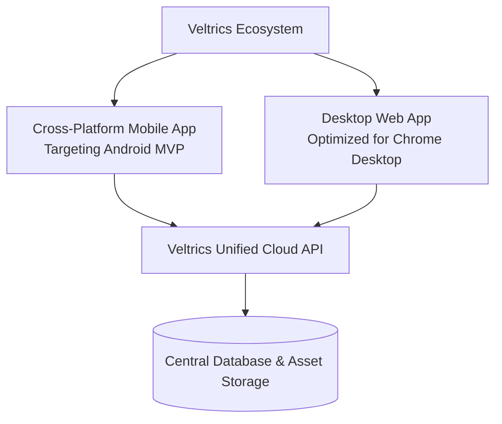

# Veltrics Fleet & Vehicle Management — Product Brief

> **Reads from:** Initial Product Vision & Strategic Market Research (`specs/perplexity chat on EZ Fleet.md`)  
> **Status:** ✅ Approved  
> **Author:** Obsessive SaaS Founder Persona (App Architect)  
> **Target Launch Scope:** Global MVP (Android + Web Desktop)

---

## 1. Executive Summary & Vision

**Veltrics Fleet & Vehicle Management** is a multi-tier SaaS platform designed to manage individual vehicles and commercial fleets seamlessly from a single unified ecosystem. 

The product executes a **dual-wedge growth strategy**:
1. **Consumer Wedge (Free Tier):** Captures individual car owners and families needing a simple, reliable maintenance logbook and routine service reminder system. This fuels organic adoption, dogfooding, and low-cost user acquisition while offsetting infrastructure overhead via subtle ad monetization and strict usage quotas.
2. **Commercial Expansion (Pro & Enterprise Tiers):** Monetizes small-to-medium logistics providers, vehicle rental operators, hotel fleets, and transport businesses with robust financial management, per-vehicle expense tracking, and driver assignment workflows.

By beginning with a clean, low-friction maintenance tracker and scaling into commercial fleet operations, Veltrics bridges the gap between over-complicated enterprise software and ineffective manual spreadsheets.

---

## 2. Problem Statement & Core Insight

### 2.1 The Problem
- **Individual Owners & Families:** Forget routine maintenance intervals (lubricants, transmission fluid, brake pads, belts, spark plugs, tires), leading to expensive mechanical failures, reduced resale values, and unorganized service records.
- **SMB Fleet & Rental Operators:** Struggle to track total cost of ownership (TCO), maintenance downtime, and vehicle profitability across multiple drivers and locations. Most mid-market solutions are over-priced, tied to complex telematics hardware, or lack modern web/mobile UX.

### 2.2 Core Insight
Vehicle upkeep is fundamentally driven by **date and odometer triggers**. By anchoring the core workflow around frictionless maintenance logging and automated alerts, Veltrics builds a trustworthy historical dataset. This dataset naturally scales from personal maintenance logs into commercial cost tracking, expense auditing, and operational profitability metrics.

---

## 3. Target User Personas

| Persona Class | User Target | Key Needs & Pain Points | Primary Interface |
| :--- | :--- | :--- | :--- |
| **Consumer (Free)** | Individual Vehicle Owners & Families | - Never miss oil/filter/belt/tire replacements. - Track service history by date & odometer reading. - Keep expense & fuel records in one place. | Android Mobile App |
| **SMB Fleet Manager (Pro)** | Rental Companies, Small Logistics, Hotel Transport | - Manage 5–50 vehicles across drivers. - Audit per-vehicle maintenance & fuel costs. - Prevent vehicle downtime & track availability. | Chrome Desktop Web App + Android App |
| **Enterprise Fleet Director** | Large Transport & Multi-Branch Operators | - High-volume fleet oversight (>50 vehicles). - Custom quotas, role-based controls, & team access. - Comprehensive financial exporting & audits. | Chrome Desktop Web App |

---

## 4. Solution Overview & MVP Feature Scope

### 4.1 In-Scope for MVP (Phase 1)
- **Multi-Vehicle Registry:** Detailed vehicle profile records (make, model, year, VIN, license plate, initial odometer reading).
- **Maintenance Engine:** 
  - Date-based and odometer-based maintenance scheduling.
  - Granular service item tracking: Engine Lubricants, Transmission Oil, Brake Pads, Halogen Bulbs, Timing Belts, Fan Belts, Spark Plugs, Tire Replacements, Tire Punctures.
  - Service history timeline and document/notes archiving.
- **Core Operations:**
  - Fuel logging (gallons/liters, odometer reading, total cost, fuel station notes).
  - Basic trip logging (date, start/end odometer, purpose, distance).
  - General expense recording (tolls, parking, repairs, insurance renewals).
- **Minimal Summary Dashboards:**
  - Upcoming & overdue maintenance alerts.
  - Total fuel & maintenance spend summaries per vehicle.
  - Fleet availability & odometer overview.

### 4.2 Out-of-Scope / Deferred (Post-MVP)
- **Hardware/GPS Telematics:** Real-time OBD-II tracking, live GPS map streaming (deferred until technical maturity).
- **Complex Analytics:** Per-trip granular P&L, AI-powered predictive failure scoring, driver ranking algorithms.
- **Integrations & AI:** OCR receipt scanning, QuickBooks/Xero synchronization, AI natural-language assistant.
- **Platform Variants:** iOS Native App (deferred to Phase 2).

---

## 5. Multi-Platform Delivery Matrix

- **Android Cross-Platform Native App:** Serves drivers, consumers, and field managers for rapid logging on the go.
- **Desktop Chrome Web App:** Serves fleet managers and business owners needing full desktop productivity, multi-vehicle tables, and data exports.

---

## 6. Business & Monetization Model

Veltrics employs a **3-Tiered Hybrid Monetization Strategy**:

| Tier | Target Audience | Pricing Structure | Feature Set & Quotas | Monetization Vector |
| :--- | :--- | :--- | :--- | :--- |
| **Free Tier** | Consumer / Individual | $0 / month | - Max 3 Vehicles (+ 2 ad-rewarded = 5 max) - Max 3 Drivers (+ 2 ad-rewarded = 5 max) - Basic maintenance reminders & logs - Standard fuel & trip logs - Includes native/banner ads | Ad Revenue & Freemium Upgrade Triggers |
| **Pro Tier** | Small Fleet / SMB (Rentals, Logistics) | Monthly Paid Subscription (Per Vehicle or Flat Pack) | - Up to 25 Vehicles - **Ad-Free Experience** - Advanced maintenance categories - Exportable PDF/CSV reports - Higher data storage quotas | Recurring SaaS Subscription (ARR/MRR) |
| **Enterprise Tier** | Large Transport / Multi-Location | Custom Monthly / Annual Subscription | - Unlimited / Highest vehicle quotas - Multi-user role management - Dedicated support & custom reports - Priority feature requests | Enterprise Contracts & Custom Support |

---

## 7. Success Metrics & 90-Day MVP Targets

To validate product-market fit (PMF) and operational stability, the 90-day post-launch benchmarks are defined as follows:

| Metric Category | Target KPI (Day 90) | Rationale |
| :--- | :--- | :--- |
| **Total Tracked Assets** | **> 500 Active Vehicles** | Proves database scalability and asset volume capture across free & paid users. |
| **Consumer Adoption** | **> 100 Active Free Users** | Validates user retention on mobile maintenance logging and ad monetization. |
| **Commercial Conversion** | **> 25 Paying Pro SMB Accounts** | Demonstrates willingness to pay among small fleet, rental, and logistics operators. |
| **Product Engagement** | **> 60% Monthly Active Retention** | Ensures users log maintenance and fuel entries regularly. |

---

## 8. Strategic Risks & Mitigation

1. **Ad Experience Friction:** Excessive or intrusive ads could drive away consumer dogfooders.  
   *Mitigation:* Implement non-intrusive banner/native ads outside core data entry flows.
2. **Data Entry Friction:** Manual odometer logging may become tedious for drivers without telematics.  
   *Mitigation:* Optimize mobile logging screens to require 3 taps or fewer for standard entries.
3. **Desktop vs. Mobile Code Divergence:** Maintaining separate platform experiences could increase engineering cost.  
   *Mitigation:* Utilize cross-platform frameworks (e.g. Flutter or React Native for Web/Mobile shared logic) to maximize code reusability.

---

## 9. Next Steps & Approval Gate

- **Next Stage:** `★ TECH STACK INTERLUDE` (`01b-tech-stack.md`) led by the *Senior Staff Engineer* persona.
- **Gate Confirmation:** Please review this Product Brief (`product-specs/01-product-brief.md`).
