# Veltrics Fleet & Vehicle Management — Tech Stack

> **Reads from:** [01-product-brief.md](file:///e:/Non_Office/Dev_Space/vibe_skool/veltrics/product-specs/01-product-brief.md)  
> **Status:** ✅ Approved  
> **Author:** Senior Staff Engineer Persona (App Architect)  
> **Stage:** ★ Tech Stack Interlude

---

## 1. Stack Philosophy & Guiding Principles

Veltrics serves two distinct user surfaces — an **Android mobile app** for drivers and consumers, and a **Chrome Desktop web app** for fleet managers — backed by a unified cloud API. The tech stack must satisfy three non-negotiable constraints drawn from the Product Brief:

1. **Maximum code sharing** between mobile and web clients to prevent the "code divergence" risk explicitly flagged in the Product Brief (Risk #3).
2. **MVP-first cost efficiency** — serverless and managed services that scale to zero, minimizing infrastructure spend until the 90-day KPIs (500 vehicles, 100 free users, 25 paying accounts) are validated.
3. **Pakistan + International payment coverage** — the monetization model requires both local (Visa/MC, Easypaisa, JazzCash) and international (Stripe) billing channels from Day 1.

Flutter (Dart) on the frontend and FastAPI (Python) on the backend form the two pillars. Firebase provides managed authentication and real-time capabilities. Google Cloud Platform (GCP) hosts all infrastructure — Cloud Run for the API, Cloud SQL for PostgreSQL, and Firebase Hosting for the Flutter web build.

---

## 2. Recommended Stack Table

| Layer | Technology | Version / Tier | Rationale |
| :--- | :--- | :--- | :--- |
| **Mobile Client** | Flutter (Dart) | Stable channel (≥ 3.x) | Single codebase for Android + Web. Material 3 design system. Hot reload accelerates MVP iteration. |
| **Web Client** | Flutter Web | Same codebase | Compiled from the same Flutter project. Eliminates mobile/web code divergence entirely. |
| **Backend Framework** | FastAPI (Python) | ≥ 0.110 | Async-first, auto-generated OpenAPI/Swagger docs, native Pydantic validation. Ideal for strongly-typed REST APIs consumed by Flutter. |
| **ORM** | SQLAlchemy 2.0 | ≥ 2.0 | Industry-standard Python ORM. Async support via `asyncpg`. Alembic for schema migrations. |
| **Database** | PostgreSQL | 15+ (Cloud SQL) | Relational model fits vehicle → maintenance → expense → fuel log hierarchies. JSONB columns available for flexible metadata. |
| **Database Hosting** | Cloud SQL for PostgreSQL | GCP Managed | Automatic backups, point-in-time recovery, read replicas when needed. Zero DBA overhead for MVP. |
| **Authentication** | Firebase Auth | Free tier → Blaze | Email/password, Google Sign-In, Facebook Login, phone OTP. JWTs verified server-side via `firebase-admin` Python SDK. Role claims (consumer/fleet_manager/driver/admin) stored as custom claims. |
| **File Storage** | Firebase Storage (Cloud Storage bucket) | Blaze plan | Vehicle photos, service receipts, document uploads. Firebase Security Rules + signed URLs for access control. |
| **API Hosting** | Cloud Run | GCP Serverless | Scales to zero (cost-efficient for MVP). Dockerized FastAPI container. Automatic HTTPS. Regional deployment (initial: `asia-south1` Mumbai for Pakistan proximity). |
| **Web Hosting** | Firebase Hosting | Free → Blaze | Global CDN for Flutter Web build. Custom domain support. Automatic SSL. |
| **Caching** | Memorystore for Redis | Basic tier | Session caching, rate limiting, and hot-path query caching (dashboard summaries, upcoming maintenance). Connect via VPC connector from Cloud Run. |
| **Background Jobs / Queues** | Cloud Tasks + Cloud Pub/Sub | GCP Managed | Cloud Tasks: scheduled maintenance reminder checks, overdue alert processing. Pub/Sub: event-driven workflows (e.g., new fuel log triggers dashboard recalculation). |
| **Push Notifications** | Firebase Cloud Messaging (FCM) | Free | Maintenance reminders, overdue alerts, and fleet status notifications delivered to Android devices. Web push for Chrome desktop. |
| **Analytics** | Firebase Analytics + Google Analytics 4 | Free | In-app event tracking (vehicle added, maintenance logged, fuel entry). GA4 for web funnel analysis and conversion tracking. |
| **Crash Reporting** | Firebase Crashlytics | Free | Real-time crash reports for Flutter Android. Integrated with Firebase console. |
| **Monitoring & Logging** | Cloud Monitoring + Cloud Logging | GCP Native | API latency, error rates, Cloud Run metrics. Structured logging from FastAPI. Alerting policies for SLA breaches. |
| **Error Tracking (Backend)** | Sentry | Free tier (5K events/mo) | Python-specific error tracking with stack traces, breadcrumbs, and release tracking. Complements Crashlytics (which covers Flutter client-side). |
| **CI/CD** | Cloud Build + GitHub Actions | GCP + GitHub | Cloud Build: Docker image builds and Cloud Run deployments. GitHub Actions: Flutter build/test, linting, and Firebase Hosting deploy. |
| **Ads (Android)** | Google AdMob | Free Tier only | Banner and native ads in the consumer Free Tier mobile experience. Non-intrusive placement outside data entry flows (per Product Brief Risk #1). |
| **Ads (Web)** | Google AdSense | Free Tier only | Display ads in the Flutter Web Free Tier experience. Same placement policy as mobile. |
| **Payments (International)** | Stripe | Standard | Recurring Pro/Enterprise subscriptions. Stripe Checkout + Customer Portal for self-service billing. Webhook-driven subscription lifecycle management. |
| **Payments (Pakistan Domestic)** | Safepay | Standard | Single integration covering Visa/Mastercard (debit & credit) + Easypaisa + JazzCash mobile wallets. Developer-friendly REST API with webhook support. Lahore-based, SBP-regulated. Eliminates the need for separate card gateway + wallet integrations. |
| **Secrets Management** | Secret Manager | GCP Managed | API keys, database credentials, Stripe/Safepay secrets. Mounted as environment variables in Cloud Run. Zero secrets in source code. |
| **DNS & Domain** | Cloud DNS | GCP Managed | Programmatic DNS management. Custom domains for API (`api.veltrics.com`) and Web (`app.veltrics.com`). |

---

## 3. Architecture Topology (Preview)

```mermaid
graph TB
    subgraph Clients["Client Layer"]
        FlutterAndroid["Flutter Android App<br/>(AdMob · FCM · Crashlytics)"]
        FlutterWeb["Flutter Web App<br/>(AdSense · Firebase Hosting)"]
    end

    subgraph GCP["Google Cloud Platform"]
        subgraph Serverless["Serverless Compute"]
            CloudRun["Cloud Run<br/>FastAPI (Python)"]
            CloudTasks["Cloud Tasks<br/>(Scheduled Jobs)"]
            PubSub["Cloud Pub/Sub<br/>(Event Bus)"]
        end

        subgraph Data["Data Layer"]
            CloudSQL["Cloud SQL<br/>PostgreSQL 15+"]
            Redis["Memorystore<br/>Redis"]
        end

        subgraph Observability["Observability"]
            CloudMonitoring["Cloud Monitoring"]
            CloudLogging["Cloud Logging"]
            Sentry["Sentry"]
        end

        SecretMgr["Secret Manager"]
    end

    subgraph Firebase["Firebase Services"]
        FireAuth["Firebase Auth"]
        FireStorage["Firebase Storage"]
        FCM["Firebase Cloud Messaging"]
        FireAnalytics["Firebase Analytics"]
        Crashlytics["Crashlytics"]
    end

    subgraph Payments["Payment Providers"]
        Stripe["Stripe<br/>(International)"]
        Safepay["Safepay<br/>(Pakistan: Cards + Wallets)"]
    end

    FlutterAndroid -->|"HTTPS / REST"| CloudRun
    FlutterWeb -->|"HTTPS / REST"| CloudRun
    FlutterAndroid --> FireAuth
    FlutterWeb --> FireAuth
    FlutterAndroid --> FireAnalytics
    FlutterAndroid --> Crashlytics
    FlutterWeb --> FireAnalytics

    CloudRun --> CloudSQL
    CloudRun --> Redis
    CloudRun --> FireAuth
    CloudRun --> FireStorage
    CloudRun --> FCM
    CloudRun --> SecretMgr
    CloudRun --> Stripe
    CloudRun --> Safepay
    CloudRun --> PubSub
    CloudTasks --> CloudRun
    PubSub --> CloudRun

    CloudRun --> CloudMonitoring
    CloudRun --> CloudLogging
    CloudRun --> Sentry
```

---

## 4. Missing Layers Checklist

Every production SaaS needs coverage across these layers. This checklist confirms that all critical infrastructure layers have been addressed:

| Layer | Status | Technology Selected | Notes |
| :--- | :---: | :--- | :--- |
| Frontend (Mobile) | ✅ | Flutter (Android) | Single codebase with Web. |
| Frontend (Web) | ✅ | Flutter Web | Same project, compiled to JS/WASM. |
| Backend API | ✅ | FastAPI (Python) on Cloud Run | Auto-scaling serverless containers. |
| Database | ✅ | PostgreSQL 15+ on Cloud SQL | Relational model, managed backups. |
| ORM & Migrations | ✅ | SQLAlchemy 2.0 + Alembic | Async via `asyncpg` driver. |
| Authentication | ✅ | Firebase Auth | JWT verification server-side. Custom claims for roles. |
| Authorization / RBAC | ✅ | Custom middleware in FastAPI | Role-based access using Firebase custom claims (`consumer`, `fleet_manager`, `driver`, `admin`). Enforced at API layer. |
| File / Asset Storage | ✅ | Firebase Storage (Cloud Storage) | Vehicle photos, receipts, documents. |
| Caching | ✅ | Memorystore for Redis | Dashboard queries, session data, rate limiting. |
| Background Jobs | ✅ | Cloud Tasks | Scheduled maintenance checks, reminder dispatch. |
| Event Bus / Queues | ✅ | Cloud Pub/Sub | Decoupled event processing (fuel log → dashboard update). |
| Push Notifications | ✅ | Firebase Cloud Messaging (FCM) | Maintenance reminders to Android + Web Push. |
| Analytics | ✅ | Firebase Analytics + GA4 | In-app events + web funnels. |
| Crash Reporting | ✅ | Firebase Crashlytics | Flutter Android crash traces. |
| Monitoring | ✅ | Cloud Monitoring + Cloud Logging | API health, latency, error budgets. |
| Error Tracking (Backend) | ✅ | Sentry (Free tier) | Python stack traces, release tracking. |
| CI/CD | ✅ | Cloud Build + GitHub Actions | Automated builds, tests, deploys. |
| Ads (Mobile) | ✅ | Google AdMob | Free Tier only, non-intrusive banners. |
| Ads (Web) | ✅ | Google AdSense | Free Tier only. |
| Payments (International) | ✅ | Stripe | Recurring SaaS billing, webhooks. |
| Payments (Pakistan) | ✅ | Safepay | Cards + Easypaisa + JazzCash in one integration. |
| Secrets Management | ✅ | GCP Secret Manager | No secrets in source code. |
| DNS / Domain | ✅ | Cloud DNS | Programmatic, GCP-native. |
| Email (Transactional) | ⚠️ Deferred | TBD (SendGrid / Mailgun / Firebase Extensions) | Not required for MVP. Push notifications cover reminders. Evaluate when email invoices or onboarding drips are needed. |
| Feature Flags | ⚠️ Deferred | TBD (Firebase Remote Config or LaunchDarkly) | Not required for MVP. Add when A/B testing or gradual rollouts are needed. |
| CDN (API) | ⚠️ Deferred | Cloud CDN | Not required for MVP. Cloud Run's built-in load balancer suffices. Add when API traffic exceeds regional capacity. |
| Search (Full-Text) | ⚠️ Deferred | TBD (PostgreSQL `tsvector` or Typesense) | PostgreSQL's native full-text search is sufficient for MVP vehicle/maintenance search. |

---

## 5. Tech Decision Log

Every significant stack choice is logged with its rationale, alternatives considered, and risk profile. This log is the authoritative reference for future architectural reviews.

### TDL-001: Flutter over React Native for Cross-Platform

| Attribute | Detail |
| :--- | :--- |
| **Decision** | Use Flutter (Dart) as the single client framework for Android and Web. |
| **Rationale** | Flutter compiles to native Android ARM code and JavaScript/WASM for web from a single codebase. Material 3 design system provides pixel-perfect consistency across platforms. Hot reload accelerates MVP iteration speed. Eliminates the Product Brief's Risk #3 (desktop/mobile code divergence) entirely. |
| **Alternatives Rejected** | **React Native + React Native Web:** Requires separate web adaptation layer; CSS-in-JS inconsistencies between platforms. **Separate codebases (Kotlin + React):** Maximum divergence risk; doubles engineering effort. |
| **Risk** | Flutter Web performance for complex data tables (fleet manager dashboards) may require `CanvasKit` renderer, increasing initial bundle size (~2MB). Mitigated by lazy loading and route-level code splitting. |
| **Reversibility** | Low. Framework choice is foundational. Migration cost is a full rewrite. |

### TDL-002: FastAPI over Django/Flask for Backend

| Attribute | Detail |
| :--- | :--- |
| **Decision** | Use FastAPI (Python) as the backend API framework. |
| **Rationale** | Async-first design pairs naturally with `asyncpg` (async PostgreSQL driver) and Cloud Run's concurrent request handling. Auto-generated OpenAPI/Swagger documentation enables Flutter team to consume APIs without manual spec maintenance. Pydantic models enforce strict request/response validation, reducing integration bugs. |
| **Alternatives Rejected** | **Django + DRF:** Heavier ORM (would conflict with SQLAlchemy choice); synchronous by default; admin panel unnecessary for API-only backend. **Flask:** Lacks built-in async support, validation, and auto-docs — all of which FastAPI provides natively. |
| **Risk** | Python's GIL limits CPU-bound parallelism. Mitigated by Cloud Run's horizontal auto-scaling — each container instance handles I/O-bound workloads efficiently; CPU-heavy tasks (report generation) offloaded to Cloud Tasks. |
| **Reversibility** | Medium. API contracts (OpenAPI spec) are portable. Backend could be rewritten in Go/Node without client changes. |

### TDL-003: Cloud SQL for PostgreSQL over Firestore/AlloyDB

| Attribute | Detail |
| :--- | :--- |
| **Decision** | Use Cloud SQL for PostgreSQL as the primary database. |
| **Rationale** | Veltrics' data model is inherently relational — vehicles have many maintenance records, fuel logs, expenses, and trips. Foreign key constraints, JOINs, and transactional integrity are critical for financial reporting (Pro/Enterprise tier expense audits). Cloud SQL provides automated backups, point-in-time recovery, and read replicas without DBA overhead. |
| **Alternatives Rejected** | **Firestore:** Document model creates denormalization complexity for relational vehicle → log hierarchies; aggregation queries (total spend per vehicle per month) require composite indexes or client-side computation. **AlloyDB:** Superior performance but significantly higher cost; overkill for MVP scale (target: 500 vehicles at Day 90). |
| **Risk** | Cloud SQL does not scale to zero — minimum instance cost (~$7–10/month for `db-f1-micro`). Acceptable for MVP budget. Upgrade to `db-custom` when Pro/Enterprise revenue covers infrastructure. |
| **Reversibility** | High. PostgreSQL is portable. Can migrate to AlloyDB, Aurora, or self-hosted PostgreSQL with minimal schema changes. |

### TDL-004: Firebase Auth over Custom JWT / Auth0

| Attribute | Detail |
| :--- | :--- |
| **Decision** | Use Firebase Auth as the identity provider. |
| **Rationale** | Native Flutter SDK (`firebase_auth`) provides seamless client integration. Supports email/password, Google Sign-In, and phone OTP out of the box — covering consumer (email) and driver (phone) registration flows. Custom claims enable role-based access control (`consumer`, `fleet_manager`, `driver`, `admin`) without a separate RBAC database. Free for up to 50K MAU (well beyond 90-day MVP targets). |
| **Alternatives Rejected** | **Custom JWT auth:** Requires building registration, password reset, token refresh, and rate limiting from scratch — weeks of engineering for no differentiation. **Auth0/Clerk:** Paid at scale; external dependency outside GCP ecosystem; less native Flutter integration. |
| **Risk** | Firebase Auth custom claims are limited to 1000 bytes per user. Sufficient for role + organization_id + tier metadata. If claims grow complex, overflow to a `user_profiles` PostgreSQL table (planned in data model). |
| **Reversibility** | Medium. Firebase Auth JWTs are standard. Migration requires re-issuing tokens and updating client SDK, but API verification logic (checking JWT claims) remains structurally identical. |

### TDL-005: Cloud Run over GKE / App Engine

| Attribute | Detail |
| :--- | :--- |
| **Decision** | Deploy FastAPI on Cloud Run (serverless containers). |
| **Rationale** | Scales to zero when idle — critical for MVP cost control before revenue validates. Supports standard Docker containers, avoiding vendor lock-in. Automatic HTTPS and load balancing. Cold start (~1–2s for Python) is acceptable for a SaaS dashboard API (not a real-time trading system). Regional deployment in `asia-south1` (Mumbai) provides low latency to Pakistan users. |
| **Alternatives Rejected** | **GKE:** Kubernetes operational overhead unjustified for a single API service at MVP scale. Reserved for post-product-market-fit when microservice decomposition is warranted. **App Engine Flexible:** Less granular scaling control than Cloud Run; legacy deployment model. **Compute Engine:** Maximum overhead; manual scaling, patching, and provisioning. |
| **Risk** | Cold starts may cause first-request latency spikes after idle periods. Mitigated by Cloud Run's `min-instances=1` setting once traffic justifies the cost (~$5/month for always-warm). |
| **Reversibility** | High. Dockerized FastAPI can deploy to any container platform (GKE, AWS ECS, Fly.io) without code changes. |

### TDL-006: Safepay for Pakistan Domestic Payments

| Attribute | Detail |
| :--- | :--- |
| **Decision** | Use Safepay as the Pakistan domestic payment gateway for Visa/Mastercard (debit & credit) + Easypaisa + JazzCash mobile wallets. |
| **Rationale** | Single integration covering all required Pakistan payment methods. Developer-friendly REST API with webhook support (similar to Stripe's DX). SBP (State Bank of Pakistan) regulated. Eliminates the need for separate card gateway (e.g., HBL Pay) + separate mobile wallet integrations (Easypaisa API + JazzCash API). Based in Lahore — local support and compliance. Supports PKR settlements directly to Pakistani bank accounts. |
| **Alternatives Rejected** | **Direct Easypaisa + JazzCash APIs:** Two separate integrations, inconsistent API quality, more maintenance. **PayFast (Avanza):** Less modern API design; webhook support less mature. **1Link/HBL for cards + separate wallet integrations:** Three separate integrations; highest engineering overhead. |
| **Risk** | Safepay is a younger company compared to established banks. Mitigated by Stripe as the fallback international gateway — if Safepay has downtime, international users are unaffected. Pakistan-domestic-only risk is bounded. |
| **Reversibility** | High. Payment gateway integrations are API-based and isolated behind a payment service abstraction layer. Swapping Safepay for another gateway requires updating one integration module. |

### TDL-007: Stripe for International Payments

| Attribute | Detail |
| :--- | :--- |
| **Decision** | Use Stripe for all international (non-Pakistan) Pro and Enterprise subscription billing. |
| **Rationale** | Industry standard for SaaS recurring billing. Stripe Checkout provides hosted payment pages (PCI compliance offloaded). Customer Portal enables self-service subscription management (upgrade, downgrade, cancel). Webhook-driven lifecycle management integrates cleanly with FastAPI. Supports 135+ currencies. |
| **Alternatives Rejected** | **Paddle:** Higher fees; less control over billing UX. **LemonSqueezy:** Primarily for digital products; less suited for SaaS tier management. |
| **Risk** | Stripe Atlas entity may be required if operating from Pakistan without a US/EU business entity. Evaluate during pre-launch legal setup. |
| **Reversibility** | Medium. Stripe's subscription data model is proprietary. Migration requires re-creating subscriptions on the new platform. API abstraction layer minimizes code-level impact. |

---

## 6. Development Environment & Tooling

| Tool | Purpose |
| :--- | :--- |
| **Flutter SDK** (stable channel) | Client development, hot reload, widget testing |
| **Python 3.11+** | Backend runtime (FastAPI, SQLAlchemy, Alembic) |
| **Docker** | Containerize FastAPI for Cloud Run deployment |
| **VS Code / Android Studio** | IDE (Flutter + Dart plugins, Python extensions) |
| **GitHub** | Source control, pull requests, code review |
| **GitHub Actions** | CI: lint, test, build Flutter APK/Web, push Docker images |
| **Cloud Build** | CD: Build Docker images, deploy to Cloud Run |
| **Firebase CLI** | Deploy hosting, manage auth, configure storage rules |
| **gcloud CLI** | Cloud Run, Cloud SQL, Secret Manager, Cloud Tasks management |
| **Alembic** | PostgreSQL schema migrations |
| **Postman / Swagger UI** | API testing (FastAPI's auto-generated `/docs` endpoint) |
| **Sentry CLI** | Release tracking, source map uploads |

---

## 7. Cost Estimate — MVP Phase (90-Day Window)

| Service | Estimated Monthly Cost | Notes |
| :--- | :--- | :--- |
| Cloud Run | $0–5 | Scales to zero. 2M free requests/month. `min-instances=0` during MVP. |
| Cloud SQL (db-f1-micro) | $7–10 | Smallest managed PostgreSQL instance. Sufficient for 500 vehicles. |
| Memorystore Redis (Basic, 1GB) | $30–35 | Smallest tier. Can defer to MVP Phase 2 if caching isn't critical at launch. |
| Firebase Auth | $0 | Free for up to 50K MAU. |
| Firebase Hosting | $0 | Free tier: 10GB storage, 360MB/day transfer. |
| Firebase Storage | $0–2 | Free tier: 5GB storage, 1GB/day download. |
| Cloud Tasks / Pub/Sub | $0 | Free tier covers MVP volumes. |
| FCM | $0 | Free, unlimited messages. |
| Firebase Analytics / GA4 | $0 | Free. |
| Crashlytics | $0 | Free. |
| Cloud Monitoring / Logging | $0–5 | Free tier: 50GB logs/month. |
| Sentry | $0 | Free tier: 5K events/month. |
| Secret Manager | $0 | Free tier: 6 active secret versions. |
| **Total Estimated** | **$37–57/month** | Before payment gateway fees. Redis is the largest line item — can defer if needed. |

> **Without Redis (deferred):** $7–22/month. This is the absolute minimum viable infrastructure cost.

---

## 8. Key Architectural Constraints for Stage 2

The following constraints, established by this tech stack, must be respected in the High-Level Architecture (Stage 2):

1. **API-first boundary:** Flutter clients (mobile + web) communicate exclusively with the FastAPI backend via HTTPS REST endpoints. No direct client-to-PostgreSQL connections.
2. **Firebase Auth as the sole identity layer:** All authentication flows (registration, login, token refresh) go through Firebase Auth. The FastAPI backend verifies Firebase JWTs on every request.
3. **Role enforcement at API layer:** Firebase custom claims carry role identifiers. FastAPI middleware enforces RBAC. No client-side-only access control.
4. **Payment gateway abstraction:** Stripe and Safepay are wrapped behind a common payment service interface in FastAPI. The Flutter client calls a unified `/api/payments/*` endpoint — never interacts with Stripe/Safepay SDKs directly.
5. **Cloud Run regional deployment:** Initial deployment in `asia-south1` (Mumbai). Multi-region expansion is a post-MVP concern.
6. **PostgreSQL is the single source of truth:** Firestore is NOT used as a database. Firebase services are limited to Auth, Storage, Hosting, Analytics, Crashlytics, and FCM.

---

## 9. Next Steps & Approval Gate

- **Next Stage:** `STAGE 2 — High-Level Architecture` (`02-architecture.md`) led by the *Senior Software Architect* persona.
- **Gate Confirmation:** Please review this Tech Stack document (`product-specs/01b-tech-stack.md`).

> Does this look right, or shall we refine anything before moving on?
