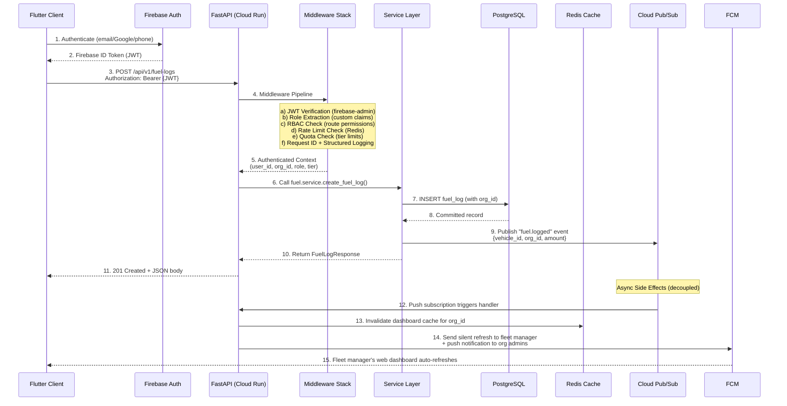
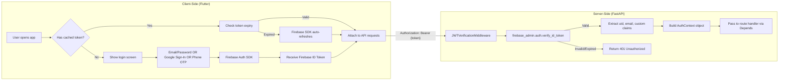
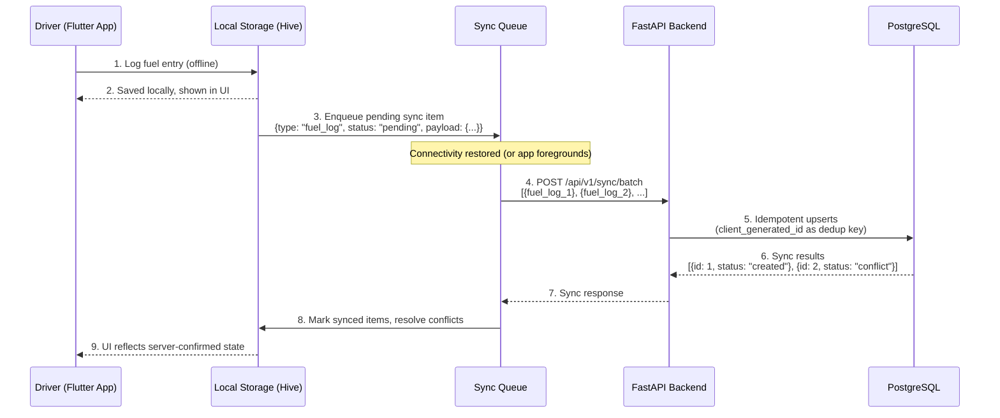
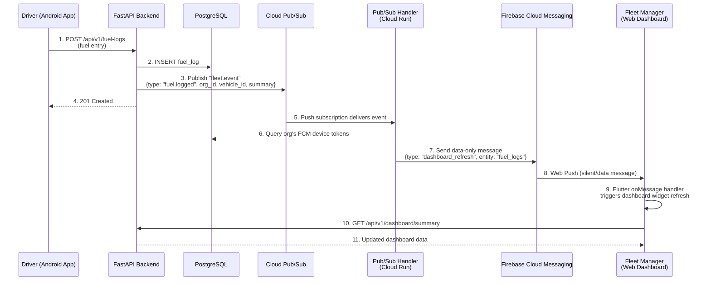
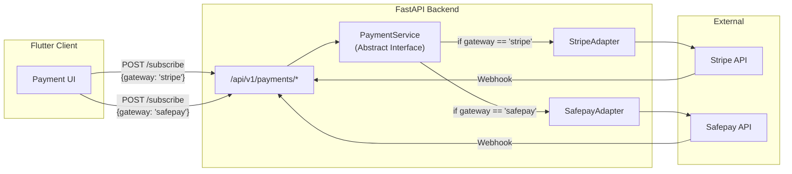
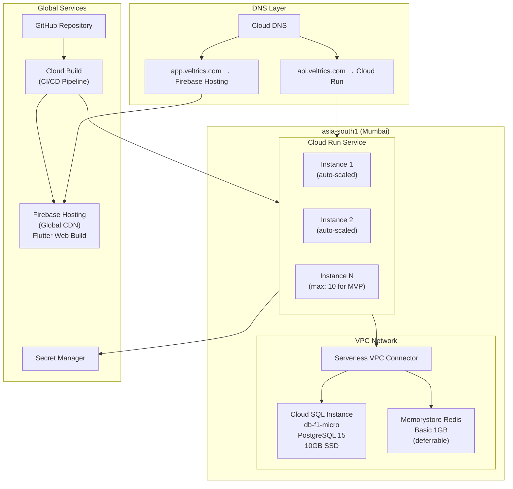

# Veltrics Fleet & Vehicle Management — High-Level Architecture

> **Reads from:** [01-product-brief.md](file:///e:/Non_Office/Dev_Space/vibe_skool/veltrics/product-specs/01-product-brief.md), [01b-tech-stack.md](file:///e:/Non_Office/Dev_Space/vibe_skool/veltrics/product-specs/01b-tech-stack.md)  
> **Status:** ✅ Approved  
> **Author:** Senior Software Architect Persona (App Architect)  
> **Stage:** STAGE 2 — High-Level Architecture

---

## 1. Architecture Philosophy

Veltrics is a multi-tier SaaS platform that serves two distinct user surfaces — an Android mobile app for consumers, drivers, and field managers, and a Chrome Desktop web app for fleet operators — both powered by a single Flutter codebase talking to a unified FastAPI backend.

The architecture follows three guiding principles inherited from the Product Brief and Tech Stack decisions:

1. **Modular Monolith** — A single deployable Cloud Run service with well-defined internal domain modules. Clean boundaries enable future microservice extraction without upfront operational overhead.
2. **API-First** — Flutter clients interact exclusively with versioned REST endpoints (`/api/v1/*`). No direct client-to-database access. The OpenAPI spec is the contract.
3. **Event-Driven Side Effects** — Core request-response flows stay synchronous and fast. Side effects (notifications, dashboard cache invalidation, audit logging) are dispatched asynchronously via Cloud Pub/Sub.

---

## 2. Architecture Pattern: Modular Monolith

### 2.1 Why Modular Monolith

| Consideration | Decision |
|:---|:---|
| **Team size** | Solo / small team at MVP. A single deployable unit eliminates inter-service networking, distributed tracing, and deployment orchestration overhead. |
| **Decomposition readiness** | Each domain module has a defined public interface (Python package with `__init__.py` exports). Refactoring a module into a standalone Cloud Run service requires extracting it and pointing the API gateway — not rewriting business logic. |
| **Shared transaction scope** | Vehicle creation, initial maintenance schedule setup, and organization quota checks can participate in a single PostgreSQL transaction. Microservices would require sagas or eventual consistency for Day 1 features. |
| **Operational simplicity** | One Docker image. One Cloud Run service. One deployment pipeline. One log stream. One health check. |

### 2.2 Module Inventory

The FastAPI application is organized into the following domain modules. Each module owns its own SQLAlchemy models, Pydantic schemas, service layer, and API router:

| Module | Responsibility | Key Entities |
|:---|:---|:---|
| `auth` | Firebase JWT verification, role enforcement middleware, user profile sync | `User`, `UserProfile` |
| `organizations` | Multi-tenant organization management, membership, invitations | `Organization`, `Membership`, `Invitation` |
| `vehicles` | Vehicle registry CRUD, vehicle-to-organization assignment, odometer tracking | `Vehicle`, `OdometerReading` |
| `maintenance` | Maintenance schedule templates, service records, date/odometer trigger engine | `MaintenanceSchedule`, `ServiceRecord`, `ServiceItem` |
| `fuel` | Fuel log CRUD, fuel efficiency calculations | `FuelLog` |
| `trips` | Trip logging, distance calculation | `TripLog` |
| `expenses` | General expense recording (tolls, parking, insurance, repairs) | `Expense` |
| `dashboard` | Read-only aggregation endpoints for summaries, upcoming alerts, fleet overview | (no owned entities — reads from other modules) |
| `notifications` | FCM push dispatch, notification preferences, notification history | `Notification`, `NotificationPreference` |
| `payments` | Unified payment gateway abstraction (Stripe + Safepay), subscription lifecycle | `Subscription`, `PaymentEvent`, `Invoice` |
| `ads` | Ad tier gating logic, ad placement configuration | (no owned entities — reads tier from `organizations`) |
| `common` | Shared utilities: pagination, error handling, audit logging, Pub/Sub publisher | (no owned entities) |

### 2.3 Module Dependency Rules

```
┌─────────────────────────────────────────────────────────┐
│                     API Layer (FastAPI Routers)          │
├─────────────────────────────────────────────────────────┤
│  auth │ orgs │ vehicles │ maint │ fuel │ trips │ ...    │
├─────────────────────────────────────────────────────────┤
│                   Service Layer (Business Logic)        │
├─────────────────────────────────────────────────────────┤
│                   Data Layer (SQLAlchemy Models)        │
├─────────────────────────────────────────────────────────┤
│                   Common (Shared Utilities)             │
└─────────────────────────────────────────────────────────┘
```

**Rules:**
1. Modules may depend **only downward** — API → Service → Data → Common.
2. **No circular dependencies** between domain modules. If `maintenance` needs vehicle data, it calls the `vehicles` service layer — never imports `vehicles` models directly.
3. The `dashboard` module is read-only and may aggregate data from any module's service layer.
4. The `common` module has **zero domain dependencies** — it provides utilities only.

---

## 3. System Architecture Diagram

```mermaid
graph TB
    subgraph Clients["Client Layer"]
        FlutterAndroid["Flutter Android App<br/>(AdMob · FCM · Crashlytics)<br/>Offline Queue: Hive/SQLite"]
        FlutterWeb["Flutter Web App<br/>(AdSense · Firebase Hosting)<br/>FCM Web Push"]
    end

    subgraph FirebaseServices["Firebase Services"]
        FireAuth["Firebase Auth<br/>(Email · Google · Facebook · Phone OTP)"]
        FireStorage["Firebase Storage<br/>(Photos · Receipts · Docs)"]
        FCM["Firebase Cloud Messaging<br/>(Android Push + Web Push)"]
        FireAnalytics["Firebase Analytics + GA4"]
        Crashlytics["Crashlytics"]
    end

    subgraph GCP["Google Cloud Platform — asia-south1"]
        subgraph Compute["Serverless Compute"]
            CloudRun["Cloud Run<br/>FastAPI Modular Monolith<br/>(Dockerized Python 3.11+)"]
            CloudTasks["Cloud Tasks<br/>(Scheduled Jobs:<br/>Maintenance Checks,<br/>Overdue Alerts)"]
            PubSub["Cloud Pub/Sub<br/>(Event Bus:<br/>fuel.logged, maintenance.completed,<br/>vehicle.created, payment.received)"]
        end

        subgraph DataLayer["Data Layer"]
            CloudSQL["Cloud SQL<br/>PostgreSQL 15+<br/>(Shared Schema Multi-Tenancy)"]
            Redis["Memorystore Redis<br/>(Rate Limiting · Dashboard Cache<br/>· Quota Counters)"]
        end

        subgraph Security["Security"]
            SecretMgr["Secret Manager<br/>(DB Creds · Stripe Keys<br/>· Safepay Keys · FCM Keys)"]
            VPC["VPC Connector<br/>(Cloud Run ↔ Cloud SQL<br/>Cloud Run ↔ Redis)"]
        end

        subgraph Observability["Observability"]
            CloudMonitoring["Cloud Monitoring<br/>(Latency · Error Rates · SLOs)"]
            CloudLogging["Cloud Logging<br/>(Structured JSON Logs)"]
            Sentry["Sentry<br/>(Python Error Tracking)"]
        end
    end

    subgraph Payments["Payment Providers"]
        Stripe["Stripe<br/>(International Subscriptions<br/>Checkout + Customer Portal)"]
        Safepay["Safepay<br/>(Pakistan: Visa/MC<br/>+ Easypaisa + JazzCash)"]
    end

    %% Client → Firebase Auth
    FlutterAndroid -->|"1. Auth (Firebase SDK)"| FireAuth
    FlutterWeb -->|"1. Auth (Firebase SDK)"| FireAuth

    %% Client → Cloud Run API
    FlutterAndroid -->|"2. HTTPS REST /api/v1/*<br/>Bearer: Firebase JWT"| CloudRun
    FlutterWeb -->|"2. HTTPS REST /api/v1/*<br/>Bearer: Firebase JWT"| CloudRun

    %% Client → Firebase Direct
    FlutterAndroid --> FireAnalytics
    FlutterAndroid --> Crashlytics
    FlutterWeb --> FireAnalytics

    %% Cloud Run → Data
    CloudRun -->|"SQL via asyncpg<br/>VPC Connector"| CloudSQL
    CloudRun -->|"Cache/Rate Limit<br/>VPC Connector"| Redis

    %% Cloud Run → Firebase
    CloudRun -->|"3. Verify JWT<br/>(firebase-admin SDK)"| FireAuth
    CloudRun -->|"Signed URLs"| FireStorage
    CloudRun -->|"4. Send Push<br/>(firebase-admin SDK)"| FCM

    %% Cloud Run → Events
    CloudRun -->|"Publish Events"| PubSub
    PubSub -->|"Push Subscription<br/>(HTTP POST)"| CloudRun

    %% Cloud Tasks → Cloud Run
    CloudTasks -->|"Scheduled HTTP<br/>Invocations"| CloudRun

    %% Cloud Run → Payments
    CloudRun -->|"Subscriptions API"| Stripe
    CloudRun -->|"Checkout API"| Safepay
    Stripe -->|"Webhooks"| CloudRun
    Safepay -->|"Webhooks"| CloudRun

    %% Cloud Run → Security
    CloudRun --> SecretMgr
    CloudRun --- VPC

    %% Cloud Run → Observability
    CloudRun --> CloudMonitoring
    CloudRun --> CloudLogging
    CloudRun --> Sentry

    %% FCM → Clients (Push)
    FCM -->|"5. Push Notification<br/>(Silent Refresh + Alert)"| FlutterAndroid
    FCM -->|"5. Web Push<br/>(Silent Refresh + Badge)"| FlutterWeb
```



---

## 4. Core Data Flow: Request Lifecycle

Every API request follows this standardized pipeline:



### 4.1 Middleware Stack (Execution Order)

| Order | Middleware | Responsibility | Failure Response |
|:---|:---|:---|:---|
| 1 | `RequestIdMiddleware` | Assigns a UUID to every request. Attaches to structured logs and response headers. | — (never fails) |
| 2 | `CORSMiddleware` | Allows `app.veltrics.com` and `localhost:*` origins. | 403 Forbidden |
| 3 | `JWTVerificationMiddleware` | Extracts `Authorization: Bearer` header, verifies Firebase JWT via `firebase-admin` SDK, extracts `uid`, `email`, custom claims (`role`, `org_id`, `tier`). | 401 Unauthorized |
| 4 | `RBACMiddleware` | Checks if the user's role has permission for the requested route + HTTP method. Permission map defined per module. | 403 Forbidden |
| 5 | `RateLimitMiddleware` | Checks per-user request rate against Redis counters. Configurable per tier (Free: 60 req/min, Pro: 300 req/min, Enterprise: 1000 req/min). | 429 Too Many Requests |
| 6 | `QuotaMiddleware` | Checks tier-specific quotas (Free: max 3 vehicles, Pro: max 25 vehicles). Reads quota limits from DB `organization` table, caches in Redis. | 403 Quota Exceeded |
| 7 | `AuditLogMiddleware` | Logs request method, path, user_id, org_id, response status, and latency to Cloud Logging (structured JSON). | — (fire-and-forget) |

---

## 5. Authentication & Authorization Strategy

### 5.1 Authentication Flow

Firebase Auth is the **sole identity provider**. The flow differs by platform:



### 5.2 Role-Based Access Control (RBAC)

Firebase custom claims carry the user's role. The FastAPI backend enforces access rules — **never the client**.

| Role | Custom Claim Value | Accessible Modules | Typical User |
|:---|:---|:---|:---|
| `consumer` | `{"role": "consumer", "tier": "free"}` | vehicles (own, max 3), maintenance, fuel, trips, expenses, dashboard (own vehicles) | Individual car owner |
| `driver` | `{"role": "driver", "org_id": "uuid", "tier": "pro"}` | vehicles (assigned), fuel (own logs), trips (own logs), maintenance (read-only) | Fleet driver |
| `fleet_manager` | `{"role": "fleet_manager", "org_id": "uuid", "tier": "pro"}` | All modules scoped to own `org_id`. Full CRUD on vehicles, drivers, maintenance, expenses. Payment management. | Fleet operator / SMB owner |
| `admin` | `{"role": "admin", "org_id": "uuid", "tier": "enterprise"}` | Everything `fleet_manager` can do + organization settings, user management, custom reports, audit logs | Enterprise administrator |

### 5.3 RBAC Enforcement Architecture

```python
# Simplified RBAC dependency injection pattern (FastAPI)

class AuthContext:
    user_id: str        # Firebase UID
    email: str
    role: str           # consumer | driver | fleet_manager | admin
    org_id: str | None  # None for consumers
    tier: str           # free | pro | enterprise

def require_role(*allowed_roles: str):
    """FastAPI dependency that checks the user's role."""
    async def dependency(auth: AuthContext = Depends(get_auth_context)):
        if auth.role not in allowed_roles:
            raise HTTPException(403, "Insufficient permissions")
        return auth
    return dependency

# Usage in route:
@router.post("/api/v1/vehicles")
async def create_vehicle(
    payload: VehicleCreate,
    auth: AuthContext = Depends(require_role("consumer", "fleet_manager", "admin"))
):
    # Quota check happens in middleware — if we're here, the user is within limits
    return await vehicle_service.create(payload, auth)
```

### 5.4 Consumer-to-Organization Upgrade Path

When a Free Tier consumer upgrades to Pro, the system executes this transition:

1. Consumer initiates payment via `/api/v1/payments/subscribe` (Stripe or Safepay).
2. Payment webhook confirms subscription activation.
3. Backend creates an `Organization` record, sets the user as `fleet_manager`.
4. Firebase custom claims are updated: `{"role": "fleet_manager", "org_id": "new-uuid", "tier": "pro"}`.
5. Existing vehicles are migrated to the new organization.
6. Token refresh propagates new claims to the Flutter client.

---

## 6. Multi-Tenancy Architecture

### 6.1 Shared Schema Model

All tenants share the same PostgreSQL tables. Tenant isolation is enforced at two levels:

| Level | Mechanism | Purpose |
|:---|:---|:---|
| **Application Layer** | Every query includes `WHERE organization_id = :org_id` (injected by service layer using `AuthContext.org_id`) | Primary isolation. Prevents cross-tenant data access in application code. |
| **Database Layer** | PostgreSQL Row-Level Security (RLS) policies on all tenant-scoped tables | Safety net. Even if application code has a bug, the database enforces `current_setting('app.current_org_id') = organization_id`. |

### 6.2 Consumer (No Organization) Handling

Free Tier consumers do not belong to an organization. Their data uses a **personal pseudo-organization**:

- On registration, a `personal_org` is created with `is_personal = true` and the consumer as the sole member.
- Quota enforcement: `max_vehicles = 3` for personal orgs.
- When upgrading to Pro, the personal org is converted into a full organization (flag flipped, quota raised).

This design means **every query path is organization-scoped** — no special-casing for consumers vs. fleet users.

### 6.3 Scalability Profile

| Metric | MVP Target (Day 90) | Shared Schema Comfortable Limit | Action at Limit |
|:---|:---|:---|:---|
| Organizations | ~125 (100 consumers + 25 Pro) | 50,000+ | No action needed |
| Total vehicles | 500 | 500,000+ | Partition large tables by `organization_id` |
| Rows per table | ~5,000 | 50,000,000+ | Add read replicas, table partitioning |
| Concurrent queries | ~10-20 | ~500 | Upgrade `db-f1-micro` to `db-custom-2-8` |

---

## 7. API Design & Versioning

### 7.1 URL Structure

All API endpoints follow this convention:

```
https://api.veltrics.com/api/v1/{module}/{resource}
```

| Pattern | Example | Description |
|:---|:---|:---|
| Collection | `GET /api/v1/vehicles` | List vehicles (paginated, filtered by org) |
| Resource | `GET /api/v1/vehicles/{id}` | Get single vehicle |
| Nested | `GET /api/v1/vehicles/{id}/fuel-logs` | Fuel logs for a specific vehicle |
| Action | `POST /api/v1/vehicles/{id}/odometer-readings` | Log a new odometer reading |
| Singleton | `GET /api/v1/dashboard/summary` | Organization dashboard summary |

### 7.2 Versioning Strategy

- **URL-path versioning:** `/api/v1/*` is the current version.
- When breaking changes are needed, `/api/v2/*` is introduced alongside `/api/v1/*`.
- **Deprecation policy:** Old versions are supported for 6 months after a new version launches. Mobile clients may linger on old versions — forced upgrade prompts are sent via FCM after the deprecation window.
- **Non-breaking changes** (new optional fields, new endpoints) do NOT increment the version.

### 7.3 Standard Response Envelope

```json
{
  "data": { ... },
  "meta": {
    "request_id": "uuid",
    "timestamp": "ISO-8601",
    "pagination": {
      "page": 1,
      "per_page": 20,
      "total": 87,
      "total_pages": 5
    }
  },
  "errors": null
}
```

Error responses:

```json
{
  "data": null,
  "meta": {
    "request_id": "uuid",
    "timestamp": "ISO-8601"
  },
  "errors": [
    {
      "code": "QUOTA_EXCEEDED",
      "message": "Free tier allows a maximum of 3 vehicles.",
      "field": null
    }
  ]
}
```

---

## 8. Offline-First Architecture (Flutter Client)

### 8.1 Strategy

Drivers in the field (Pakistan roads, inconsistent cellular connectivity) must be able to log fuel, trips, and maintenance entries without network access. The Flutter app implements an **offline queue with background sync**.

### 8.2 Offline Sync Flow



### 8.3 Conflict Resolution Policy

| Scenario | Resolution | Rationale |
|:---|:---|:---|
| Same record created offline on two devices | **Last-write-wins** based on `client_timestamp` | Fuel/trip logs are append-only — duplicates are unlikely. |
| Record modified on server while offline edit is pending | **Server wins** — client is notified of the conflict and can re-apply changes | Fleet manager edits (e.g., correcting an expense) take priority over stale offline edits. |
| Vehicle deleted on server while offline logs reference it | **Soft delete** — vehicle is marked deleted, but pending offline logs are accepted and flagged for review | Prevents data loss from race conditions. |

### 8.4 Technical Implementation

| Component | Technology | Purpose |
|:---|:---|:---|
| Local storage | **Hive** (Flutter) | Lightweight NoSQL box for offline entries. Fast reads/writes. No native dependency issues (unlike SQLite on web). |
| Sync queue | **Custom Dart isolate** | Background isolate monitors connectivity. On reconnection, processes the queue in FIFO order. |
| Deduplication | **Client-generated UUIDs** | Every entry gets a `client_id` (UUID v4) at creation time. Server uses `client_id` as an idempotent key — re-syncing the same entry is safe. |
| Batch sync endpoint | `POST /api/v1/sync/batch` | Accepts an array of pending entries across entity types. Returns per-item sync results. |
| Web fallback | **Online-only** | Flutter Web does not support Hive isolates. Web users are assumed to have stable connectivity (Chrome Desktop use case). Falls back to simple local storage for unsaved form state. |

---

## 9. Near-Real-Time Updates: Pub/Sub → FCM Pipeline

### 9.1 Strategy

Fleet managers need to see updates (driver logged fuel, maintenance completed, new vehicle added) on their dashboard within seconds — without manual refresh. This is achieved via a **Pub/Sub → FCM silent refresh pipeline** that costs $0 in additional infrastructure.

### 9.2 Event Flow



### 9.3 Event Topics & Message Types

| Pub/Sub Topic | Event Types | Triggered By | FCM Action |
|:---|:---|:---|:---|
| `fleet.events` | `fuel.logged`, `trip.logged`, `expense.created` | Driver/consumer data entry | Silent refresh → dashboard auto-updates |
| `fleet.events` | `maintenance.completed`, `maintenance.overdue` | Service record creation, scheduled check | Push notification (alert) + silent refresh |
| `fleet.events` | `vehicle.created`, `vehicle.updated` | Vehicle CRUD operations | Silent refresh |
| `payment.events` | `subscription.activated`, `subscription.cancelled`, `payment.failed` | Stripe/Safepay webhooks | Push notification (alert) to org admins |

### 9.4 FCM Message Types

| Type | Behavior on Client | Use Case |
|:---|:---|:---|
| **Data-only message** | Handled silently by Flutter `onMessage`. No user-visible notification. Triggers widget rebuild. | Dashboard auto-refresh when tab is active |
| **Notification + data** | Shows browser notification with badge. On click, navigates to relevant screen. | Overdue maintenance alert, payment failure |
| **On-focus poll** | On tab visibility change (`visibilitychange` event), Flutter Web polls `/api/v1/dashboard/summary` | Catch-up after being away from the dashboard |

---

## 10. Third-Party Integration Architecture

### 10.1 Payment Gateway Abstraction

Stripe (international) and Safepay (Pakistan domestic) are wrapped behind a unified payment service. The Flutter client never interacts with payment provider SDKs directly.



### 10.2 Payment Flow (Stripe Example)

1. Client calls `POST /api/v1/payments/subscribe` with `{tier: "pro", gateway: "stripe"}`.
2. `PaymentService` delegates to `StripeAdapter`, which creates a Stripe Checkout Session.
3. Server returns `{checkout_url: "https://checkout.stripe.com/..."}`.
4. Client opens the URL in an in-app browser / new tab.
5. User completes payment on Stripe-hosted page (PCI compliance offloaded).
6. Stripe sends `checkout.session.completed` webhook to `POST /api/v1/payments/webhooks/stripe`.
7. Webhook handler verifies signature, creates `Subscription` record, updates org tier, updates Firebase custom claims.
8. Client polls `/api/v1/payments/status` or receives FCM push confirming activation.

### 10.3 Payment Flow (Safepay Example)

1. Client calls `POST /api/v1/payments/subscribe` with `{tier: "pro", gateway: "safepay"}`.
2. `SafepayAdapter` creates a Safepay checkout session via REST API.
3. Server returns `{checkout_url: "https://sandbox.api.safepay.com/..."}`.
4. User completes payment (supports Visa/MC, Easypaisa, JazzCash from one page).
5. Safepay sends webhook to `POST /api/v1/payments/webhooks/safepay`.
6. Same downstream flow as Stripe — subscription created, claims updated.

### 10.4 Integration Summary Table

| Integration | Direction | Protocol | Auth Mechanism | Error Handling |
|:---|:---|:---|:---|:---|
| Firebase Auth | Client → Firebase, Server verifies | HTTPS + SDK | Firebase SDK (client), `firebase-admin` (server) | Token refresh on 401 |
| Firebase Storage | Server generates signed URLs | HTTPS | Signed URL with expiry | Retry with exponential backoff |
| FCM | Server → FCM → Client | HTTPS (`firebase-admin`) | Service account credentials | Retry failed sends; remove stale tokens |
| Stripe | Server ↔ Stripe | HTTPS REST | API key (Secret Manager) + webhook signature | Idempotency keys on all requests |
| Safepay | Server ↔ Safepay | HTTPS REST | API key (Secret Manager) + webhook signature | Idempotency keys on all requests |
| AdMob | Client-side SDK (Android) | SDK | App ID in `AndroidManifest.xml` | Fallback to empty ad slot |
| AdSense | Client-side embed (Web) | JavaScript snippet | Publisher ID | Fallback to empty container |

---

## 11. Infrastructure Topology

### 11.1 Deployment Architecture



### 11.2 Cloud Run Configuration (MVP)

| Parameter | Value | Rationale |
|:---|:---|:---|
| `min-instances` | `0` | Scale to zero for cost savings. Accept cold start (~1-2s) during MVP. |
| `max-instances` | `10` | Safety cap. 10 instances × 80 concurrent requests = 800 RPS capacity. |
| `concurrency` | `80` | FastAPI async handles I/O-bound workloads efficiently. |
| `memory` | `512 MiB` | Sufficient for FastAPI + SQLAlchemy + firebase-admin. |
| `cpu` | `1` | Single vCPU per instance. |
| `timeout` | `300s` | 5-minute max for report generation endpoints. Standard endpoints complete in <1s. |
| `region` | `asia-south1` | Mumbai — lowest latency to Pakistan (~20ms). |
| `ingress` | `all` | Public internet access (Flutter clients). |
| `vpc-connector` | `veltrics-vpc` | Private access to Cloud SQL and Redis. |

### 11.3 Cloud SQL Configuration (MVP)

| Parameter | Value |
|:---|:---|
| Instance type | `db-f1-micro` (shared core, 614 MB RAM) |
| PostgreSQL version | 15 |
| Storage | 10 GB SSD (auto-increase enabled) |
| Backups | Daily automated, 7-day retention |
| Point-in-time recovery | Enabled |
| High availability | Disabled (MVP) — enable post-PMF |
| Maintenance window | Sunday 03:00 AM PKT |
| Connection | Private IP via VPC connector |

---

## 12. Background Jobs & Scheduled Tasks

### 12.1 Cloud Tasks (Scheduled)

| Task | Schedule | Action |
|:---|:---|:---|
| Maintenance Due Check | Every 6 hours | Scans all active vehicles for upcoming/overdue maintenance items based on date and odometer triggers. Publishes `maintenance.upcoming` or `maintenance.overdue` events to Pub/Sub. |
| Subscription Expiry Check | Daily at 00:00 UTC | Identifies subscriptions expiring within 7 days. Sends reminder notifications via FCM. |
| Stale Token Cleanup | Weekly (Sunday 02:00 UTC) | Removes FCM device tokens that have failed delivery > 3 times. |

### 12.2 Cloud Pub/Sub (Event-Driven)

| Topic | Subscribers | Purpose |
|:---|:---|:---|
| `fleet.events` | Notification handler, Dashboard cache invalidator | Dispatches FCM pushes, invalidates Redis dashboard caches |
| `payment.events` | Subscription manager, Notification handler | Activates/cancels subscriptions, sends payment alerts |
| `audit.events` | Audit log writer | Writes audit trail entries to dedicated `audit_log` table |

---

## 13. Security & Compliance

### 13.1 Security Architecture

| Layer | Measure | Implementation |
|:---|:---|:---|
| **Transport** | TLS 1.3 everywhere | Cloud Run provides automatic HTTPS. Cloud SQL connections encrypted via VPC. |
| **Authentication** | Firebase JWT verification on every request | `firebase-admin` SDK in middleware. Token expiry: 1 hour (Firebase default). |
| **Authorization** | RBAC via Firebase custom claims | Middleware checks role + org_id before route handler executes. |
| **Data isolation** | Shared schema + `organization_id` filtering + PostgreSQL RLS | Two-layer defense: application code + database policies. |
| **Secrets** | GCP Secret Manager | All API keys, DB credentials, webhook secrets stored as managed secrets. Mounted as env vars in Cloud Run at deploy time. |
| **Input validation** | Pydantic models on all endpoints | Strict type checking, field constraints, and custom validators. Invalid requests rejected before reaching the service layer. |
| **SQL injection** | SQLAlchemy parameterized queries | ORM-generated queries use parameterized bindings. No raw SQL concatenation. |
| **Rate limiting** | Redis-backed per-user rate counters | Tiered limits (Free: 60/min, Pro: 300/min, Enterprise: 1000/min). |
| **Webhook verification** | Signature validation on all payment webhooks | Stripe: `stripe.Webhook.construct_event()`. Safepay: HMAC signature header validation. |
| **CORS** | Allowlist-based | Only `app.veltrics.com`, `localhost:*` (dev). No wildcard origins. |
| **File uploads** | Signed URLs with expiry | Firebase Storage signed URLs (1-hour expiry). Server generates URL; client uploads directly. No file data passes through the API. |

### 13.2 Data Privacy & Retention

| Data Category | Retention | Deletion Policy |
|:---|:---|:---|
| User account data | Until account deletion | User can request deletion via app. Cascading soft-delete of all associated data. Hard-delete after 30-day grace period. |
| Vehicle records | Until vehicle removed or account deleted | Soft-delete with 30-day recovery window. |
| Maintenance & fuel logs | Indefinite (user's data) | Deleted with vehicle. Exportable before deletion (CSV/PDF). |
| Payment records | 7 years (financial compliance) | Retained even after account deletion. Anonymized after 7 years. |
| Audit logs | 2 years | Immutable append-only table. Auto-purged after 2 years. |
| Analytics events | Governed by Firebase/GA4 policies | Google-managed retention. |

---

## 14. Scale Profile & Growth Path

### 14.1 MVP Scale Targets (Day 90)

| Metric | Target | Architecture Capacity |
|:---|:---|:---|
| Active users | 100 free + 25 Pro orgs | Cloud Run auto-scaling handles 100x this without config changes |
| Vehicles | 500 | PostgreSQL `db-f1-micro` comfortable to 50,000 rows |
| API requests/day | ~5,000-10,000 | Well within Cloud Run free tier (2M requests/month) |
| Concurrent users | ~20-30 | Single Cloud Run instance handles 80 concurrent requests |
| Database size | ~50 MB | 10 GB SSD allocated (200x headroom) |

### 14.2 Growth Milestones & Architecture Actions

| Milestone | Trigger | Architecture Action |
|:---|:---|:---|
| **1,000 vehicles** | ~3-6 months post-launch | Upgrade Cloud SQL to `db-custom-1-3840` (~$30/month). Enable Redis (if deferred). |
| **10,000 vehicles** | ~12 months | Add Cloud SQL read replica for dashboard queries. Introduce Redis caching for all read endpoints. Set `min-instances=1` on Cloud Run to eliminate cold starts. |
| **50,000 vehicles** | ~18-24 months | Table partitioning by `organization_id` for large tables. Consider extracting `notifications` and `payments` modules into separate Cloud Run services. Evaluate Cloud CDN for API caching. |
| **100,000+ vehicles** | Post-PMF | Full microservice decomposition. GKE migration if operational complexity justifies it. Multi-region deployment (Mumbai + Singapore). AlloyDB evaluation for analytical workloads. |

---

## 15. Repository Structure (Proposed)

```
veltrics/
├── product-specs/              # Architecture & planning docs
├── handoff-prompts/            # Stage handoff prompts
│
├── backend/                    # FastAPI Modular Monolith
│   ├── app/
│   │   ├── main.py             # FastAPI app entry point
│   │   ├── config.py           # Settings (env vars, Secret Manager)
│   │   ├── middleware/         # JWT, RBAC, rate limit, audit
│   │   ├── common/             # Shared utilities, pagination, errors
│   │   ├── auth/               # Auth module
│   │   │   ├── router.py
│   │   │   ├── service.py
│   │   │   ├── schemas.py
│   │   │   └── models.py
│   │   ├── organizations/      # Multi-tenancy module
│   │   ├── vehicles/           # Vehicle registry module
│   │   ├── maintenance/        # Maintenance engine module
│   │   ├── fuel/               # Fuel logging module
│   │   ├── trips/              # Trip logging module
│   │   ├── expenses/           # Expense recording module
│   │   ├── dashboard/          # Aggregation & summary module
│   │   ├── notifications/      # FCM dispatch module
│   │   ├── payments/           # Stripe + Safepay abstraction
│   │   └── ads/                # Ad tier gating module
│   ├── alembic/                # Database migrations
│   ├── tests/                  # Pytest test suite
│   ├── Dockerfile              # Cloud Run container
│   ├── requirements.txt
│   └── pyproject.toml
│
├── frontend/                   # Flutter (Dart) — Android + Web
│   ├── lib/
│   │   ├── main.dart
│   │   ├── app/                # App-level config, routing, theme
│   │   ├── core/               # Shared: API client, auth, offline queue
│   │   ├── features/           # Feature modules (mirroring backend)
│   │   │   ├── auth/
│   │   │   ├── vehicles/
│   │   │   ├── maintenance/
│   │   │   ├── fuel/
│   │   │   ├── trips/
│   │   │   ├── expenses/
│   │   │   ├── dashboard/
│   │   │   └── payments/
│   │   └── shared/             # Shared widgets, constants
│   ├── android/                # Android platform config
│   ├── web/                    # Web platform config
│   ├── test/                   # Widget & integration tests
│   └── pubspec.yaml
│
├── infra/                      # Infrastructure-as-Code
│   ├── cloudbuild.yaml         # Cloud Build pipeline
│   ├── cloud-run/              # Cloud Run service configs
│   └── terraform/              # (Future) IaC for Cloud SQL, Redis, etc.
│
└── .github/
    └── workflows/              # GitHub Actions CI/CD
        ├── backend-ci.yml
        ├── frontend-ci.yml
        └── deploy.yml
```

---

## 16. Architecture Decision Record (ADR) Summary

| ID | Decision | Pattern | Rationale | Reversibility |
|:---|:---|:---|:---|:---|
| ADR-001 | Modular Monolith | Architecture | Solo team, MVP simplicity, shared transactions, single deploy | Medium — extract modules to services later |
| ADR-002 | URL-path API versioning (`/api/v1/*`) | API Design | Simple, explicit, mobile-client-friendly | High — add `/v2/*` alongside |
| ADR-003 | Shared schema multi-tenancy | Data | Simplest for MVP, scales to 50K+ tenants, PostgreSQL RLS as safety net | Medium — migrate to schema-per-tenant if isolation needs change |
| ADR-004 | Offline-first with Hive + sync queue | Client | Drivers need connectivity-resilient logging (Pakistan roads) | Low — offline architecture is pervasive in client code |
| ADR-005 | Polling + FCM push (no SSE/WebSocket) | Real-time | Zero extra infra cost, reuses FCM, 2-5s latency acceptable for MVP | High — can layer SSE on top later |
| ADR-006 | Redis for rate limiting + caching | Security/Performance | Tier-aware throttling, dashboard cache, quota counters | High — can swap for in-memory if Redis is deferred |

---

## 17. Next Steps & Approval Gate

- **Next Stage:** `STAGE 3 — User Journeys` (`03-user-journeys.md`) led by the *FAANG-Veteran UX Designer* persona.
- **Gate Confirmation:** Please review this High-Level Architecture document (`product-specs/02-architecture.md`).

> Does this look right, or shall we refine anything before moving on?
