# Veltrics Fleet & Vehicle Management — User Journeys

> **Reads from:** [01-product-brief.md](file:///e:/Non_Office/Dev_Space/vibe_skool/veltrics/product-specs/01-product-brief.md), [01b-tech-stack.md](file:///e:/Non_Office/Dev_Space/vibe_skool/veltrics/product-specs/01b-tech-stack.md), [02-architecture.md](file:///e:/Non_Office/Dev_Space/vibe_skool/veltrics/product-specs/02-architecture.md)  
> **Status:** ✅ Approved  
> **Author:** FAANG-Veteran UX Designer Persona (App Architect)  
> **Stage:** STAGE 3 — User Journeys

---

## 1. Journey Design Philosophy

Veltrics serves four personas across two surfaces — but acquisition flows through a single funnel: **Consumer-first on Android.** Fleet managers are not acquired from cold web sign-ups; they are *graduated* from satisfied consumers who outgrow the free tier.

This means:

1. **The consumer onboarding journey is the critical path.** It must deliver an "aha moment" within 90 seconds of first launch — before the user has entered a single data point manually.
2. **The fleet manager experience is an expansion journey**, not a separate funnel. The upgrade from Consumer to Pro must feel like unlocking a new wing of a building the user already lives in — not moving to a new building.
3. **Every journey must account for Pakistan road conditions** — intermittent connectivity, refueling at rural stations, maintenance at roadside mechanics. The offline experience is not an edge case; it is the *primary* experience for drivers.
4. **Recovery paths are trust-building moments.** A gracefully handled failure (sync conflict, payment decline, expired session) converts a frustrated user into a loyal one.

### Persona-to-Surface Matrix

| Persona | Primary Surface | Secondary Surface | Acquisition Path |
|:---|:---|:---|:---|
| Consumer (Free) | Android App | — | Direct install (Play Store, word-of-mouth) |
| Fleet Manager (Pro) | Chrome Web App | Android App | Consumer upgrade → Organization creation |
| Driver (Pro) | Android App | — | Invitation from Fleet Manager |
| Admin (Enterprise) | Chrome Web App | Android App | Organization scaling → Enterprise upgrade |

> **Note on Tier Limits:** Free tier limits (max `X` vehicles, max `Y` drivers) have not yet been formally defined. This document uses `X` and `Y` as placeholders. These values will be finalized during the MVP Scoping Gate (Stage 4b). All upgrade prompts reference these variables.

---

## 2. Onboarding Journeys

### UJ-001: Consumer First-Time Onboarding (Android)

**Goal:** Install → First vehicle added → Pre-populated maintenance schedule visible. Target: under 90 seconds.

**Emotional Arc:** Curious → Relieved (sign-up is fast) → *Impressed* (the app already knows my car's maintenance needs) → Committed (set my first reminder).

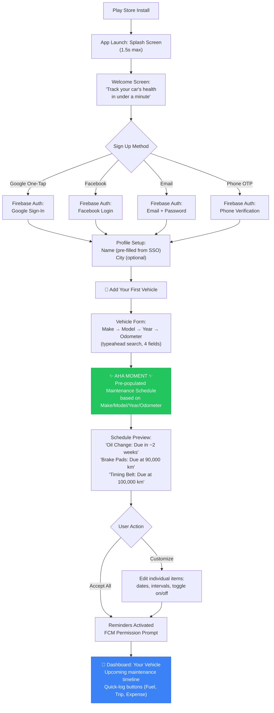

#### Step-by-Step Detail

| Step | Screen | User Action | System Response | Duration Target |
|:---|:---|:---|:---|:---|
| 1 | Splash | — | Branding animation, token check | ≤ 1.5s |
| 2 | Welcome | Swipe through 2 value-prop cards OR tap "Get Started" | Navigate to auth | ≤ 10s |
| 3 | Auth | Tap Google One-Tap / enter email / enter phone | Firebase Auth flow. On success: create `User` + personal pseudo-`Organization` on backend (`POST /api/v1/auth/register`) | ≤ 15s |
| 4 | Profile | Confirm name (pre-filled for Google), optional city | `PATCH /api/v1/users/me` | ≤ 5s |
| 5 | Add Vehicle | Enter Make, Model, Year, current odometer | Typeahead search against local vehicle database. `POST /api/v1/vehicles` | ≤ 20s |
| 6 | **Aha Moment** | View pre-populated maintenance schedule | Backend returns default schedule template for vehicle Make/Model/Year. Scheduled items are calculated from current odometer + date. | ≤ 3s |
| 7 | Schedule Review | Accept all or customize individual items | `POST /api/v1/maintenance/schedules/bulk` | ≤ 15s |
| 8 | FCM Prompt | Allow notifications (Android system prompt) | Register FCM token via `POST /api/v1/notifications/devices` | ≤ 5s |
| 9 | Dashboard | View vehicle card with upcoming maintenance + quick-log buttons | `GET /api/v1/dashboard/summary` | — |

**Total time to Aha Moment:** ~55 seconds (Google One-Tap path) to ~80 seconds (email/phone path).

#### Key Design Decisions

1. **No email verification gate.** Firebase Auth handles email verification asynchronously. The user lands on the dashboard immediately. A subtle banner prompts verification later ("Verify your email to enable password recovery").
2. **Vehicle typeahead, not manual entry.** The vehicle Make/Model/Year selector uses a local database (bundled in APK) to auto-suggest. This eliminates typos, enables pre-populated maintenance schedules, and makes the form feel intelligent.
3. **Pre-populated maintenance schedule is the hook.** The backend stores default maintenance interval templates per vehicle category (sedan, SUV, truck, motorcycle). When the user adds a vehicle, the system calculates the next service date/odometer for each item. The user sees *immediate personalized intelligence* — not an empty app.
4. **FCM prompt comes AFTER value delivery.** Never ask for notification permissions before the user understands why they'd want notifications.

---

### UJ-002: Fleet Manager Onboarding (Consumer Upgrade Path)

**Goal:** Existing consumer decides to upgrade → Organization created → First vehicle added to org → First driver invited. Target: under 5 minutes.

**Prerequisite:** User has been using the app as a Consumer (free tier) and wants to manage more vehicles or add team members.

**Emotional Arc:** Frustrated (hit vehicle limit X or need to add a driver) → Hopeful (upgrade path is clear) → Empowered (organization is set up, driver is invited) → Confident (ready to scale).

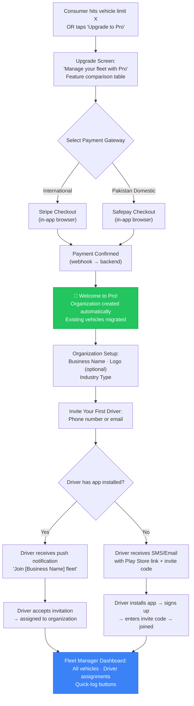

#### Key Design Decisions

1. **Organization is auto-created.** When payment is confirmed, the backend converts the consumer's personal pseudo-organization into a full organization (as defined in Architecture ADR-003). The user does NOT need to create an organization manually. This is a zero-friction upgrade.
2. **Existing vehicles are migrated automatically.** The user's existing vehicles (up to X) are moved to the new organization. No re-entry of data.
3. **Driver invitation via phone number.** Pakistan's primary communication channel is phone (WhatsApp, SMS). The invitation flow prioritizes phone number over email. If the driver already has the app, they get a push notification. If not, they get an SMS with a deep link.
4. **No separate web onboarding flow for fleet managers.** The fleet manager upgrades on Android (where they're already active), then can access the Chrome Web dashboard at `app.veltrics.com` by logging in with the same Firebase Auth credentials.

---

### UJ-003: Driver Invitation & Activation

**Goal:** Fleet manager invites a driver → Driver installs app / opens existing app → Joins organization → Sees assigned vehicles.

**Emotional Arc:** Curious (received invitation) → Easy (sign-up is fast) → Oriented (I see my assigned vehicles and know what to do).

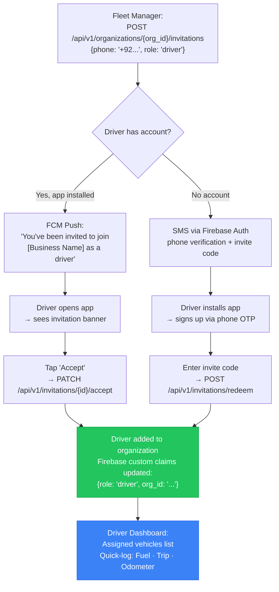

#### Key Design Decisions

1. **Invitation expiry:** 7 days. After expiry, the fleet manager can re-invite.
2. **Invite code format:** 6-character alphanumeric (e.g., `VLT-A3K`). Easy to share verbally or via WhatsApp.
3. **Driver's personal vehicles remain separate.** If the driver has a personal consumer account, their personal vehicles stay in their personal pseudo-organization. The driver sees both personal and fleet vehicles, clearly labeled.
4. **Role change is server-driven.** The driver's Firebase custom claims are updated by the backend when they accept the invitation. The Flutter client refreshes its token to pick up the new `role` and `org_id` claims.

---

## 3. Core Recurring Flows

These are the journeys users repeat daily or weekly — the "inner loop" of the product. They must be optimized for speed and muscle memory.

### UJ-004: Log Fuel Entry (Android — Consumer or Driver)

**Goal:** User fills up at a fuel station → Logs the entry in under 15 seconds.

**Context:** The user is standing at a fuel pump, phone in one hand, potentially in bright sunlight, possibly offline.

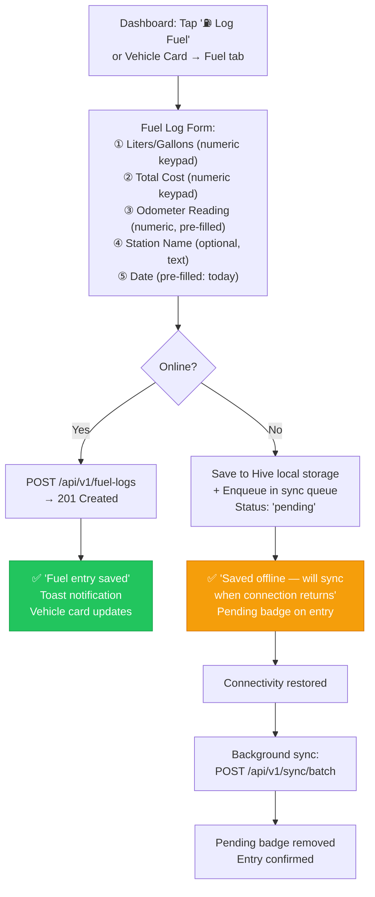

#### UX Micro-Decisions

| Decision | Rationale |
|:---|:---|
| Odometer is pre-filled from last known reading | Reduces taps. Driver only adjusts if significantly different. |
| Numeric keypad opens by default for Liters/Cost/Odometer | The form is 100% numbers. No keyboard switching. |
| Station Name is optional | Drivers at rural Pakistan stations won't have a station name. Don't block submission. |
| Date defaults to "today" | 95%+ of fuel logs are same-day. One tap to change if backdating. |
| Offline save shows a yellow badge, not an error | Offline is normal, not an error state. The badge is informational, not alarming. |

---

### UJ-005: Log Maintenance Service (Android — Consumer or Driver)

**Goal:** User completes a service at a mechanic → Logs the entry with relevant service items.

**Context:** User is at a mechanic's shop. May have a paper receipt. Possibly offline.

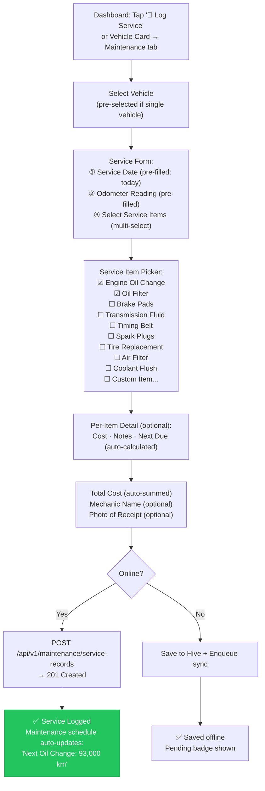

#### Key Design Decisions

1. **Service item multi-select, not free text.** Standardized items enable schedule recalculation. When the user checks "Oil Change" and enters an odometer reading, the system automatically pushes the next oil change reminder forward.
2. **"Custom Item" escape hatch.** If the user's service isn't in the list, they can add a custom item with a name and cost. Custom items don't trigger schedule recalculation (no known interval).
3. **Receipt photo is optional.** Uses Firebase Storage signed URL. The photo is uploaded directly from the client to Firebase Storage — not through the API (as per Architecture section 10.4). The server stores only the reference URI.
4. **Auto-sum of costs.** The total cost field is auto-calculated from per-item costs. The user can override it.

---

### UJ-006: View Dashboard (Web — Fleet Manager)

**Goal:** Fleet manager opens the Chrome Web dashboard → Sees real-time fleet status → Identifies actionable items.

**Context:** Fleet manager is at their desk, managing 5–25 vehicles. They check the dashboard 1–3 times per day.

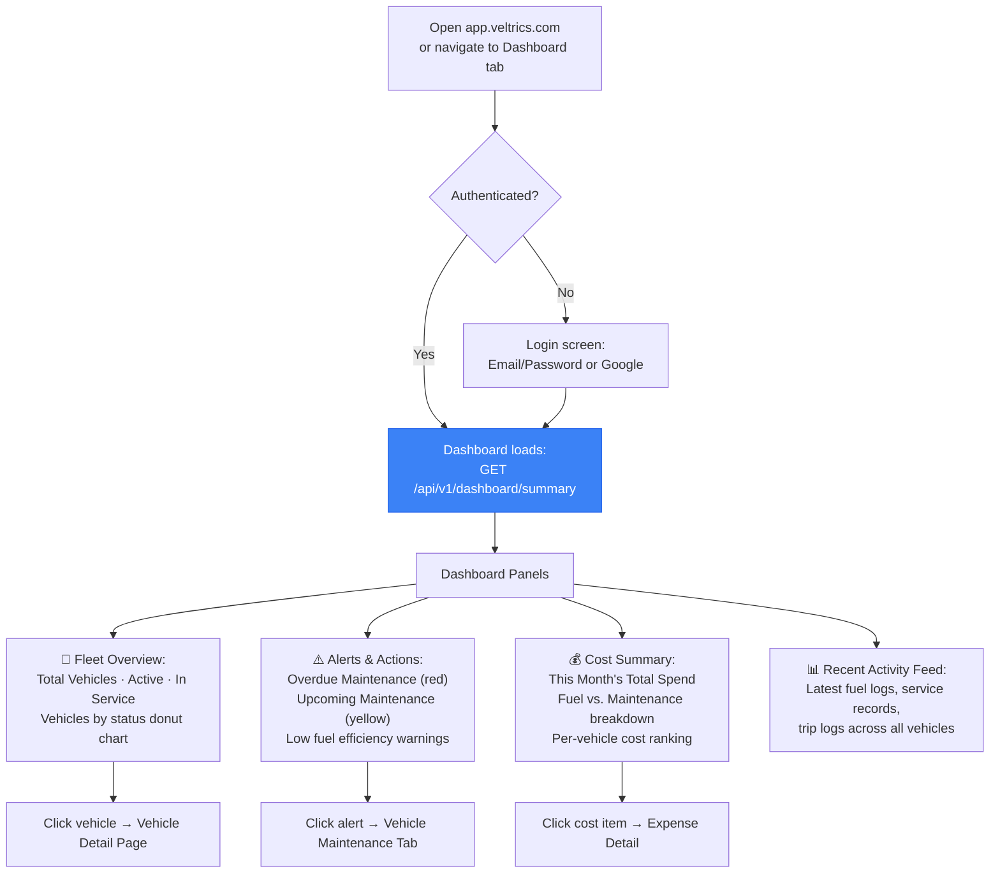

#### Dashboard Auto-Refresh Behavior

Per Architecture Section 9 (Pub/Sub → FCM Pipeline):

1. When a driver logs a fuel entry or completes maintenance, the backend publishes a `fleet.event` to Pub/Sub.
2. Pub/Sub triggers an FCM data-only message to the fleet manager's active web session.
3. The Flutter Web `onMessage` handler receives the silent push.
4. The dashboard widget triggers a re-fetch of `/api/v1/dashboard/summary`.
5. **Result:** The fleet manager sees the new entry appear on their dashboard within 2–5 seconds without manual refresh.

If the fleet manager switches tabs and returns, the `visibilitychange` event triggers a poll of the dashboard endpoint — catching up on any events missed while the tab was inactive.

---

### UJ-007: Log Trip (Android — Driver)

**Goal:** Driver completes a trip → Logs it in under 10 seconds.

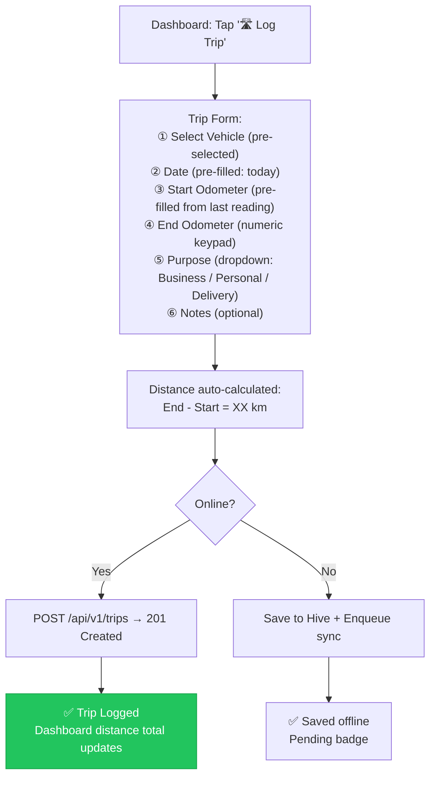

---

### UJ-008: Log Expense (Android or Web — Consumer / Fleet Manager)

**Goal:** User records a non-fuel, non-maintenance expense (toll, parking, insurance, repair).

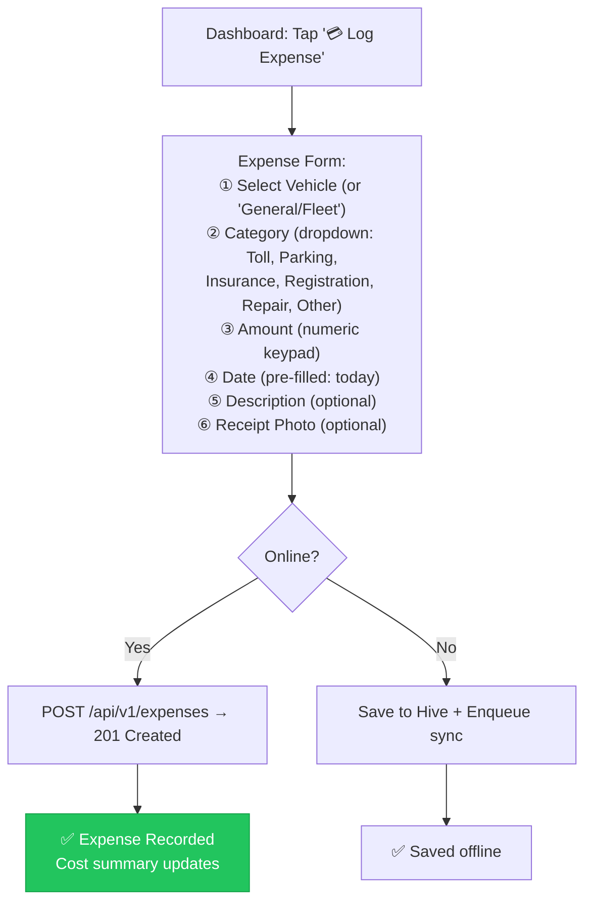

---

## 4. Recovery & Error Paths

Every error is a moment the user decides whether to trust the app or uninstall it. These paths must be explicitly designed.

### UJ-009: Recovery Path — Sync Conflict Resolution (Android)

**Scenario:** A driver logs a fuel entry offline. While offline, the fleet manager edits the same vehicle's odometer reading on the web. When the driver reconnects, the sync detects a conflict.

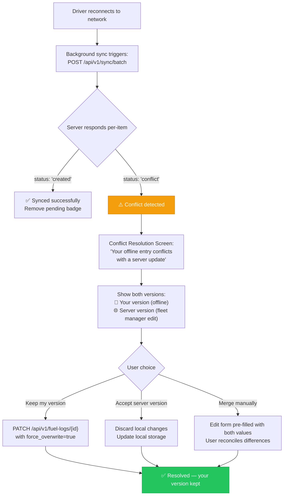

#### Design Principles for Conflict Resolution

1. **Never silently discard user data.** Even with last-write-wins as the default backend policy, the client shows the conflict and lets the user choose.
2. **Side-by-side comparison.** The user sees their offline version next to the server version with differences highlighted.
3. **Default is "Accept server version"** (fleet manager edits take priority, per Architecture section 8.3) — but the user can override.
4. **Conflict resolution does NOT block other syncs.** The batch sync processes all non-conflicting items immediately. Only conflicting items are queued for user review.

---

### UJ-010: Recovery Path — Authentication & Session Errors

```mermaid
graph TD
    subgraph ForgotPassword["Forgot Password Flow"]
        A1["Login screen: Tap 'Forgot Password'"] --> A2["Enter email address"]
        A2 --> A3["Firebase Auth sends reset email"]
        A3 --> A4["User clicks email link<br/>→ Firebase-hosted reset page"]
        A4 --> A5["New password set<br/>→ Return to app → Login"]
    end

    subgraph ExpiredSession["Expired Session Flow"]
        B1["API returns 401 Unauthorized<br/>(JWT expired, not refreshable)"] --> B2["Flutter interceptor catches 401"]
        B2 --> B3{"Firebase SDK can refresh?"}
        B3 -->|Yes| B4["Silent token refresh<br/>→ Retry original request"]
        B3 -->|No| B5["Show 'Session expired' modal<br/>'Please sign in again'"]
        B5 --> B6["Navigate to login screen<br/>Pre-fill email"]
        B6 --> B7["User re-authenticates<br/>→ Resume where they left off"]
    end

    subgraph TokenRefreshAfterUpgrade["Role Change Token Refresh"]
        C1["Backend updates Firebase custom claims<br/>(e.g., consumer → fleet_manager)"] --> C2["Client token still has old claims"]
        C2 --> C3["FCM push: 'role_updated'<br/>triggers token refresh"]
        C3 --> C4["Firebase SDK force-refreshes token<br/>→ New claims available"]
        C4 --> C5["UI updates:<br/>New navigation items appear<br/>Quota limits change"]
    end
```

#### Key Recovery Decisions

| Scenario | Behavior | Rationale |
|:---|:---|:---|
| JWT expired, refresh token valid | Silent refresh, retry request. User sees nothing. | 99% of cases. Firebase tokens expire every hour; SDK handles refresh transparently. |
| JWT expired, refresh token invalid | Show "Session expired" modal, navigate to login. Pre-fill email for speed. | Rare (app was inactive for weeks). Don't lose the user — make re-auth fast. |
| Forgot password | Firebase-hosted reset flow. 1 email, 1 click, 1 new password. | Standard Firebase Auth flow. No custom implementation needed. |
| Role updated server-side | FCM push triggers client token refresh. UI updates immediately. | Consumer-to-Pro upgrade must reflect without requiring logout/login. |

---

### UJ-011: Recovery Path — Payment & Quota Errors

```mermaid
graph TD
    subgraph PaymentFailure["Payment Failure Flow"]
        A1["User initiates subscription:<br/>POST /api/v1/payments/subscribe"] --> A2["Redirected to Stripe/Safepay checkout"]
        A2 --> A3{"Payment succeeds?"}
        A3 -->|Yes| A4["Webhook confirms → Subscription activated"]
        A3 -->|No (card declined)| A5["User returns to app<br/>Payment status: 'failed'"]
        A5 --> A6["Error Screen:<br/>'Payment could not be processed'<br/>Suggestions: Try another card,<br/>use a different payment method"]
        A6 --> A7["Retry button → back to checkout"]
        A7 --> A2
    end

    subgraph QuotaExceeded["Quota Exceeded Flow"]
        B1["Consumer tries to add vehicle (X+1)"] --> B2["API returns 403 QUOTA_EXCEEDED:<br/>'Free tier allows max X vehicles'"]
        B2 --> B3["Upgrade Prompt Screen:<br/>'You've reached the vehicle limit'<br/>Feature comparison: Free vs. Pro<br/>CTA: 'Upgrade to Pro'"]
        B3 --> B4{"User action"}
        B4 -->|Upgrade| B5["→ UJ-002 Upgrade Flow"]
        B4 -->|Not now| B6["Dismiss. Subtle 'Upgrade' badge<br/>remains in navigation"]
    end

    subgraph DriverQuota["Driver Quota Exceeded Flow"]
        C1["Fleet Manager tries to invite driver (Y+1)"] --> C2["API returns 403 QUOTA_EXCEEDED:<br/>'Current plan allows max Y drivers'"]
        C2 --> C3["Upgrade Prompt:<br/>'Need more team members?'<br/>Enterprise tier comparison"]
        C3 --> C4{"User action"}
        C4 -->|Upgrade to Enterprise| C5["Contact sales / Enterprise checkout"]
        C4 -->|Not now| C6["Dismiss"]
    end

    subgraph FailedInvitation["Failed Driver Invitation"]
        D1["Fleet Manager sends invitation<br/>to invalid phone/email"] --> D2["API returns 422:<br/>'Invalid phone number format'"]
        D2 --> D3["Inline field error:<br/>'Please enter a valid phone number<br/>with country code (+92...)'"]
        D3 --> D4["User corrects → Retry"]
    end

    subgraph InvitationExpired["Invitation Expired"]
        E1["Driver tries to accept invitation<br/>after 7-day expiry"] --> E2["API returns 410 GONE:<br/>'This invitation has expired'"]
        E2 --> E3["Error Screen:<br/>'Invitation expired. Please ask<br/>[Fleet Manager Name] to resend.'"]
        E3 --> E4["Driver contacts fleet manager"]
        E4 --> E5["Fleet Manager re-invites<br/>→ new invitation created"]
    end

    style A4 fill:#22c55e,stroke:#16a34a,color:#fff
    style B3 fill:#f59e0b,stroke:#d97706,color:#fff
    style C3 fill:#f59e0b,stroke:#d97706,color:#fff
```

---

## 5. Edge Cases & Specialized Flows

### UJ-012: Consumer-to-Pro Upgrade Journey

This is the most important conversion journey in the product. It must feel like a natural progression, not a paywall.

#### Upgrade Trigger Points

| Trigger | Context | UX Treatment |
|:---|:---|:---|
| **Vehicle quota wall** | Consumer tries to add vehicle (X+1) | Full-screen upgrade prompt with feature comparison. Cannot proceed without upgrade. |
| **Driver quota wall** | Fleet manager tries to invite driver (Y+1) | Same pattern — upgrade prompt with Enterprise comparison. |
| **Feature discovery** | Consumer taps a Pro-only feature (e.g., export PDF reports, advanced analytics) | Inline lock icon + tooltip: "Available with Pro. [Learn more]" |
| **Proactive nudge** | After 30 days of consistent usage (≥ 3 entries/week for 4 weeks) | Non-intrusive banner: "Managing more vehicles? Pro gives you unlimited..." |
| **Persistent badge** | Always visible in navigation sidebar/drawer | Subtle "⭐ Upgrade" badge. Never aggressive — never modal. Disappears after upgrade. |

#### Upgrade Screen Design

```
┌─────────────────────────────────────────────┐
│  🚀  Upgrade to Pro                         │
│                                             │
│  You've been using Veltrics for 32 days.    │
│  Ready to unlock your fleet's full          │
│  potential?                                 │
│                                             │
│  ┌──────────────┬───────────────┐           │
│  │     Free     │     Pro ⭐    │           │
│  ├──────────────┼───────────────┤           │
│  │ X vehicles   │ XX vehicles   │           │
│  │ 0 drivers    │ Y drivers     │           │
│  │ Basic alerts │ Full schedule │           │
│  │ Ads shown    │ Ad-free       │           │
│  │ —            │ PDF exports   │           │
│  │ —            │ Cost reports  │           │
│  │ —            │ Driver mgmt   │           │
│  └──────────────┴───────────────┘           │
│                                             │
│  ┌─────────────────────────────┐            │
│  │  💳 Upgrade via Stripe      │            │
│  │     (International)         │            │
│  └─────────────────────────────┘            │
│  ┌─────────────────────────────┐            │
│  │  🇵🇰 Upgrade via Safepay    │            │
│  │     (Cards · Easypaisa ·    │            │
│  │      JazzCash)              │            │
│  └─────────────────────────────┘            │
│                                             │
│           Maybe later                       │
└─────────────────────────────────────────────┘
```

#### Post-Upgrade Transition (Backend Sequence)

1. Payment webhook confirms subscription → `payments` module processes event.
2. Backend creates full `Organization` from personal pseudo-org (flag `is_personal = false`, quota raised).
3. Firebase custom claims updated: `{role: "fleet_manager", org_id: "uuid", tier: "pro"}`.
4. FCM push sent to client: `{type: "role_updated"}`.
5. Client forces Firebase token refresh → new claims available.
6. UI rebuilds: Navigation adds "Drivers", "Organization Settings", "Reports". Ads removed. Vehicle limit raised.
7. Confetti animation + "Welcome to Pro!" screen with next-step suggestions:
   - "Add more vehicles"
   - "Invite your first driver"
   - "Set up your maintenance schedules"

---

## 6. Emotional Journey Map

### Consumer Lifecycle Emotional Arc

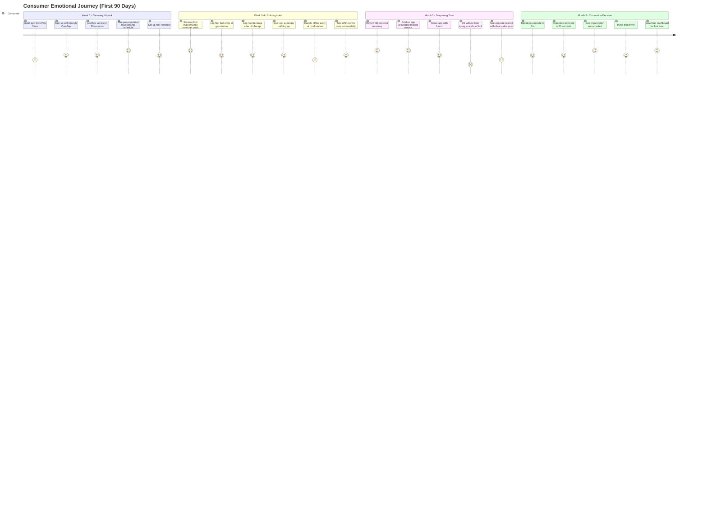

### Emotional Peaks & Valleys

| Moment | Emotion | Score | Design Response |
|:---|:---|:---|:---|
| **Pre-populated schedule appears** | Impressed, delighted | 5/5 | This is the hook. Make it visually stunning — animated cards revealing each maintenance item. |
| **First push reminder received** | Reassured, trusting | 5/5 | Reinforce: "We're watching out for your car." The app proves its value passively. |
| **Offline entry syncs successfully** | Relieved | 4/5 | Confirmation animation: pending badge dissolves into a green checkmark. |
| **Hit vehicle quota wall** | Frustrated | 2/5 | Acknowledge frustration: "We know it's annoying. Here's what Pro gives you." Never shame the user for being on free tier. |
| **First fleet dashboard view** | Empowered | 5/5 | The dashboard must feel like a *promotion* — the user has graduated from individual to fleet manager. Premium UI treatment. |

---

## 7. Screen Inventory

Every screen referenced in the user journeys above is catalogued here. This inventory becomes the input for the Style Guide (Stage 5) and Feature Stories (Stage 4).

### 7.1 Authentication Screens

| Screen ID | Screen Name | Platform | Role(s) | Key Elements |
|:---|:---|:---|:---|:---|
| SCR-AUTH-001 | Splash Screen | Android, Web | All | Brand logo animation, token check, auto-navigate |
| SCR-AUTH-002 | Welcome / Onboarding Carousel | Android | New users | 2-3 value prop cards + "Get Started" CTA |
| SCR-AUTH-003 | Login | Android, Web | All | Email/Password, Google Sign-In, Phone OTP tabs. "Forgot Password" link. |
| SCR-AUTH-004 | Register | Android, Web | New users | Same as Login with "Create Account" mode toggle |
| SCR-AUTH-005 | Phone OTP Verification | Android | New users, Drivers | Phone number input → OTP code input → Verify |
| SCR-AUTH-006 | Forgot Password | Android, Web | All | Email input → "Reset link sent" confirmation |
| SCR-AUTH-007 | Profile Setup | Android | New users | Name (pre-filled for Google), City (optional), Avatar |

### 7.2 Vehicle Screens

| Screen ID | Screen Name | Platform | Role(s) | Key Elements |
|:---|:---|:---|:---|:---|
| SCR-VEH-001 | Add Vehicle | Android, Web | Consumer, Fleet Manager, Admin | Make/Model/Year typeahead, Odometer, License Plate, VIN (optional), Color, Photo |
| SCR-VEH-002 | Vehicle Detail | Android, Web | All | Vehicle card header, Tabs: Overview · Maintenance · Fuel · Trips · Expenses |
| SCR-VEH-003 | Vehicle List | Android, Web | Consumer, Fleet Manager, Admin | Scrollable vehicle cards with status indicators (healthy/attention/overdue) |
| SCR-VEH-004 | Edit Vehicle | Android, Web | Consumer, Fleet Manager, Admin | Same as Add with pre-filled values |
| SCR-VEH-005 | Vehicle Status Badge | Android, Web | All | Inline component: 🟢 Healthy, 🟡 Attention, 🔴 Overdue |

### 7.3 Maintenance Screens

| Screen ID | Screen Name | Platform | Role(s) | Key Elements |
|:---|:---|:---|:---|:---|
| SCR-MNT-001 | Maintenance Schedule (per vehicle) | Android, Web | Consumer, Fleet Manager, Admin | Timeline of upcoming maintenance items with date/odometer triggers |
| SCR-MNT-002 | Log Service Record | Android, Web | Consumer, Driver, Fleet Manager | Service item multi-select, per-item cost, total cost, mechanic name, receipt photo |
| SCR-MNT-003 | Service History | Android, Web | All | Chronological list of past service records for a vehicle |
| SCR-MNT-004 | Edit Maintenance Schedule | Android, Web | Consumer, Fleet Manager, Admin | Toggle items on/off, edit intervals (km/days), edit next-due values |
| SCR-MNT-005 | Maintenance Alert Card | Android, Web | All | Inline component: "Oil Change overdue by 500 km" with "Log Service" CTA |

### 7.4 Fuel & Trip Screens

| Screen ID | Screen Name | Platform | Role(s) | Key Elements |
|:---|:---|:---|:---|:---|
| SCR-FUEL-001 | Log Fuel Entry | Android, Web | Consumer, Driver | Liters/Gallons, Total Cost, Odometer, Station Name (optional), Date |
| SCR-FUEL-002 | Fuel History (per vehicle) | Android, Web | All | Chronological fuel log list with fuel efficiency trend indicator |
| SCR-TRIP-001 | Log Trip | Android, Web | Consumer, Driver | Start/End Odometer, Purpose (dropdown), Date, Notes |
| SCR-TRIP-002 | Trip History (per vehicle) | Android, Web | All | Chronological trip list with distance totals |

### 7.5 Expense Screens

| Screen ID | Screen Name | Platform | Role(s) | Key Elements |
|:---|:---|:---|:---|:---|
| SCR-EXP-001 | Log Expense | Android, Web | Consumer, Fleet Manager | Category (Toll/Parking/Insurance/Registration/Repair/Other), Amount, Date, Description, Receipt Photo |
| SCR-EXP-002 | Expense History | Android, Web | Consumer, Fleet Manager, Admin | Filterable/sortable expense list with category icons and monthly totals |

### 7.6 Dashboard Screens

| Screen ID | Screen Name | Platform | Role(s) | Key Elements |
|:---|:---|:---|:---|:---|
| SCR-DASH-001 | Consumer Dashboard | Android | Consumer | Single-vehicle or multi-vehicle card(s). Upcoming maintenance. Quick-log buttons: Fuel, Service, Trip, Expense. |
| SCR-DASH-002 | Fleet Manager Dashboard | Web, Android | Fleet Manager, Admin | Fleet overview panel, Alerts & Actions panel, Cost summary panel, Recent activity feed. Auto-refreshes via FCM. |
| SCR-DASH-003 | Driver Dashboard | Android | Driver | Assigned vehicles list. Quick-log: Fuel, Trip, Odometer. Simplified — no cost data, no management actions. |

### 7.7 Organization & Driver Management Screens

| Screen ID | Screen Name | Platform | Role(s) | Key Elements |
|:---|:---|:---|:---|:---|
| SCR-ORG-001 | Organization Settings | Web, Android | Fleet Manager, Admin | Business name, Logo, Industry type, Subscription tier display |
| SCR-ORG-002 | Driver List | Web, Android | Fleet Manager, Admin | Driver name, phone, assigned vehicles, status (active/invited/inactive) |
| SCR-ORG-003 | Invite Driver | Web, Android | Fleet Manager, Admin | Phone number or email input, Role selection (driver), Send invitation CTA |
| SCR-ORG-004 | Driver Detail | Web, Android | Fleet Manager, Admin | Driver profile, Assigned vehicles, Recent activity, Remove from org option |
| SCR-ORG-005 | Accept Invitation | Android | Driver | Invitation details (org name, fleet manager name), Accept/Decline buttons |
| SCR-ORG-006 | Redeem Invite Code | Android | Driver (new user) | Code input field (VLT-XXXX), Join organization CTA |

### 7.8 Payment & Upgrade Screens

| Screen ID | Screen Name | Platform | Role(s) | Key Elements |
|:---|:---|:---|:---|:---|
| SCR-PAY-001 | Upgrade to Pro | Android, Web | Consumer | Feature comparison table (Free vs. Pro), Gateway selection (Stripe/Safepay), CTA |
| SCR-PAY-002 | Upgrade to Enterprise | Web | Fleet Manager | Enterprise feature comparison, Contact sales / checkout |
| SCR-PAY-003 | Payment Status | Android, Web | All paid | Current subscription tier, Renewal date, Payment method, "Manage subscription" link |
| SCR-PAY-004 | Payment Failed | Android, Web | All paid | Error message, Retry CTA, Alternative payment method suggestion |
| SCR-PAY-005 | Welcome to Pro! | Android | Upgraded consumer | Confetti animation, Next steps suggestions, Dismiss CTA |

### 7.9 Notification & Settings Screens

| Screen ID | Screen Name | Platform | Role(s) | Key Elements |
|:---|:---|:---|:---|:---|
| SCR-NOTIF-001 | Notification Center | Android, Web | All | Chronological notification list. Types: maintenance reminder, sync status, payment alert, invitation. |
| SCR-NOTIF-002 | Notification Preferences | Android, Web | All | Toggle: Maintenance reminders, Payment alerts, Fleet activity (fleet managers only), Quiet hours |
| SCR-SET-001 | App Settings | Android, Web | All | Profile edit, Notification preferences, Language, Units (km/miles, liters/gallons), Theme, About, Logout |
| SCR-SET-002 | Account Deletion | Android, Web | All | Confirm deletion, 30-day grace period warning, Download data option |

### 7.10 Offline & Sync Screens

| Screen ID | Screen Name | Platform | Role(s) | Key Elements |
|:---|:---|:---|:---|:---|
| SCR-SYNC-001 | Pending Sync Queue | Android | Consumer, Driver | List of entries waiting to sync. Per-item status: pending, syncing, synced, conflict. |
| SCR-SYNC-002 | Sync Conflict Resolution | Android | Consumer, Driver | Side-by-side comparison: your version vs. server version. Actions: Keep mine, Accept server, Edit manually. |
| SCR-SYNC-003 | Offline Indicator | Android | All | Inline banner: "You're offline — entries will be saved locally and synced when connected." |

### 7.11 Ad Screens (Free Tier Only)

| Screen ID | Screen Name | Platform | Role(s) | Key Elements |
|:---|:---|:---|:---|:---|
| SCR-AD-001 | Banner Ad Slot (Bottom) | Android | Consumer (Free) | AdMob banner ad at bottom of dashboard and list screens. Not on data entry forms. |
| SCR-AD-002 | Native Ad Card | Android | Consumer (Free) | AdMob native ad styled as a card in the vehicle list or activity feed. |
| SCR-AD-003 | AdSense Display Block | Web | Consumer (Free) | AdSense responsive display ad in dashboard sidebar. |

---

## 8. Screen Count Summary

| Category | Count |
|:---|:---|
| Authentication | 7 |
| Vehicle | 5 |
| Maintenance | 5 |
| Fuel & Trip | 4 |
| Expense | 2 |
| Dashboard | 3 |
| Organization & Drivers | 6 |
| Payment & Upgrade | 5 |
| Notifications & Settings | 4 |
| Offline & Sync | 3 |
| Ads | 3 |
| **Total** | **47** |

---

## 9. Cross-Reference: Journeys → Screens → API Endpoints

| Journey ID | Journey Name | Screens Used | Primary API Endpoints |
|:---|:---|:---|:---|
| UJ-001 | Consumer Onboarding | SCR-AUTH-001→007, SCR-VEH-001, SCR-MNT-001, SCR-DASH-001 | `POST /auth/register`, `POST /vehicles`, `POST /maintenance/schedules/bulk`, `GET /dashboard/summary` |
| UJ-002 | Fleet Manager Upgrade | SCR-PAY-001, SCR-PAY-005, SCR-ORG-001, SCR-ORG-003 | `POST /payments/subscribe`, `PATCH /organizations/{id}`, `POST /organizations/{id}/invitations` |
| UJ-003 | Driver Invitation | SCR-ORG-003, SCR-ORG-005, SCR-ORG-006, SCR-DASH-003 | `POST /organizations/{id}/invitations`, `PATCH /invitations/{id}/accept`, `POST /invitations/redeem` |
| UJ-004 | Log Fuel Entry | SCR-FUEL-001, SCR-SYNC-003 | `POST /fuel-logs`, `POST /sync/batch` |
| UJ-005 | Log Maintenance | SCR-MNT-002, SCR-SYNC-003 | `POST /maintenance/service-records`, `POST /sync/batch` |
| UJ-006 | View Dashboard | SCR-DASH-001/002/003 | `GET /dashboard/summary` |
| UJ-007 | Log Trip | SCR-TRIP-001, SCR-SYNC-003 | `POST /trips`, `POST /sync/batch` |
| UJ-008 | Log Expense | SCR-EXP-001, SCR-SYNC-003 | `POST /expenses`, `POST /sync/batch` |
| UJ-009 | Sync Conflict | SCR-SYNC-001, SCR-SYNC-002 | `POST /sync/batch`, `PATCH /{entity}/{id}` |
| UJ-010 | Auth Recovery | SCR-AUTH-003, SCR-AUTH-006 | Firebase Auth SDK (client-side) |
| UJ-011 | Payment/Quota Errors | SCR-PAY-004, SCR-PAY-001 | `POST /payments/subscribe`, `GET /payments/status` |
| UJ-012 | Consumer-to-Pro Upgrade | SCR-PAY-001, SCR-PAY-005, SCR-ORG-001 | `POST /payments/subscribe`, `GET /users/me` |

---

## 10. Open Items for Downstream Stages

| Item | Owner Stage | Description |
|:---|:---|:---|
| **Free tier vehicle limit (X)** | Stage 4b — MVP Scoping Gate | Define the exact number of vehicles allowed on the free tier. |
| **Free tier driver limit (Y)** | Stage 4b — MVP Scoping Gate | Define the exact number of drivers allowed on the free/pro tier. |
| **Vehicle Make/Model database** | Stage 6 — Data Model | Define the source and schema for the vehicle typeahead database used in onboarding. |
| **Default maintenance schedule templates** | Stage 6 — Data Model | Define per-vehicle-category default maintenance intervals (sedan, SUV, truck, motorcycle). |
| **Invite code format & generation** | Stage 6 — Data Model | Define the invite code format (VLT-XXXX), generation algorithm, and expiry rules. |
| **Ad placement policy** | Stage 4 — Feature Stories | Define exactly which screens show ads and which are ad-free zones (per Product Brief Risk #1). |
| **Offline-capable screen list** | Stage 4 — Feature Stories | Formally enumerate which screens function fully offline vs. require connectivity. |

---

## 11. Next Steps & Approval Gate

- **Next Stage:** `STAGE 4 — Feature Stories` (`04-feature-stories.md`) led by the *SaaS Founder × Product Designer* persona.
- **Gate Confirmation:** Please review this User Journeys document (`product-specs/03-user-journeys.md`).

> Does this look right, or shall we refine anything before moving on?
