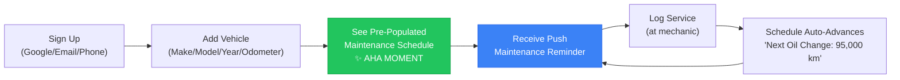
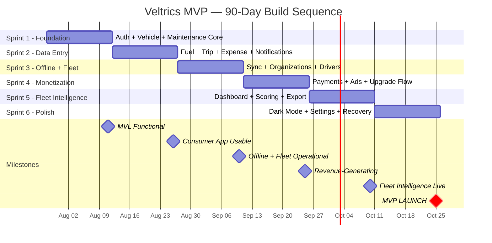

# Veltrics Fleet & Vehicle Management — MVP Scoping Gate

> **Reads from:** [01-product-brief.md](file:///e:/Non_Office/Dev_Space/vibe_skool/veltrics/product-specs/01-product-brief.md), [01b-tech-stack.md](file:///e:/Non_Office/Dev_Space/vibe_skool/veltrics/product-specs/01b-tech-stack.md), [02-architecture.md](file:///e:/Non_Office/Dev_Space/vibe_skool/veltrics/product-specs/02-architecture.md), [03-user-journeys.md](file:///e:/Non_Office/Dev_Space/vibe_skool/veltrics/product-specs/03-user-journeys.md), [04-feature-stories.md](file:///e:/Non_Office/Dev_Space/vibe_skool/veltrics/product-specs/04-feature-stories.md)  
> **Status:** Draft — Pending Approval  
> **Author:** Technical Product Strategist Persona (App Architect)  
> **Stage:** ★ MVP Scoping Gate

---

## 1. MVP Scoping Philosophy

The MVP Scoping Gate exists to answer one question: **Can a solo developer shipping AI-assisted code deliver 117 feature stories in 90 days — and if so, in what order?**

The answer is yes — but only with ruthless prioritization of the *build sequence*, not the feature list. All 117 stories remain `IN`. None are cut. The discipline shifts from "what to cut" to "what to build first" so that the minimum value loop is functional as early as possible, and every subsequent sprint adds monetizable capability on top of a working product.

### Team & Timeline

| Parameter | Value |
|:---|:---|
| **Developer count** | 1 (solo, AI-assisted) |
| **Timeline** | 90 days to MVP launch |
| **Estimated velocity** | ~1.3 stories/day average (117 stories ÷ 90 days) |
| **Sprint cadence** | 2-week sprints (6 sprints × 15 days = 90 days) |
| **Stories per sprint** | ~19-20 stories per sprint |

---

## 2. Tier Limit Definitions (Resolved)

The following tier limits are now formally defined. These values replace all `X` and `Y` placeholders in prior artifacts.

### 2.1 Tier Limit Table

| Resource | Free Tier | Pro Tier | Enterprise Tier |
|:---|:---|:---|:---|
| **Base vehicles** | 3 | 25 | Up to 1000 |
| **Ad-rewarded bonus vehicles** | +2 (max total: 5) | — | — |
| **Base drivers** | 3 | 15 | Up to 1000 |
| **Ad-rewarded bonus drivers** | +2 (max total: 5) | — | — |
| **Ads** | Banners + native cards + rewarded video | Ad-free | Ad-free |
| **Data export (PDF/CSV)** | 🔒 Locked | ✅ Included | ✅ Included |
| **Driver scoring** | 🔒 Locked | ✅ Included | ✅ Included |
| **Custom maintenance templates** | Standard only | ✅ Custom | ✅ Custom |
| **Beyond Enterprise limits** | — | — | Contact sales |

### 2.2 Ad-Rewarded Vehicle Mechanic

Free tier users can earn up to **2 additional vehicle slots** (total: 5 vehicles) through the rewarded video ad system:

```mermaid
graph TD
    A["Consumer has 3 vehicles (base limit)"] --> B["Tries to add 4th vehicle"]
    B --> C["Quota Wall Screen:<br/>'You've reached 3 vehicles'"]
    C --> D{"User choice"}
    D -->|Upgrade to Pro| E["→ Payment flow (UJ-002)"]
    D -->|Watch ads for bonus slot| F["Rewarded Video Flow:<br/>Watch 3 consecutive video ads<br/>(back-to-back, no skip)"]
    F --> G{"All 3 ads completed?"}
    G -->|Yes| H["✅ Bonus vehicle slot unlocked<br/>(permanent slot, not time-limited)"]
    G -->|No (abandoned)| I["❌ Slot not unlocked<br/>Return to quota wall"]
    H --> J["User adds 4th vehicle<br/>(tagged as 'ad-rewarded')"]
    J --> K["Every subsequent action on<br/>this vehicle requires watching<br/>1 video ad before proceeding"]

    style H fill:#22c55e,stroke:#16a34a,color:#fff
    style K fill:#f59e0b,stroke:#d97706,color:#fff
```

#### Ad-Rewarded Vehicle Rules

| Rule | Detail |
|:---|:---|
| **Earning a slot** | Watch 3 consecutive video ads (back-to-back, no skip). This unlocks 1 bonus vehicle slot. Repeat for the 2nd bonus slot. |
| **Maximum bonus vehicles** | 2 (total free vehicles: 3 base + 2 bonus = 5). |
| **Slot permanence** | The bonus slot is permanent — not time-limited. The vehicle stays as long as the user wants. |
| **Per-action ad requirement** | Every action involving an ad-rewarded vehicle (log fuel, log maintenance, log trip, log expense, update odometer) requires watching 1 video ad before the action completes. |
| **Ad failure fallback** | If the video ad fails to load, the action is blocked with: "Ad unavailable. Try again later or upgrade to Pro for ad-free access." |
| **Upgrade removes all ads** | If the user upgrades to Pro, all ad-rewarded vehicles become standard vehicles. No more per-action ads. |
| **Visual indicator** | Ad-rewarded vehicles show a small "🎬 Ad" badge on their vehicle card to set expectations. |

### 2.3 Ad-Rewarded Driver Mechanic

Free tier users can earn **2 additional driver slots** (total: 5 drivers) through the same rewarded video mechanism:

| Rule | Detail |
|:---|:---|
| **Earning the slot** | Watch 3 consecutive video ads. This unlocks 1 bonus driver slot. Repeat for the 2nd bonus slot. |
| **Maximum bonus drivers** | 2 (total free drivers: 3 base + 2 bonus = 5). |
| **Per-transaction ad requirement** | Every transaction involving the ad-rewarded driver (fuel log, trip log, maintenance log submitted by or involving the rewarded driver) requires the fleet manager to watch 1 video ad when viewing/approving the data. |
| **Upgrade removes all ads** | Pro upgrade converts all ad-rewarded drivers to standard drivers. |
| **Visual indicator** | The rewarded driver shows a "🎬 Ad" badge on the driver list. |

### 2.4 Cross-Artifact Placeholder Resolution

The following placeholders in prior artifacts are now resolved:

| Artifact | Placeholder | Resolved Value |
|:---|:---|:---|
| `03-user-journeys.md` | `X` (free vehicle limit) | 3 base + 2 ad-rewarded = **5 max** |
| `03-user-journeys.md` | `Y` (free driver limit) | 3 base + 2 ad-rewarded = **5 max** |
| `04-feature-stories.md` | FS-PAY-007 quota wall | Triggers at vehicle 4 (or 6 if both bonus slots used) |
| `04-feature-stories.md` | FS-PAY-008 driver quota wall | Triggers at driver 4 (or 6 if both bonus slots used) |
| `04-feature-stories.md` | FS-AD-004 rewarded video | Updated mechanic: 3 ads to earn slot + per-action ads on rewarded resources |

---

## 3. Minimum Value Loop

The Minimum Value Loop (MVL) is the smallest set of features that, working together, deliver end-to-end value and validate the core product hypothesis. If only the MVL existed and nothing else, a user could still get meaningful value from the app.

### 3.1 MVL Definition



**MVL = Auth + Vehicle + Maintenance + Notifications (Push).** This loop validates the core hypothesis: *"Users will adopt an app that automatically tells them when their car needs service and lets them log it in seconds."*

### 3.2 MVL Stories (The Absolute First Stories to Build)

| Story ID | Story | Epic |
|:---|:---|:---|
| FS-AUTH-001 | Sign up with Google One-Tap | EP-AUTH |
| FS-AUTH-002 | Sign up with Email and Password | EP-AUTH |
| FS-AUTH-004 | Sign in (all methods) | EP-AUTH |
| FS-AUTH-006 | Complete profile setup | EP-AUTH |
| FS-AUTH-011 | Splash screen with auto-navigation | EP-AUTH |
| FS-ORG-001 | Auto-create personal pseudo-org | EP-ORG |
| FS-VEH-001 | Add a vehicle with typeahead | EP-VEH |
| FS-VEH-002 | View vehicle list | EP-VEH |
| FS-VEH-003 | View vehicle detail | EP-VEH |
| FS-MNT-001 | View pre-populated maintenance schedule | EP-MNT |
| FS-MNT-002 | Customize maintenance schedule items | EP-MNT |
| FS-MNT-003 | Log a service record | EP-MNT |
| FS-MNT-005 | View service history | EP-MNT |
| FS-MNT-010 | Bulk accept maintenance schedule | EP-MNT |
| FS-NOTIF-001 | Request FCM permission | EP-NOTIF |
| FS-NOTIF-002 | Send maintenance overdue push | EP-NOTIF |
| FS-NOTIF-003 | Send maintenance upcoming push | EP-NOTIF |
| FS-DASH-001 | Consumer dashboard | EP-DASH |

**MVL story count: 18 stories** — the foundation everything else builds on.

---

## 4. MVP Build Sequence

The 117 stories are organized into 6 two-week sprints. Each sprint builds on the previous one, and every sprint ends with a **deployable, testable increment**.

### Sprint 1: Foundation — Auth + Vehicle + Maintenance Core (Days 1–15)

**Goal:** A user can sign up, add a vehicle, see a pre-populated maintenance schedule, and log a service record. The minimum value loop is functional.

| # | Story ID | Story | Epic |
|:---|:---|:---|:---|
| 1 | FS-AUTH-011 | Splash screen with auto-navigation | EP-AUTH |
| 2 | FS-AUTH-012 | Welcome / onboarding carousel | EP-AUTH |
| 3 | FS-AUTH-001 | Sign up with Google One-Tap | EP-AUTH |
| 4 | FS-AUTH-002 | Sign up with Email and Password | EP-AUTH |
| 5 | FS-AUTH-004 | Sign in (all methods) | EP-AUTH |
| 6 | FS-AUTH-006 | Complete profile setup | EP-AUTH |
| 7 | FS-AUTH-008 | Silent token refresh | EP-AUTH |
| 8 | FS-AUTH-009 | Role-based navigation rendering | EP-AUTH |
| 9 | FS-ORG-001 | Auto-create personal pseudo-org | EP-ORG |
| 10 | FS-VEH-001 | Add a vehicle with typeahead | EP-VEH |
| 11 | FS-VEH-002 | View vehicle list | EP-VEH |
| 12 | FS-VEH-003 | View vehicle detail | EP-VEH |
| 13 | FS-VEH-004 | Edit vehicle | EP-VEH |
| 14 | FS-MNT-001 | View pre-populated maintenance schedule | EP-MNT |
| 15 | FS-MNT-002 | Customize maintenance schedule items | EP-MNT |
| 16 | FS-MNT-003 | Log a service record | EP-MNT |
| 17 | FS-MNT-005 | View service history | EP-MNT |
| 18 | FS-MNT-010 | Bulk accept maintenance schedule | EP-MNT |
| 19 | FS-MNT-012 | Create schedule for additional vehicles | EP-MNT |
| 20 | FS-DASH-001 | Consumer dashboard with vehicle cards | EP-DASH |

**Stories: 20 · Deployable state:** User can sign up → add vehicle → see schedule → log service → view dashboard.

---

### Sprint 2: Data Entry Loop — Fuel + Trip + Expense + Notifications (Days 16–30)

**Goal:** All four data entry flows (maintenance already done) are functional. Push notifications deliver the reinforcement loop. Dashboard shows cost summaries.

| # | Story ID | Story | Epic |
|:---|:---|:---|:---|
| 21 | FS-FUEL-001 | Log a fuel entry | EP-FUEL |
| 22 | FS-FUEL-002 | View fuel log history | EP-FUEL |
| 23 | FS-FUEL-003 | Edit a fuel entry | EP-FUEL |
| 24 | FS-FUEL-004 | Delete a fuel entry | EP-FUEL |
| 25 | FS-FUEL-005 | Calculate fuel efficiency | EP-FUEL |
| 26 | FS-FUEL-006 | Quick-log fuel from dashboard | EP-FUEL |
| 27 | FS-TRIP-001 | Log a trip entry | EP-TRIP |
| 28 | FS-TRIP-002 | View trip history | EP-TRIP |
| 29 | FS-TRIP-003 | Edit a trip entry | EP-TRIP |
| 30 | FS-TRIP-004 | Delete a trip entry | EP-TRIP |
| 31 | FS-TRIP-005 | Quick-log trip from dashboard | EP-TRIP |
| 32 | FS-TRIP-006 | View distance summary | EP-TRIP |
| 33 | FS-EXP-001 | Log an expense | EP-EXP |
| 34 | FS-EXP-002 | View expense history | EP-EXP |
| 35 | FS-EXP-003 | Edit an expense | EP-EXP |
| 36 | FS-EXP-004 | Delete an expense | EP-EXP |
| 37 | FS-EXP-005 | Quick-log expense from dashboard | EP-EXP |
| 38 | FS-EXP-006 | Attach receipt photo | EP-EXP |
| 39 | FS-NOTIF-001 | Request FCM permission | EP-NOTIF |
| 40 | FS-NOTIF-002 | Send maintenance overdue push | EP-NOTIF |
| 41 | FS-NOTIF-003 | Send maintenance upcoming push | EP-NOTIF |
| 42 | FS-DASH-006 | Cost summary per vehicle | EP-DASH |

**Stories: 22 · Deployable state:** Full consumer data entry loop + push notifications. App is now *usable* for daily vehicle management.

---

### Sprint 3: Offline + Fleet Foundation — Sync + Organization + Drivers (Days 31–45)

**Goal:** Offline-first works for Android. Fleet managers can create organizations, invite drivers, and assign vehicles.

| # | Story ID | Story | Epic |
|:---|:---|:---|:---|
| 43 | FS-SYNC-001 | Save data entry offline | EP-SYNC |
| 44 | FS-SYNC-002 | Background sync on reconnect | EP-SYNC |
| 45 | FS-SYNC-003 | Display offline indicator banner | EP-SYNC |
| 46 | FS-SYNC-004 | View pending sync queue | EP-SYNC |
| 47 | FS-SYNC-005 | Sync conflict resolution | EP-SYNC |
| 48 | FS-SYNC-006 | Idempotent sync (client UUIDs) | EP-SYNC |
| 49 | FS-SYNC-007 | Non-conflicting items sync immediately | EP-SYNC |
| 50 | FS-SYNC-008 | Sync on app foreground | EP-SYNC |
| 51 | FS-ORG-003 | Edit organization details | EP-ORG |
| 52 | FS-ORG-004 | View organization members | EP-ORG |
| 53 | FS-ORG-005 | Invite driver by phone | EP-ORG |
| 54 | FS-ORG-006 | Invite driver by email | EP-ORG |
| 55 | FS-ORG-007 | Accept invitation (existing user) | EP-ORG |
| 56 | FS-ORG-008 | Redeem invite code (new user) | EP-ORG |
| 57 | FS-ORG-009 | Remove member from organization | EP-ORG |
| 58 | FS-ORG-010 | Cancel pending invitation | EP-ORG |
| 59 | FS-VEH-007 | Assign vehicle to driver | EP-VEH |
| 60 | FS-VEH-008 | Unassign vehicle from driver | EP-VEH |
| 61 | FS-DASH-005 | Driver dashboard (assigned vehicles) | EP-DASH |
| 62 | FS-AUTH-003 | Sign up with Phone OTP | EP-AUTH |

**Stories: 20 · Deployable state:** Offline sync works. Organizations + drivers are functional. Multi-user fleet management is operational.

---

### Sprint 4: Monetization — Payments + Ads + Upgrade Flow (Days 46–60)

**Goal:** Stripe and Safepay payments work. Ads display for free tier. Rewarded video mechanic is functional. Consumer-to-Pro upgrade flow is end-to-end.

| # | Story ID | Story | Epic |
|:---|:---|:---|:---|
| 63 | FS-PAY-001 | Initiate Pro subscription (Stripe) | EP-PAY |
| 64 | FS-PAY-002 | Initiate Pro subscription (Safepay) | EP-PAY |
| 65 | FS-PAY-003 | Handle payment failure | EP-PAY |
| 66 | FS-PAY-004 | View subscription status | EP-PAY |
| 67 | FS-PAY-005 | Process Stripe webhook | EP-PAY |
| 68 | FS-PAY-006 | Process Safepay webhook | EP-PAY |
| 69 | FS-PAY-007 | Upgrade prompt at vehicle quota wall | EP-PAY |
| 70 | FS-PAY-008 | Upgrade prompt at driver quota wall | EP-PAY |
| 71 | FS-PAY-009 | Welcome to Pro celebration screen | EP-PAY |
| 72 | FS-PAY-010 | Persistent upgrade badge (Free tier) | EP-PAY |
| 73 | FS-ORG-002 | Convert personal org on Pro upgrade | EP-ORG |
| 74 | FS-AD-001 | Banner ad on dashboard (Android, Free) | EP-AD |
| 75 | FS-AD-002 | Native ad card in vehicle list (Android, Free) | EP-AD |
| 76 | FS-AD-003 | AdSense ad on web dashboard (Free) | EP-AD |
| 77 | FS-AD-004 | Rewarded video for bonus vehicle/driver slot | EP-AD |
| 78 | FS-AD-005 | Ad-free zone on data entry forms | EP-AD |

**Stories: 16 · Deployable state:** Revenue-generating. Free users see ads, can earn bonus slots via rewarded video. Pro upgrade works end-to-end.

---

### Sprint 5: Fleet Intelligence — Fleet Dashboard + Driver Scoring + Export (Days 61–75)

**Goal:** Fleet manager web dashboard is fully operational with auto-refresh, cost ranking, and driver scoring. Data export works for Pro users.

| # | Story ID | Story | Epic |
|:---|:---|:---|:---|
| 79 | FS-DASH-002 | Fleet manager dashboard with panels | EP-DASH |
| 80 | FS-DASH-003 | Dashboard auto-refresh via FCM | EP-DASH |
| 81 | FS-DASH-004 | Dashboard catch-up on tab focus | EP-DASH |
| 82 | FS-DASH-007 | Fleet cost ranking | EP-DASH |
| 83 | FS-DASH-008 | Fleet availability overview | EP-DASH |
| 84 | FS-NOTIF-004 | Silent refresh FCM to fleet managers | EP-NOTIF |
| 85 | FS-NOTIF-005 | View notification center | EP-NOTIF |
| 86 | FS-NOTIF-006 | Configure notification preferences | EP-NOTIF |
| 87 | FS-NOTIF-007 | Payment-related notifications | EP-NOTIF |
| 88 | FS-NOTIF-008 | Remove stale FCM tokens | EP-NOTIF |
| 89 | FS-DRV-001 | Calculate driver consistency score | EP-DRV |
| 90 | FS-DRV-002 | View driver score on driver list | EP-DRV |
| 91 | FS-DRV-003 | View driver activity detail | EP-DRV |
| 92 | FS-DRV-004 | Alert for inactive driver | EP-DRV |
| 93 | FS-EXPORT-001 | Export maintenance history as PDF | EP-EXPORT |
| 94 | FS-EXPORT-002 | Export fuel/expense data as CSV | EP-EXPORT |
| 95 | FS-EXPORT-003 | Export fleet summary report as PDF | EP-EXPORT |

**Stories: 17 · Deployable state:** Fleet managers have full operational visibility. Driver accountability is measurable. Pro users can export data.

---

### Sprint 6: Polish — Dark Mode + Settings + Recovery + Hardening (Days 76–90)

**Goal:** Dark mode, all settings, account management, recovery flows, remaining vehicle operations, and final hardening for launch.

| # | Story ID | Story | Epic |
|:---|:---|:---|:---|
| 96 | FS-THEME-001 | Toggle dark mode in settings | EP-THEME |
| 97 | FS-THEME-002 | Dark mode color scheme | EP-THEME |
| 98 | FS-THEME-003 | Persist theme preference | EP-THEME |
| 99 | FS-SET-001 | View app settings | EP-SET |
| 100 | FS-SET-002 | Configure measurement units | EP-SET |
| 101 | FS-SET-003 | Logout | EP-SET |
| 102 | FS-SET-004 | Request account deletion | EP-SET |
| 103 | FS-SET-005 | Download data before deletion | EP-SET |
| 104 | FS-SET-006 | View app version and about | EP-SET |
| 105 | FS-AUTH-005 | Forgot password | EP-AUTH |
| 106 | FS-AUTH-007 | View and edit profile | EP-AUTH |
| 107 | FS-AUTH-010 | Session-expired forced re-auth | EP-AUTH |
| 108 | FS-VEH-005 | Delete vehicle (soft delete) | EP-VEH |
| 109 | FS-VEH-006 | Log odometer reading | EP-VEH |
| 110 | FS-VEH-009 | Upload vehicle photo | EP-VEH |
| 111 | FS-VEH-010 | Recover deleted vehicle | EP-VEH |
| 112 | FS-MNT-004 | Add custom service item | EP-MNT |
| 113 | FS-MNT-006 | Edit a service record | EP-MNT |
| 114 | FS-MNT-007 | Delete a service record | EP-MNT |
| 115 | FS-MNT-008 | View overdue maintenance alerts | EP-MNT |
| 116 | FS-MNT-009 | View upcoming maintenance alerts | EP-MNT |
| 117 | FS-MNT-011 | View maintenance schedule timeline | EP-MNT |

**Stories: 22 · Deployable state:** Feature-complete MVP. Dark mode, settings, recovery flows, all CRUD operations, account management. Ready for launch.

---

## 5. MVP Build Sequence Diagram



---

## 6. Sprint Milestone Validation

Each sprint ends with a deployable state and a validation checkpoint:

| Sprint | End Date | Deployable State | Validation Checkpoint |
|:---|:---|:---|:---|
| **Sprint 1** | Day 15 | Sign up → Add vehicle → See schedule → Log service | Can 1 user complete the full onboarding flow end-to-end? |
| **Sprint 2** | Day 30 | Full consumer data entry + push notifications | Can a user log fuel, trip, expense, and receive a maintenance reminder? |
| **Sprint 3** | Day 45 | Offline sync + Fleet manager + Driver invitation | Can a driver log fuel offline and have it sync? Can a fleet manager invite a driver? |
| **Sprint 4** | Day 60 | Payments + Ads + Pro upgrade | Can a user upgrade to Pro via Stripe/Safepay? Do ads display correctly for free tier? |
| **Sprint 5** | Day 75 | Fleet dashboard + Driver scoring + PDF/CSV export | Can a fleet manager see real-time fleet data? Can they export a report? |
| **Sprint 6** | Day 90 | Feature-complete MVP | Full regression test. All 117 stories functional. Dark mode. Settings. Recovery flows. |

---

## 7. Risk Mitigation Plan

| Risk | Probability | Impact | Mitigation |
|:---|:---|:---|:---|
| **Sprint velocity < 1.3 stories/day** | Medium | Delays launch | Sprints 5-6 stories (settings, dark mode, exports) are lower-complexity. Sprint 1-2 stories are higher-effort but foundational. If behind by Sprint 3, defer EP-DRV (4 stories) and EP-EXPORT (3 stories) to a Day 91-100 "hardening sprint". |
| **Payment gateway integration takes longer than expected** | Medium | Sprint 4 delays | Stripe integration is well-documented. Safepay has a Stripe-like API. Start Sprint 4 with Stripe first (more documentation). Safepay second. If Safepay blocks, launch with Stripe-only and add Safepay post-launch. |
| **Rewarded video ad integration complexity** | Low | Sprint 4 delays | AdMob rewarded video SDK is mature. The per-action ad gate is a UI concern (show ad before form submit). If it blocks, defer FS-AD-004 and launch with banner + native ads only. Add rewarded video in a patch. |
| **Offline sync edge cases** | Medium | Sprint 3 delays | Build the happy path first (FIFO sync with idempotent UUIDs). Conflict resolution UI (FS-SYNC-005) can be simplified to "server wins" with a notification, and upgraded to side-by-side comparison in Sprint 6. |
| **Flutter Web performance (dashboard tables)** | Low | Sprint 5 quality | Use `CanvasKit` renderer for web. Lazy-load dashboard panels. Paginate all list views. Test on a low-end Chrome instance during Sprint 5. |
| **Solo developer burnout** | Medium | Overall delay | 90-day timeline with 2-week sprints includes natural review/retrospective points. Leverage AI assistance for boilerplate (models, CRUD routes, schemas). Focus manual effort on business logic and UX polish. |

---

## 8. Explicitly NOT Descoped

All 117 stories remain `IN`. The following stories were flagged as potential cuts but explicitly retained after review:

| Story | Retention Rationale |
|:---|:---|
| **EP-DRV (4 stories)** — Driver scoring | Differentiator for Pro fleet managers. Relatively simple to implement (one calculated field + 3 UI screens). Low risk. |
| **EP-EXPORT (3 stories)** — PDF/CSV export | Pro-gated feature that justifies the subscription. PDF generation libraries exist for Python. Low risk. |
| **FS-AD-004** — Rewarded video | Core monetization mechanic for free tier. The "3 ads for a slot + per-action ads" model creates strong upgrade pressure. Worth the integration effort. |
| **FS-VEH-009** — Vehicle photo upload | Firebase Storage signed URLs are already in the architecture. Adds polish to vehicle profiles at minimal cost. |
| **FS-VEH-010** — Recover deleted vehicle | Soft delete is already implemented. Recovery UI is a simple list + "Restore" button. Prevents data loss complaints. |

---

## 9. Post-MVP Roadmap (For Reference)

These items are formally deferred. They are NOT in the 90-day build.

| Priority | Feature | Sprint Estimate |
|:---|:---|:---|
| **Immediate** | AI-Powered Predictive Maintenance | 2-3 sprints post-launch (requires accumulated data) |
| **Immediate** | iOS App (Flutter native compilation) | 1-2 sprints (App Store listing, IAP, testing) |
| **Immediate** | Transactional Email (SendGrid/Mailgun) | 1 sprint (email templates, user toggle in preferences) |
| **High** | GPS Trip Tracking (auto-logging) | 2 sprints |
| **Medium** | Feature Flags (Firebase Remote Config) | 0.5 sprints |
| **Low** | QuickBooks/Xero Integration | 2-3 sprints |
| **Low** | Full-Text Search (PostgreSQL tsvector) | 0.5 sprints |
| **Low** | Cloud CDN for API | 0.5 sprints |

---

## 10. MVP Scoping Decision Record

| ID | Decision | Rationale |
|:---|:---|:---|
| MVS-001 | All 117 stories remain IN — zero cuts | Solo + AI-assisted velocity, granular story size, and 90-day timeline make full scope achievable. |
| MVS-002 | Free: 3 vehicles + 2 ad-rewarded (max 5), 3 drivers + 2 ad-rewarded (max 5) | Balanced pressure: base limits are usable, bonus slots create ad revenue, upgrade to Pro for a clean experience. |
| MVS-003 | Pro: 25 vehicles, 15 drivers | Covers 90%+ of Pakistan SMB fleets. |
| MVS-004 | Enterprise: up to 100 vehicles, up to 500 drivers, contact sales beyond | Practical soft limit with sales escalation for large operators. |
| MVS-005 | Ad-rewarded slots require 3 consecutive video ads to earn + per-action ad on rewarded resources | Creates sustainable friction: free users can expand, but the ad cost per interaction drives upgrades. |
| MVS-006 | Build sequence: Foundation → Data Entry → Offline+Fleet → Monetization → Intelligence → Polish | Dependencies flow left-to-right. Each sprint produces a deployable increment. Monetization comes at Day 60 — enough time to test revenue before launch. |
| MVS-007 | Sprint 4 fallback: launch Stripe-only if Safepay integration blocks | De-risks payment sprint. Safepay can be added post-launch without affecting international users. |

---

## 11. Next Steps & Approval Gate

- **Next Stage:** `STAGE 5 — Style Guide` (`05-style-guide.md`) led by the *Brand & Design Systems Lead* persona.
- **Gate Confirmation:** Please review this MVP Scoping Gate document (`product-specs/04b-mvp-scope.md`).

> Does this look right, or shall we refine anything before moving on?
