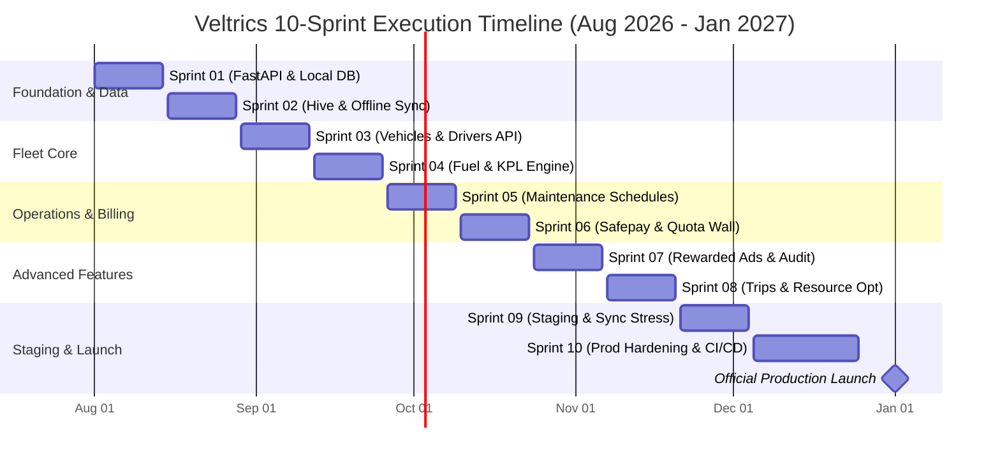

# Veltrics Fleet & Vehicle Management — Development Roadmap

> **Reads from:** [01-product-brief.md](file:///e:/Non_Office/Dev_Space/vibe_skool/veltrics/product-specs/01-product-brief.md), [01b-tech-stack.md](file:///e:/Non_Office/Dev_Space/vibe_skool/veltrics/product-specs/01b-tech-stack.md), [02-architecture.md](file:///e:/Non_Office/Dev_Space/vibe_skool/veltrics/product-specs/02-architecture.md), [03-user-journeys.md](file:///e:/Non_Office/Dev_Space/vibe_skool/veltrics/product-specs/03-user-journeys.md), [04-feature-stories.md](file:///e:/Non_Office/Dev_Space/vibe_skool/veltrics/product-specs/04-feature-stories.md), [04b-mvp-scope.md](file:///e:/Non_Office/Dev_Space/vibe_skool/veltrics/product-specs/04b-mvp-scope.md), [05-style-guide.md](file:///e:/Non_Office/Dev_Space/vibe_skool/veltrics/product-specs/05-style-guide.md), [05b-flutter-theme.dart](file:///e:/Non_Office/Dev_Space/vibe_skool/veltrics/product-specs/05b-flutter-theme.dart), [06-data-model.md](file:///e:/Non_Office/Dev_Space/vibe_skool/veltrics/product-specs/06-data-model.md)  
> **Status:** ✅ Approved & Complete  
> **Author:** Engineering Programme Manager Persona (App Architect)  
> **Stage:** Stage 7 — Development Roadmap  

---

## 1. Executive Summary & Delivery Strategy

The **Veltrics Fleet & Vehicle Management Platform** development roadmap outlines a structured, 10-sprint execution plan leading to official production launch on **January 1, 2027**.

Designed specifically for a **solo full-stack developer leveraging AI-assisted coding**, the delivery strategy prioritizes:
1. **API-First & TDD Discipline:** 100% of frontend data interactions route through FastAPI REST endpoints governed by Pydantic schema validation. Unit and integration tests are written at the start of every sprint before implementation code.
2. **Three-Tier Environment Isolation:** 
   - **Dev (Local):** Zero-cloud, Docker-free local development using FastAPI + Uvicorn + SQLite (`sqlite:///./dev.db`) + Firebase Local Auth Emulators.
   - **Staging (GCP Staging):** GCP Cloud Run Staging + Staging Cloud SQL + Safepay Sandbox. Deployed automatically on merge to `dev`.
   - **Production (GCP Prod):** GCP Cloud Run Production + Cloud SQL + Live Gateways. Deployed automatically on merge to `main`.
3. **Branch Protection Workflow:** Feature development occurs on `sprint/sprint-XX` branches checked out from `dev`. Once local TDD tests pass, code is merged via PR into `dev` (Staging), and finally merged into `main` (Production) upon milestone completion.
4. **Hierarchical Execution Tracking:** Monitored via [07-big-picture-tracker.md](file:///e:/Non_Office/Dev_Space/vibe_skool/veltrics/trackers/07-big-picture-tracker.md) and stage/sprint sub-trackers in `./trackers/`.

---

## 2. 10-Sprint Master Timeline (Target Launch: Jan 1, 2027)

---

## 3. Sprint Breakdown & Task Specifications

### 3.1 Sprint 01 — Foundation, FastAPI Core & Local Backend
* **Target Completion Date:** August 14, 2026
* **Sprint Goal:** Establish repository structure, local non-Docker development environment, FastAPI backend skeleton, SQLAlchemy models, Pydantic payloads, and Firebase Auth verification middleware.
* **Key Tasks:**
  - Setup `./scripts/start_backend.ps1` for single-command Uvicorn + SQLite startup.
  - Implement SQLAlchemy ORM schemas for `organizations`, `users`, and `user_organizations` from [06-data-model.md](file:///e:/Non_Office/Dev_Space/vibe_skool/veltrics/product-specs/06-data-model.md).
  - Build Auth API Endpoints: `POST /api/v1/auth/sync-user`, `GET /api/v1/auth/me`.
  - Configure Flutter project theme foundation from [05b-flutter-theme.dart](file:///e:/Non_Office/Dev_Space/vibe_skool/veltrics/product-specs/05b-flutter-theme.dart).
* **TDD Deliverables:** Unit tests for Auth payload validation; Integration tests for tenant user creation.

### 3.2 Sprint 02 — Hive Offline Infrastructure & Sync Protocol Core
* **Target Completion Date:** August 28, 2026
* **Sprint Goal:** Build Flutter Hive local key-value store, sync metadata queues, and backend batch sync endpoint with deterministic server-wins conflict resolution.
* **Key Tasks:**
  - Create Hive Adapters for `SyncMetadataModel`, `VehicleLocalModel`, and `FuelLogSyncModel`.
  - Implement FastAPI Sync API Endpoint: `POST /api/v1/sync/batch`.
  - Implement client-side transaction queue & connection listener in Flutter.
* **TDD Deliverables:** Offline-to-online sync simulation unit tests; Server-wins timestamp collision integration tests.

### 3.3 Sprint 03 — Vehicles & Drivers Fleet Core
* **Target Completion Date:** September 11, 2026
* **Sprint Goal:** Build full CRUD API endpoints and UI screens for Vehicle assets and Driver management with strict tenant isolation.
* **Key Tasks:**
  - Implement FastAPI Endpoints: `GET/POST/PUT/DELETE /api/v1/vehicles`, `GET/POST/PUT/DELETE /api/v1/drivers`.
  - Build JSONB Pydantic schema validator for `vehicles.custom_specs`.
  - Construct Flutter UI: Fleet Dashboard (`SCR-FLT-001`), Add/Edit Vehicle Form (`SCR-FLT-002`), Driver List (`SCR-DRV-001`).
* **TDD Deliverables:** `custom_specs` JSONB schema validation tests; Multi-tenant tenant boundary leak security tests (`organization_id` isolation).

### 3.4 Sprint 04 — Fuel Refill Logging & Automatic Efficiency Engine
* **Target Completion Date:** September 25, 2026
* **Sprint Goal:** Build fuel log entry APIs, image receipt upload placeholders, and automatic km-per-liter (KPL) calculation logic.
* **Key Tasks:**
  - Implement FastAPI Endpoints: `POST /api/v1/fuel-logs`, `GET /api/v1/fuel-logs/vehicle/{id}`.
  - Write KPL Efficiency Engine: Computes `calculated_efficiency_kpl` against previous full tank refuels.
  - Build Flutter UI: Quick Refuel Entry (`SCR-FUEL-001`), Fuel History Graph (`SCR-FUEL-002`).
* **TDD Deliverables:** KPL math edge-case unit tests (partial refuel, missing previous full tank); Fuel log CRUD integration tests.

### 3.5 Sprint 05 — Maintenance Schedules & Service Work Orders
* **Target Completion Date:** October 09, 2026
* **Sprint Goal:** Implement the "Aha Moment" recurring maintenance alert engine and service log history.
* **Key Tasks:**
  - Implement FastAPI Endpoints: `GET/POST /api/v1/maintenance/schedules`, `POST /api/v1/maintenance/logs`.
  - Build Maintenance Alert Engine: State machine transitioning tasks (`upcoming` -> `due_soon` -> `overdue`).
  - Build JSONB Pydantic schema validator for `maintenance_logs.checklist_items`.
  - Build Flutter UI: Maintenance Dashboard (`SCR-MNT-001`), Service Logger with checklist (`SCR-MNT-002`).
* **TDD Deliverables:** Maintenance state machine transition unit tests; Checklist JSONB payload validation tests.

### 3.6 Sprint 06 — Safepay Billing Gateway & Quota Wall Enforcement
* **Target Completion Date:** October 23, 2026
* **Sprint Goal:** Integrate Safepay Checkout (Pakistan MVP), subscription lifecycle webhooks, and materialized quota enforcement (3 vehicles / 3 drivers).
* **Key Tasks:**
  - Implement FastAPI Endpoints: `POST /api/v1/billing/safepay/checkout`, `POST /api/v1/billing/safepay/webhook`.
  - Implement Quota Middleware: Rejects creation of 4th vehicle/driver unless Pro plan active or slot unlocked.
  - Build Flutter UI: Subscription Tier Upgrade Modal & Quota Wall (`SCR-SUB-001`).
* **TDD Deliverables:** Safepay HMAC webhook signature verification tests; Quota limit enforcement unit tests.

### 3.7 Sprint 07 — Rewarded Video Ad Slot Unlocks & Audit Logging
* **Target Completion Date:** November 06, 2026
* **Sprint Goal:** Build 3-ad video watch verification to unlock temporary bonus slots (+1 vehicle, +1 driver) and immutable audit logging.
* **Key Tasks:**
  - Implement FastAPI Endpoints: `POST /api/v1/ads/verify-reward`, `GET /api/v1/audit-logs`.
  - Build Ad Bonus Manager: Updates `quota_usages.bonus_vehicles_count` upon 3rd verified watch.
  - Build system-wide SQLAlchemy audit event listener capturing mutations into `audit_logs`.
  - Build Flutter UI: Rewarded Ad Slot Unlock Card (`SCR-AD-001`).
* **TDD Deliverables:** Ad count increment & slot unlock unit tests; Audit payload diff validation tests.

### 3.8 Sprint 08 — Trip Logs, Expense Tracking & Device Resource Optimization
* **Target Completion Date:** November 20, 2026
* **Sprint Goal:** Implement trip mileage tracking, non-fuel expenses, GPS battery drain optimization, and photo compression before upload.
* **Key Tasks:**
  - Implement FastAPI Endpoints: `POST /api/v1/trips`, `POST /api/v1/expenses`.
  - Implement Client Photo Compressor (Flutter image compression to <300KB before Cloud Storage upload).
  - Implement GPS location sampling throttler for trip logging.
  - Build Flutter UI: Trip Logger (`SCR-TRIP-001`), Expense Manager (`SCR-EXP-001`).
* **TDD Deliverables:** Trip distance math unit tests; Expense category schema validation tests.

### 3.9 Sprint 09 — GCP Staging Deployment & E2E Sync Stress Testing
* **Target Completion Date:** December 04, 2026
* **Sprint Goal:** Deploy full stack to GCP Staging environment (Cloud Run + Staging Cloud SQL) and run end-to-end offline sync stress testing.
* **Key Tasks:**
  - Deploy FastAPI to GCP Cloud Run (Staging) via GitHub Actions (`.github/workflows/staging-ci-cd.yml`).
  - Execute automated load tests: 1,000 batch offline sync requests via Locust / Python `httpx`.
  - Perform manual QA verification on staging build (`dev` branch).
* **TDD Deliverables:** Staging E2E sync stress test suite; Zero-data-loss conflict resolution validation.

### 3.10 Sprint 10 — Production Hardening, CI/CD & Launch Buffer
* **Target Completion Date:** December 25, 2026
* **Sprint Goal:** Production environment deployment, security penetration audit, app store release build generation, and final launch buffer.
* **Key Tasks:**
  - Deploy GCP Cloud Run Production & Cloud SQL Production instance.
  - Execute Security Audit: JWT claim validation, CORS headers, SQL injection checks.
  - Build signed Android APK / App Bundle and Web production bundle.
  - Finalize documentation and handoff artifacts.
* **TDD Deliverables:** Production release regression test suite (100% green); Security audit compliance checklist.

---

## 4. Definition of Done (DoD) Criteria

Every user story or task must satisfy all 4 DoD criteria before being marked complete in the sprint tracker:

1. **Unit & Integration Test Coverage:** Minimum **80% code coverage** across FastAPI backend endpoints and Flutter business logic controllers (`/tests/`).
2. **API Payload & Schema Validation:** 100% of request/response payloads validated against strict Pydantic schemas.
3. **CI/CD Pipeline Success:** GitHub Actions build, linting, and automated test runs pass with zero errors (`dev` for Staging, `main` for Prod).
4. **On-Demand Manual QA:** Core UI flows verified on local emulator or staging environment without regressions.

---

## 5. Critical Path & Risk Mitigation Matrix

| Risk Category | Potential Impact | Severity | Mitigation Strategy |
| :--- | :--- | :--- | :--- |
| **Offline Sync Conflicts** | Data overwrite / duplicate records | **High** | Enforce deterministic "server-wins" timestamp logic with client UUID v4 identity. |
| **Safepay Sandbox Instability** | Delayed billing deployment | **Medium** | Build a mock Safepay sandbox runner locally; decouple payment webhook verification from gateway network availability. |
| **GPS Battery Drain** | Poor user reviews / app termination | **Medium** | Restrict GPS sampling to distance deltas (>50m) rather than continuous high-accuracy polling. |
| **GCP Cloud SQL Charges** | Unintended infrastructure costs | **Low** | Use local SQLite for daily dev (`start_backend.ps1`); use `gcp_cloud_control.ps1` to stop Cloud SQL when idle. |

---

## 6. Next Stage Handoff

Upon review and approval of this roadmap:
- **Next Stage:** `★ SPECIFICATION INTEGRITY REVIEW` (producing `product-specs/07b-integrity-review.md`).
- **Persona:** Principal TPM / Devil's Advocate.
- **Focus:** Cross-artifact dependency audit across all 10 product specs before generating the final Master PRD.
