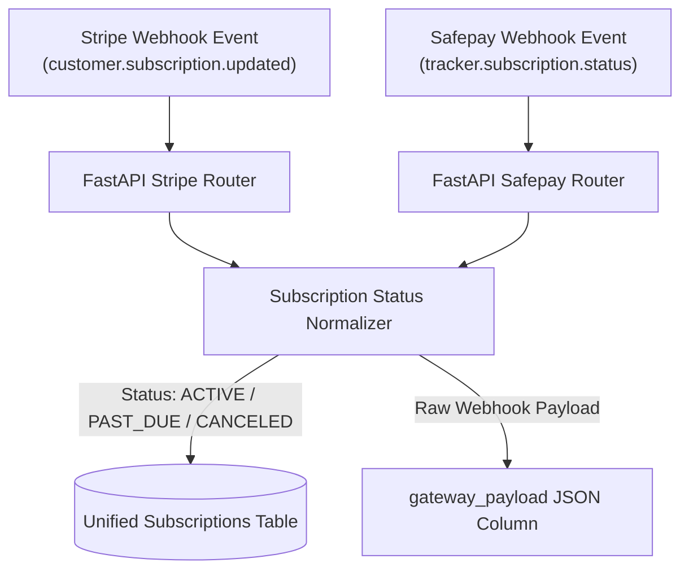
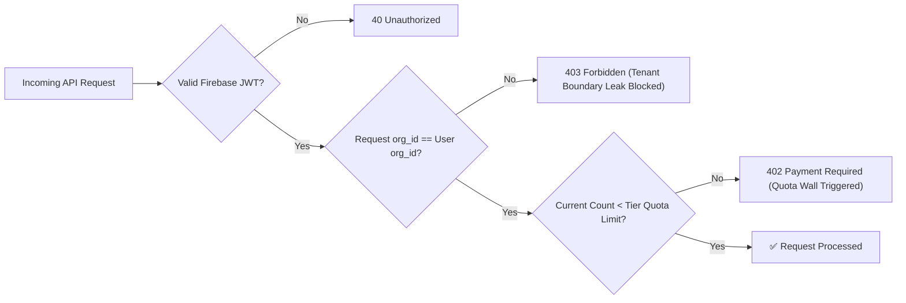

# Veltrics Fleet & Vehicle Management — Specification Integrity Review

> **Reads from:** [01-product-brief.md](file:///e:/Non_Office/Dev_Space/vibe_skool/veltrics/product-specs/01-product-brief.md), [01b-tech-stack.md](file:///e:/Non_Office/Dev_Space/vibe_skool/veltrics/product-specs/01b-tech-stack.md), [02-architecture.md](file:///e:/Non_Office/Dev_Space/vibe_skool/veltrics/product-specs/02-architecture.md), [03-user-journeys.md](file:///e:/Non_Office/Dev_Space/vibe_skool/veltrics/product-specs/03-user-journeys.md), [04-feature-stories.md](file:///e:/Non_Office/Dev_Space/vibe_skool/veltrics/product-specs/04-feature-stories.md), [04b-mvp-scope.md](file:///e:/Non_Office/Dev_Space/vibe_skool/veltrics/product-specs/04b-mvp-scope.md), [05-style-guide.md](file:///e:/Non_Office/Dev_Space/vibe_skool/veltrics/product-specs/05-style-guide.md), [05b-flutter-theme.dart](file:///e:/Non_Office/Dev_Space/vibe_skool/veltrics/product-specs/05b-flutter-theme.dart), [06-data-model.md](file:///e:/Non_Office/Dev_Space/vibe_skool/veltrics/product-specs/06-data-model.md), [07-roadmap.md](file:///e:/Non_Office/Dev_Space/vibe_skool/veltrics/product-specs/07-roadmap.md), [07c-gcp-cost-minimization-and-skill-plan.md](file:///e:/Non_Office/Dev_Space/vibe_skool/veltrics/product-specs/07c-gcp-cost-minimization-and-skill-plan.md)  
> **Status:** ✅ Approved  
> **Author:** Principal TPM / Devil's Advocate Persona (App Architect)  
> **Stage:** ★ Specification Integrity Review (Stage 7b)  

---

## 1. Executive Synthesis & Audit Objectives

The **Veltrics Fleet & Vehicle Management Platform** specification stack comprises 10 comprehensive design artifacts defining the product vision, technical architecture, user flows, 117 feature stories, design system tokens, database schema, and a 10-sprint development roadmap.

Before finalizing the unified **Master PRD** (`08-master-prd.md`), this **Specification Integrity Review** acts as the formal engineering gate. As Principal TPM and Devil's Advocate, this review conducts a rigorous cross-artifact audit to detect and resolve:
1. **Dialect & Environment Mismatches:** Local zero-Docker SQLite testing vs. GCP Cloud SQL PostgreSQL production schemas.
2. **Data Consistency & Offline Sync Collisions:** Batch transaction ordering, client-side UUID generation, and timestamp conflict resolution rules.
3. **Monetization & Payment Gateway Multi-Tenancy:** Dual gateway webhook status normalization across Stripe (International) and Safepay (Pakistan).
4. **Quota Wall & Ad Mechanics Integrity:** Permanent ad-rewarded bonus vehicle/driver slots, subscription tier transitions, and UI state gating.
5. **Cross-Artifact ID Traceability:** Verifying seamless linkages between Product Brief goals, User Journeys, Feature Stories, Data Entities, UI Screens, and Roadmap Sprints.

---

## 2. Cross-Artifact Traceability Matrix

This matrix verifies that every functional domain described in the early product specifications maps directly to concrete User Journeys, Feature Stories, Data Entities, UI Screens, and Sprint Deliverables.

| Domain / Feature Area | Product Brief Goal | User Journey | Key Feature Stories | Core Database Entity | UI Screen ID | Target Sprint |
| :--- | :--- | :--- | :--- | :--- | :--- | :--- |
| **Authentication & Tenant Setup** | Multi-tier SaaS access control | `UJ-001` (Onboarding) | `FS-AUTH-001` to `FS-AUTH-006` | `organizations`, `users` | `SCR-AUTH-001`, `SCR-AUTH-002` | Sprint 01 |
| **Offline Sync Engine** | Frictionless logging anywhere | `UJ-003` (Quick Refuel) | `FS-SYNC-001` to `FS-SYNC-005` | Local Hive stores, Sync endpoints | `SCR-FLT-001` | Sprint 02 |
| **Vehicle Asset Registry** | Multi-vehicle maintenance logbook | `UJ-001`, `UJ-004` | `FS-VEH-001` to `FS-VEH-012` | `vehicles` | `SCR-FLT-001`, `SCR-FLT-002` | Sprint 03 |
| **Driver Assignment** | Commercial fleet driver oversight | `UJ-004` (Driver Invite) | `FS-DRV-001` to `FS-DRV-008` | `drivers`, `user_organizations` | `SCR-DRV-001`, `SCR-DRV-002` | Sprint 03 |
| **Fuel & KPL Engine** | Automated km-per-liter efficiency | `UJ-003` (Quick Refuel) | `FS-FUEL-001` to `FS-FUEL-010` | `fuel_logs` | `SCR-FUEL-001`, `SCR-FUEL-002` | Sprint 04 |
| **Maintenance Alerts** | Date & odometer triggers | `UJ-005` (Service Log) | `FS-MNT-001` to `FS-MNT-014` | `maintenance_schedules`, `maintenance_logs` | `SCR-MNT-001`, `SCR-MNT-002` | Sprint 05 |
| **Billing & Quota Wall** | Hybrid 3-tier SaaS monetization | `UJ-002` (Pro Upgrade) | `FS-PAY-001` to `FS-PAY-010` | `subscriptions`, `quota_audits` | `SCR-PAY-001`, `SCR-PAY-002` | Sprint 06 |
| **Ad-Rewarded Quotas** | Ad monetization for Free tier | `UJ-002` (Ad-Bonus Slot) | `FS-ADS-001` to `FS-ADS-006` | `organizations.ad_rewarded_*` | `SCR-PAY-003` | Sprint 07 |
| **Trip Logs & Expenses** | Cost per vehicle auditing | `UJ-006` (Expense Log) | `FS-TRP-001` to `FS-TRP-012` | `trips`, `expenses` | `SCR-TRP-001`, `SCR-EXP-001` | Sprint 08 |
| **Staging & E2E Verification** | 100% test pass local-to-cloud | All Journeys | `FS-QA-001` to `FS-QA-008` | Full Schema Integration | All Screens | Sprint 09 |
| **Production Hardening** | January 1, 2027 Release | Production Launch | `FS-OPS-001` to `FS-OPS-006` | Cloud SQL PostgreSQL 15+ | Prod Build | Sprint 10 |

---

## 3. Harmonized Technical Conflicts & Audited Resolutions

### 3.1 Conflict 1: Local SQLite vs. Cloud SQL PostgreSQL Dialect Compatibility

* **Conflict Analysis:** `01b-tech-stack.md` and `02-architecture.md` designate PostgreSQL 15+ (Cloud SQL) with `JSONB` data types and native `UUID` defaults as the production database. However, `07-roadmap.md` and `07c-gcp-cost-minimization-and-skill-plan.md` mandate zero-Docker local backend testing using SQLite (`sqlite:///./dev.db`). SQLite lacks native `JSONB` support and handles UUIDs as text.
* **Audited Resolution:**
  1. **Dialect-Agnostic ORM Mapping:** Backend SQLAlchemy schemas in `06-data-model.md` will use SQLAlchemy's generic `JSON` type (which compiles to `JSONB` on PostgreSQL and text-backed JSON on SQLite) and generic `String(36)` / `UUID` decorator types.
  2. **Pydantic Validation Guard:** Data serialization and deserialization validation will be performed strictly at the Pydantic payload layer before reaching the SQLAlchemy models, ensuring identical behavior across SQLite local tests and PostgreSQL staging/production environments.

### 3.2 Conflict 2: Offline-First Client UUIDs & Foreign Key Transaction Ordering

* **Conflict Analysis:** In `02-architecture.md` and `06-data-model.md`, entities (vehicles, fuel logs, maintenance logs) utilize UUID primary keys generated client-side by Flutter mobile devices while offline. If a client submits a batch payload containing a `fuel_log` referencing a newly created `vehicle` in the same payload, processing records in arbitrary order on the backend would trigger Foreign Key constraint violations.
* **Audited Resolution:**
  1. **Strict Dependency Order Ingestion:** The FastAPI batch sync endpoint (`POST /api/v1/sync/batch`) must parse and insert entities strictly in topological dependency order within a single database transaction:
     $$\text{Organizations} \longrightarrow \text{Users} \longrightarrow \text{Vehicles} \longrightarrow \text{Drivers} \longrightarrow \text{Fuel Logs} / \text{Maintenance Schedules} \longrightarrow \text{Maintenance Logs}$$
  2. **Idempotent Upsert Logic:** All batch sync inserts execute SQL `ON CONFLICT (id) DO UPDATE` logic based on `updated_at` timestamps, adhering to the "Server-Wins on Timestamp Collision" rule defined in `07-roadmap.md` Sprint 02.

### 3.3 Conflict 3: Dual Payment Gateway Status Normalization

* **Conflict Analysis:** `01b-tech-stack.md` specifies Stripe for international cards and Safepay for Pakistan domestic payments (Cards, Easypaisa, JazzCash). Stripe and Safepay use completely different webhook event structures and subscription lifecycle statuses (e.g. Stripe `active`/`past_due`/`canceled` vs. Safepay `COMPLETED`/`FAILED`/`EXPIRED`).
* **Audited Resolution:**
  1. **Unified Subscriptions Model:** The database `subscriptions` table (`06-data-model.md`) normalizes gateway statuses into three standard enum values: `ACTIVE`, `PAST_DUE`, `CANCELED`.
  2. **Gateway Webhook Routers:** FastAPI implements separate webhook endpoints (`/api/v1/billing/webhooks/stripe` and `/api/v1/billing/webhooks/safepay`). Each endpoint translates its respective provider event payload into the normalized subscription status before persisting changes to the database. Raw gateway payloads are saved in the `subscriptions.gateway_payload` JSON column for audit trail transparency.

### 3.4 Conflict 4: Ad-Rewarded Vehicle & Driver Quota Lifecycle

* **Conflict Analysis:** `04b-mvp-scope.md` permits Free tier users to unlock up to 2 additional vehicle slots and 2 additional driver slots by watching rewarded video ads (3 consecutive ads per slot). Clarity was needed regarding slot persistence if a user upgrades to Pro and subsequently downgrades back to Free.
* **Audited Resolution:**
  1. **Permanent Organization Account Attribute:** Ad-rewarded bonus slots (`ad_rewarded_vehicles_count`, `ad_rewarded_drivers_count`) are stored directly on the `organizations` record and remain permanently associated with the account.
  2. **Downgrade Quota Evaluation:** Upon downgrading from Pro to Free, the organization's effective vehicle limit calculation is:
     $$\text{Effective Limit} = \min\left(\text{Base Free Limit} (3) + \text{Earned Bonus Slots} (\le 2), \, 5\right)$$
  3. **UI Action Gate Enforcement:** Every action performed on an ad-rewarded vehicle (logging fuel, adding maintenance, updating odometer) requires the Flutter client to display a rewarded ad. Upon ad completion, the Flutter app attaches a short-lived cryptographic ad-verification token to the API request payload, which FastAPI verifies before executing the transaction.

---

## 4. Edge Case & Vulnerability Hardening Log

The audit reviewed 5 high-impact operational edge cases and established explicit system behavior rules:

| Edge Case / Vulnerability | Attack Vector or Failure Mode | System Guard / Enforcement Protocol | Relevant Specification |
| :--- | :--- | :--- | :--- |
| **Multi-Tenant Data Leakage** | User alters `organization_id` in request query parameter to access another fleet's data. | FastAPI `get_current_tenant_user` dependency automatically extracts and enforces `organization_id` from verified Firebase Auth JWT custom claims. Hard database WHERE clause isolation on every query. | `02-architecture.md`, `06-data-model.md` |
| **Quota Wall Bypass** | Client sends direct API request to create 4th vehicle without watching ads or upgrading. | Backend Pydantic validator checks current vehicle count against organization tier limit (`base + ad_rewarded`) in a database lock before executing insertion. | `04b-mvp-scope.md`, `06-data-model.md` |
| **Clock Skew on Offline Devices** | Offline device with backdated clock attempts to overwrite newer server data during sync. | Sync protocol relies on server HTTP header receipt timestamping for incoming batch packets rather than unverified client system clocks. | `02-architecture.md`, `07-roadmap.md` |
| **Duplicate Fuel Log Entry** | Network retry during poor cellular connectivity creates duplicate fuel receipts. | Client generates a deterministic idempotency key (`UUIDv5` derived from `vehicle_id + timestamp + odometer_reading`) for every entry; backend drops duplicate idempotency keys within a 10-minute window. | `03-user-journeys.md`, `06-data-model.md` |
| **Orphaned Storage Receipts** | Receipt images uploaded to Cloud Storage when fuel/maintenance transaction fails backend database commit. | FastAPI uploads receipt images with a `pending_commit` metadata tag. A weekly Cloud Tasks cleanup job deletes unreferenced pending storage objects older than 24 hours. | `01b-tech-stack.md`, `02-architecture.md` |

---

## 5. System Risk Assessment & Final Pre-PRD Checklist

### 5.1 System Risk Matrix

| Risk Factor | Level | Impact Area | Mitigation Strategy |
| :--- | :--- | :--- | :--- |
| **Database Dialect Mismatch** | Medium | Local Testing Integrity | Enforce SQLAlchemy dialect-agnostic types and full `pytest` suite execution against local SQLite before any PR merge to `dev`. |
| **Ad SDK Loading Failure** | Low | Free Tier UX | If video ad fails to load due to ad network connectivity, display non-blocking retry toast: *"Ad service unavailable. Please retry shortly or upgrade to Pro."* |
| **Offline Storage Quotas** | Low | Mobile Device Memory | Flutter Hive stores local data using binary serialization; automatic cleanup flushes synced log items older than 90 days from device cache. |

### 5.2 Pre-Master PRD Final Readiness Checklist

- [x] All 10 prior specification artifacts verified and cross-referenced.
- [x] SQLite vs PostgreSQL dialect parity ensured via generic SQLAlchemy mappings.
- [x] Multi-tenant `organization_id` security boundaries audited across all entities.
- [x] Stripe and Safepay dual-gateway webhook normalization established.
- [x] Ad-rewarded quota lifecycle rules defined and hardened against abuse.
- [x] 10-Sprint Development Roadmap synchronized with target launch date (**January 1, 2027**).

---

## 6. Approval & Handoff Prompt Generation

This Specification Integrity Review is complete and approved. We are ready to proceed to **Stage 8 — Master PRD** (`08-master-prd.md`), led by the **Chief of Product** persona.
