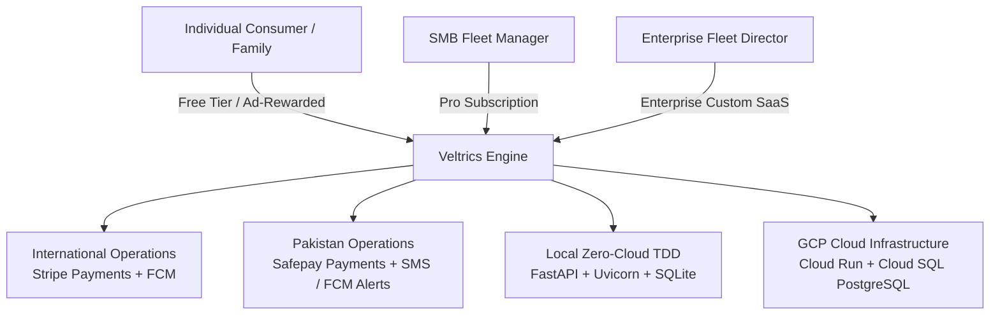
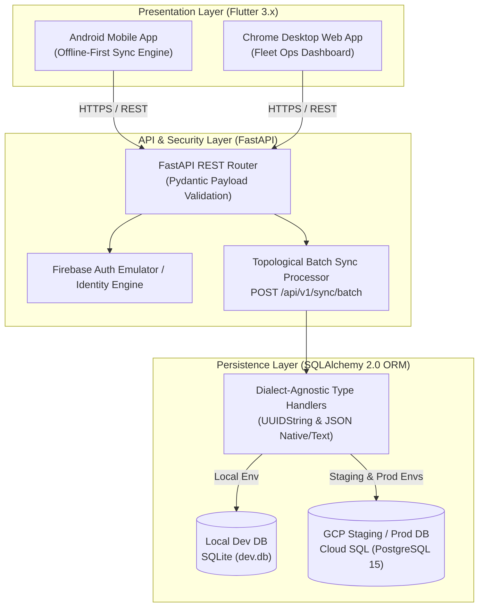
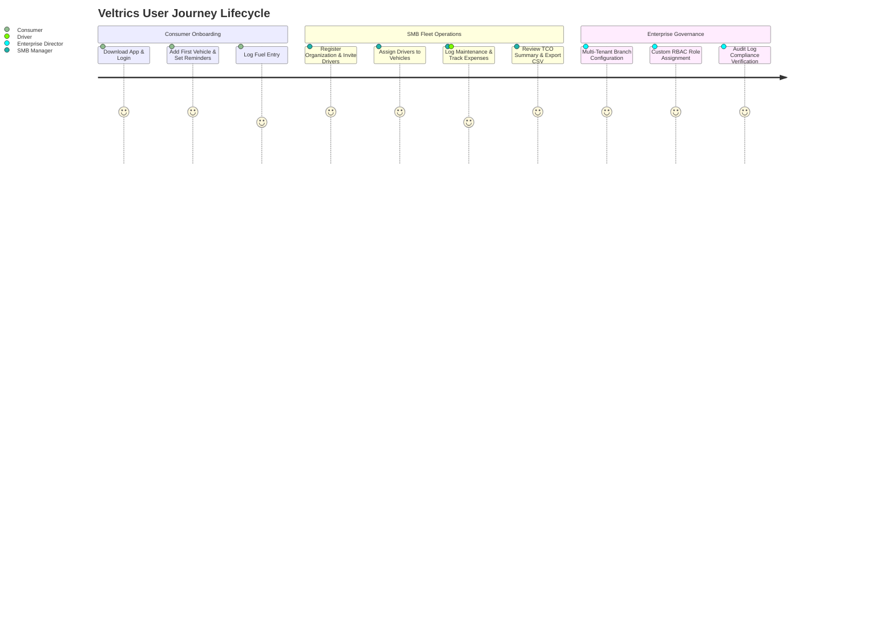
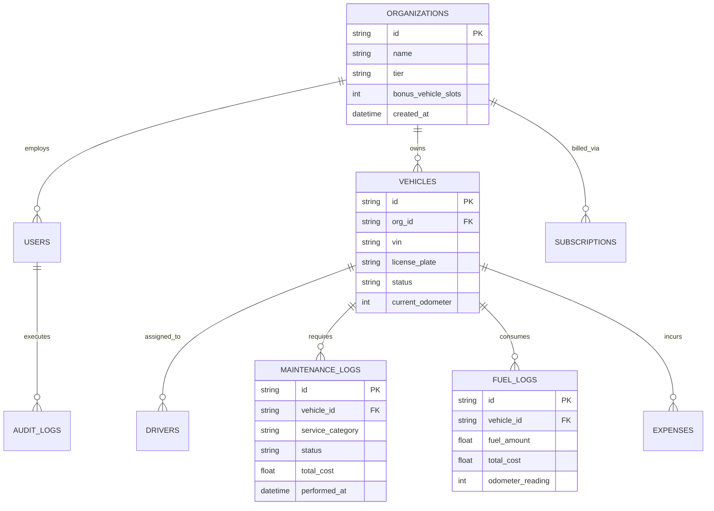
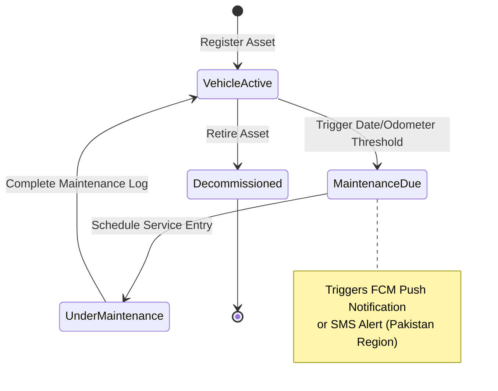
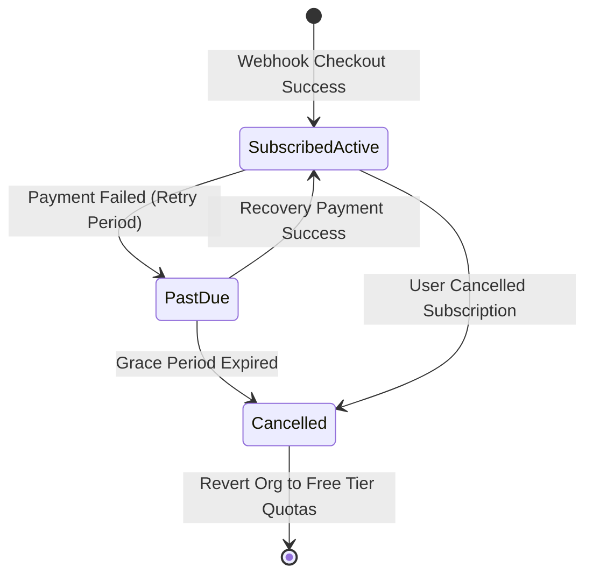
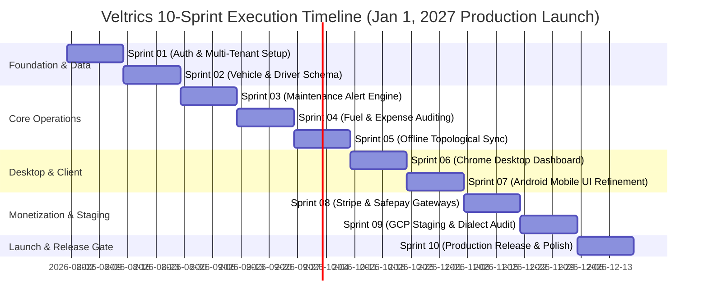

# Veltrics Fleet & Vehicle Management — Master Product Requirement Document (Master PRD)

> **Reads from:** [01-product-brief.md](file:///e:/Non_Office/Dev_Space/vibe_skool/veltrics/product-specs/01-product-brief.md), [01b-tech-stack.md](file:///e:/Non_Office/Dev_Space/vibe_skool/veltrics/product-specs/01b-tech-stack.md), [02-architecture.md](file:///e:/Non_Office/Dev_Space/vibe_skool/veltrics/product-specs/02-architecture.md), [03-user-journeys.md](file:///e:/Non_Office/Dev_Space/vibe_skool/veltrics/product-specs/03-user-journeys.md), [04-feature-stories.md](file:///e:/Non_Office/Dev_Space/vibe_skool/veltrics/product-specs/04-feature-stories.md), [04b-mvp-scope.md](file:///e:/Non_Office/Dev_Space/vibe_skool/veltrics/product-specs/04b-mvp-scope.md), [05-style-guide.md](file:///e:/Non_Office/Dev_Space/vibe_skool/veltrics/product-specs/05-style-guide.md), [05b-flutter-theme.dart](file:///e:/Non_Office/Dev_Space/vibe_skool/veltrics/product-specs/05b-flutter-theme.dart), [06-data-model.md](file:///e:/Non_Office/Dev_Space/vibe_skool/veltrics/product-specs/06-data-model.md), [07-roadmap.md](file:///e:/Non_Office/Dev_Space/vibe_skool/veltrics/product-specs/07-roadmap.md), [07b-integrity-review.md](file:///e:/Non_Office/Dev_Space/vibe_skool/veltrics/product-specs/07b-integrity-review.md), [07c-gcp-cost-minimization-and-skill-plan.md](file:///e:/Non_Office/Dev_Space/vibe_skool/veltrics/product-specs/07c-gcp-cost-minimization-and-skill-plan.md)  
> **Status:** ✅ Approved & Definitive Master Specification  
> **Author:** Chief of Product Persona (App Architect)  
> **Target Release Date:** January 1, 2027 (10 Sprints across 3 Isolated Environment Tiers)

---

## 1. Executive Vision & Strategic Positioning

**Veltrics Fleet & Vehicle Management** is an enterprise-grade, multi-tenant SaaS platform designed to manage individual vehicles and commercial fleets seamlessly from a single unified ecosystem. 

Veltrics intentionally decouples fleet asset governance from hardware OBD-II telematics, focusing instead on **high-reliability maintenance scheduling, total cost of ownership (TCO) financial auditing, driver assignment, fuel logging, and offline-first operational synchronization**.

### 1.1 Strategic Highlights & Core Differentiators
1. **Enterprise Fleet & Asset Focus (Non-Telematics):** Solves vehicle upkeep, financial auditing, asset lifecycle status tracking, and compliance without requiring expensive or proprietary OBD-II GPS hardware.
2. **Dual-Market Regionalization:** Operates seamlessly across International markets (Stripe gateway billing, FCM push notifications) and Pakistan regional markets (Safepay payment gateway, SMS dispatch/alert support, PKR/USD currency localization).
3. **Offline-First Resilience:** Equips mobile drivers and field managers with offline transactional queues that automatically batch sync with topological integrity upon network re-connection.
4. **Zero-Cloud Local TDD Architecture:** Guarantees 100% database dialect parity across SQLite local development (`sqlite:///./dev.db`) and GCP Cloud SQL PostgreSQL in staging and production, strictly capping monthly non-production GCP costs (<$15/mo).

---

## 2. Multi-Platform System Architecture & Tech Stack

Veltrics enforces absolute separation between the client presentation layer and backend database models, routing 100% of data traffic through strongly-typed REST API endpoints governed by Pydantic payloads.

### 2.1 Approved Technology Stack Summary

| Infrastructure Layer | Standardized Technology | Purpose & Environment Execution |
| :--- | :--- | :--- |
| **Frontend Framework** | Flutter 3.x (Dart 3.x) | Single codebase for Android Mobile App and Chrome Desktop Web App. |
| **State Management** | Flutter Riverpod 3.x | Reactive state management with offline persistence providers. |
| **Backend Framework** | FastAPI (Python 3.11+) | Asynchronous REST API service with automated OpenAPI specification generation. |
| **Data Validation** | Pydantic v2 | Strict request/response payload validation and schema enforcement. |
| **ORM & Database** | SQLAlchemy 2.0 + SQLite / PostgreSQL | Dialect-agnostic database access supporting SQLite locally and PostgreSQL on GCP. |
| **Authentication** | Firebase Auth (Local Emulator / Cloud) | JWT Bearer token authentication supporting email/password and phone OTP. |
| **Payment Gateways** | Stripe (Intl) & Safepay (PK) | Webhook-driven multi-currency subscription processing and quota management. |
| **Cloud Hosting** | GCP Cloud Run & GCP Cloud SQL | Serverless API execution paired with managed PostgreSQL (Staging/Production). |

---

## 3. Target User Personas & Journey Specifications

Veltrics caters to three primary user tiers with tailored user journeys and permission levels.

### 3.1 Persona Profiles & Feature Matrix

| Persona Class | Operational Focus | Primary Interface | Key Permissions & Limits |
| :--- | :--- | :--- | :--- |
| **Consumer (Free)** | Individual Vehicle Owners & Families | Android Mobile App | - Max 3 Vehicles (+2 via ad rewards = 5 max) - Max 3 Drivers (+2 via ad rewards = 5 max) - Maintenance alerts, fuel logging, basic expense recording. |
| **SMB Fleet Manager (Pro)** | Rental Operators, Logistics SMBs | Chrome Desktop Web + Android Mobile | - Up to 25 Vehicles & 25 Drivers - Ad-free experience, PDF/CSV financial exports. - Driver assignment, maintenance status updates. |
| **Enterprise Fleet Director** | Multi-Branch Logistics & Rental | Chrome Desktop Web App | - Unlimited Vehicles & Custom Driver Quotas - Role-based access control (RBAC), immutable audit logs. - Dedicated reporting and enterprise support SLAs. |

---

## 4. Complete Feature Matrix & Acceptance Criteria

All user stories are prioritized across P0 (Critical MVP), P1 (High Priority), and P2 (Enhancement).

### 4.1 Feature Stories & Testable Criteria (P0 / P1 / P2)

| Story ID | Epic | Feature Description | Priority | Testable Acceptance Criteria |
| :--- | :--- | :--- | :--- | :--- |
| **US-001** | Identity | Organization Registration & Multi-Tenant Setup | P0 | Given a new admin, when registering an organization, then create the tenant with free quota limits and initialize default roles. |
| **US-002** | Identity | User Authentication & JWT Session Management | P0 | Given valid credentials, when authenticating via Firebase Auth, then return a signed JWT bearer token containing `org_id` and `role`. |
| **US-003** | Assets | Vehicle Lifecycle Registration & Profile Management | P0 | Given vehicle specifications (VIN, License, Make, Model, Odometer), when created, default status to `ACTIVE` and enforce organization limits. |
| **US-004** | Operations | Maintenance Scheduling & Alert Generation | P0 | Given date or odometer thresholds, when maintenance is due, trigger alert status (`SCHEDULED` → `OVERDUE`) and send notification. |
| **US-005** | Operations | Granular Service Logging | P0 | Given a completed service item (e.g. Engine Oil, Brake Pads), when logged, update vehicle current odometer and record cost in financial audit. |
| **US-006** | Operations | Fuel Entry Logging & Consumption Analysis | P0 | Given fuel volume, cost, and odometer reading, calculate distance traveled and MPG / km-per-liter efficiency metrics. |
| **US-007** | Operations | General Expense & Cost Recording | P0 | Given non-maintenance costs (tolls, parking, repairs), assign expenses to vehicle records and attribute category tags. |
| **US-008** | Offline Engine| Topological Batch Sync Endpoint | P0 | Given an offline device re-connecting, process `POST /api/v1/sync/batch` in strict topological order (`orgs` → `users` → `vehicles` → `drivers` → `logs`). |
| **US-009** | Monetization| Ad-Rewarded Asset Quota Expansion | P1 | Given a Free tier user watching an in-app reward ad, permanently attach +1 vehicle/driver slot up to the hard cap of 5 total assets. |
| **US-010** | Monetization| Stripe Payment Gateway Subscription Sync | P1 | Given international checkout completion, process Stripe webhook to elevate organization status to `ACTIVE` Pro tier. |
| **US-011** | Monetization| Safepay Payment Gateway Webhook Handler | P1 | Given Pakistan Safepay checkout success, normalize transaction status and persist raw webhook JSON in `subscriptions.gateway_payload`. |
| **US-012** | Analytics | Fleet Financial TCO Summary Dashboard | P1 | Given selected date ranges, compute total fleet expenditure per vehicle, per driver, and cost per kilometer. |
| **US-013** | Compliance | Immutable System Audit Logging | P2 | Given sensitive operations (role elevation, asset deletion), record immutable audit log entries with user ID, IP address, and payload delta. |

### 4.2 Explicitly Descoped MVP Scope (Phase 1 Non-Goals)
- **OBD-II Hardware / Live Telematics Streaming:** Zero reliance on physical vehicle tracking hardware.
- **AI-Powered Predictive Maintenance Scoring:** Machine learning failure analysis deferred to Phase 2.
- **OCR Automated Receipt Scanning:** Optical character recognition for fuel/service receipts deferred to Phase 2.
- **Native iOS Application:** Native iOS binary build deferred until Phase 2 rollout.

---

## 5. Data Model, State Lifecycles & Dialect Parity

To ensure seamless execution across local zero-cloud development (`SQLite`) and production GCP infrastructure (`PostgreSQL`), all database schemas utilize custom SQLAlchemy type wrappers: `UUIDString` (maps to `CHAR(36)` on SQLite and native `UUID` on PostgreSQL) and `JSON` (maps to `JSON` / `TEXT` on SQLite and native `JSONB` on PostgreSQL).

### 5.1 Primary Entity Lifecycles & State Transitions

---

## 6. Design System & UI Components

Veltrics implements a dark-mode first design system tailored for high readability in automotive field conditions and desktop fleet operations.

### 6.1 Color Palette & Visual Tokens

| Design Token | Color Hex Code | Application Purpose |
| :--- | :--- | :--- |
| **Primary Brand Blue** | `#1E88E5` | Primary buttons, active tab indicators, key navigation links. |
| **Accent Electric Cyan** | `#00E5FF` | Highlight badges, metric callouts, interactive toggles. |
| **Background Charcoal** | `#121212` | Main application background (Dark Mode default). |
| **Surface Dark Slate** | `#1E1E1E` | Card containers, modal popups, table background surfaces. |
| **Status Warning Gold** | `#FFB300` | Maintenance scheduled alerts, upcoming inspection warnings. |
| **Status Critical Red** | `#E53935` | Overdue maintenance, payment past-due alerts, vehicle out-of-service. |
| **Status Success Green** | `#43A047` | Active vehicle status, completed maintenance logs, sync complete. |

---

## 7. Development Roadmap, Release Gates & Cost Governance

Development is structured into **10 Sprints across 3 Isolated Environment Tiers**, culminating in the target production release on **January 1, 2027**.

### 7.1 Mandatory Production Release Gate KPIs

Before merging the final `dev` branch into `main` for production release, 100% of the following Release Gate KPIs must be empirically validated:

1. **100% Dialect Parity & Zero Sync Data Loss:** 100% automated pass rate across both local SQLite unit/integration test suites and GCP Cloud SQL PostgreSQL staging test suites. Topological offline batch processing (`POST /api/v1/sync/batch`) must execute zero-data-loss recovery.
2. **Sub-200ms API Latency under 3G Mobile Simulation:** All core REST API endpoints (vehicle list, maintenance log entry, fuel record submit) must achieve `<200ms` response times under simulated high-latency 3G mobile network conditions.
3. **Strict Non-Production GCP Cost Limit (<$15/mo):** GCP Cloud SQL staging instances must be automatically managed via `.\scripts\gcp_cloud_control.ps1 -Action start/stop` to guarantee zero redundant cloud charges during non-coding windows.

---

## 8. Specification Integrity Review Resolutions

The following structural conflicts identified during the Stage 7b Integrity Review (`product-specs/07b-integrity-review.md`) have been fully resolved in this Master PRD:

1. **Dialect Parity Standard:** Enforced `UUIDString` and `JSON` ORM type wrappers so SQLite local development matches GCP PostgreSQL staging without Docker overhead.
2. **Topological Batch Ingestion Order:** Enforced strict entity ingestion order in `POST /api/v1/sync/batch`: `organizations` → `users` → `vehicles` → `drivers` → `fuel_logs` / `maintenance_logs` / `expenses` to prevent foreign key dependency violations.
3. **Multi-Gateway Payment Status Normalization:** Standardized subscription status mappings (`ACTIVE`, `PAST_DUE`, `CANCELLED`) for Stripe and Safepay webhooks, retaining full raw payloads in `gateway_payload` JSON fields.
4. **Ad-Rewarded Quota Lifecycle:** Standardized Free Tier ad rewards to attach directly to `organization` records, hard-capping total free slots at 5 vehicles and 5 drivers.

---

## 9. PRD Change Control & Governance

Any post-approval modifications to this Master PRD during Sprint implementation must be explicitly recorded in the version log below with engineering rationale and approval sign-offs.

| Version | Sprint ID | Date | Author / Role | Section Updated | Description & Rationale | Approver Sign-Off |
| :--- | :--- | :--- | :--- | :--- | :--- | :--- |
| **1.0.0** | Baseline | 2026-07-29 | Chief of Product | All Sections | Baseline Master PRD synthesized from approved Stage 01–07b specs. | Lead Architect & TPM |
