# Community 1

> 162 nodes · cohesion 0.02

## Key Concepts

- [User](file:///E:/Non_Office/Dev_Space/vibe_skool/veltrics/src/backend/app/models/user.py#L13) (115 connections)
- [OrganizationInvitation](file:///E:/Non_Office/Dev_Space/vibe_skool/veltrics/src/backend/app/models/organization_invitation.py#L6) (18 connections)
- [test_auth_uc005.py](file:///E:/Non_Office/Dev_Space/vibe_skool/veltrics/src/tests/unit/test_auth_uc005.py#L1) (11 connections)
- [test_organizations_uc016.py](file:///E:/Non_Office/Dev_Space/vibe_skool/veltrics/src/tests/unit/test_organizations_uc016.py#L1) (11 connections)
- [SwitchOrganizationResponse](file:///E:/Non_Office/Dev_Space/vibe_skool/veltrics/src/backend/app/schemas/organization.py#L40) (11 connections)
- [Retrieve organizations list.](file:///E:/Non_Office/Dev_Space/vibe_skool/veltrics/src/backend/app/api/v1/organizations.py#L102) (11 connections)
- [UC-015: Switch active organization context for user.](file:///E:/Non_Office/Dev_Space/vibe_skool/veltrics/src/backend/app/api/v1/organizations.py#L119) (11 connections)
- [UC-015: Get active organization for user.](file:///E:/Non_Office/Dev_Space/vibe_skool/veltrics/src/backend/app/api/v1/organizations.py#L152) (11 connections)
- [Retrieve organization details by ID.](file:///E:/Non_Office/Dev_Space/vibe_skool/veltrics/src/backend/app/api/v1/organizations.py#L181) (11 connections)
- [UC-016: Invite Team Member to Organization.     Generates a secure 64-character](file:///E:/Non_Office/Dev_Space/vibe_skool/veltrics/src/backend/app/api/v1/organizations.py#L204) (11 connections)
- [UC-016: List pending organization invitations.](file:///E:/Non_Office/Dev_Space/vibe_skool/veltrics/src/backend/app/api/v1/organizations.py#L262) (11 connections)
- [UC-014: Provision commercial or custom organization.](file:///E:/Non_Office/Dev_Space/vibe_skool/veltrics/src/backend/app/api/v1/organizations.py#L31) (11 connections)
- [UC-014: Auto-provision personal organization for a user during registration or s](file:///E:/Non_Office/Dev_Space/vibe_skool/veltrics/src/backend/app/api/v1/organizations.py#L61) (11 connections)
- [OrganizationInvitationCreate](file:///E:/Non_Office/Dev_Space/vibe_skool/veltrics/src/backend/app/schemas/organization_invitation.py#L8) (10 connections)
- [OrganizationInvitationResponse](file:///E:/Non_Office/Dev_Space/vibe_skool/veltrics/src/backend/app/schemas/organization_invitation.py#L29) (10 connections)
- [OrganizationCreate](file:///E:/Non_Office/Dev_Space/vibe_skool/veltrics/src/backend/app/schemas/organization.py#L5) (10 connections)
- [OrganizationResponse](file:///E:/Non_Office/Dev_Space/vibe_skool/veltrics/src/backend/app/schemas/organization.py#L24) (10 connections)
- [PersonalOrganizationCreate](file:///E:/Non_Office/Dev_Space/vibe_skool/veltrics/src/backend/app/schemas/organization.py#L20) (10 connections)
- [SwitchOrganizationRequest](file:///E:/Non_Office/Dev_Space/vibe_skool/veltrics/src/backend/app/schemas/organization.py#L36) (10 connections)
- [test_organizations_uc014.py](file:///E:/Non_Office/Dev_Space/vibe_skool/veltrics/src/tests/unit/test_organizations_uc014.py#L1) (9 connections)
- [test_organizations_uc015.py](file:///E:/Non_Office/Dev_Space/vibe_skool/veltrics/src/tests/unit/test_organizations_uc015.py#L1) (9 connections)
- [organizations.py](file:///E:/Non_Office/Dev_Space/vibe_skool/veltrics/src/backend/app/api/v1/organizations.py#L1) (8 connections)
- [test_auth_uc006.py](file:///E:/Non_Office/Dev_Space/vibe_skool/veltrics/src/tests/unit/test_auth_uc006.py#L1) (8 connections)
- [test_auth_uc008.py](file:///E:/Non_Office/Dev_Space/vibe_skool/veltrics/src/tests/unit/test_auth_uc008.py#L1) (7 connections)
- [test_auth_uc009.py](file:///E:/Non_Office/Dev_Space/vibe_skool/veltrics/src/tests/unit/test_auth_uc009.py#L1) (7 connections)
- *... and 137 more nodes in this community*

## Class Diagram

```mermaid
classDiagram
    class OrganizationInvitation {
        +organization_invitation.py()
    }
    class OrganizationInvitationCreate {
        +organization_invitation.py()
    }
    class OrganizationInvitationResponse {
        +organization_invitation.py()
    }
    class OrganizationCreate {
        +organization.py()
    }
    class OrganizationResponse {
        +organization.py()
    }
    class PersonalOrganizationCreate {
        +organization.py()
    }
    class SwitchOrganizationRequest {
        +organization.py()
    }
    class SwitchOrganizationResponse {
        +organization.py()
    }
    class User {
        +user.py()
    }
```

## Relationships

- No strong cross-community connections detected

## Source Files

- [E:\Non_Office\Dev_Space\vibe_skool\veltrics\src\backend\app\api\v1\organizations.py](file:///E:/Non_Office/Dev_Space/vibe_skool/veltrics/src/backend/app/api/v1/organizations.py)
- [E:\Non_Office\Dev_Space\vibe_skool\veltrics\src\backend\app\models\organization_invitation.py](file:///E:/Non_Office/Dev_Space/vibe_skool/veltrics/src/backend/app/models/organization_invitation.py)
- [E:\Non_Office\Dev_Space\vibe_skool\veltrics\src\backend\app\models\user.py](file:///E:/Non_Office/Dev_Space/vibe_skool/veltrics/src/backend/app/models/user.py)
- [E:\Non_Office\Dev_Space\vibe_skool\veltrics\src\backend\app\schemas\organization.py](file:///E:/Non_Office/Dev_Space/vibe_skool/veltrics/src/backend/app/schemas/organization.py)
- [E:\Non_Office\Dev_Space\vibe_skool\veltrics\src\backend\app\schemas\organization_invitation.py](file:///E:/Non_Office/Dev_Space/vibe_skool/veltrics/src/backend/app/schemas/organization_invitation.py)
- [E:\Non_Office\Dev_Space\vibe_skool\veltrics\src\tests\unit\test_auth_uc002.py](file:///E:/Non_Office/Dev_Space/vibe_skool/veltrics/src/tests/unit/test_auth_uc002.py)
- [E:\Non_Office\Dev_Space\vibe_skool\veltrics\src\tests\unit\test_auth_uc005.py](file:///E:/Non_Office/Dev_Space/vibe_skool/veltrics/src/tests/unit/test_auth_uc005.py)
- [E:\Non_Office\Dev_Space\vibe_skool\veltrics\src\tests\unit\test_auth_uc006.py](file:///E:/Non_Office/Dev_Space/vibe_skool/veltrics/src/tests/unit/test_auth_uc006.py)
- [E:\Non_Office\Dev_Space\vibe_skool\veltrics\src\tests\unit\test_auth_uc008.py](file:///E:/Non_Office/Dev_Space/vibe_skool/veltrics/src/tests/unit/test_auth_uc008.py)
- [E:\Non_Office\Dev_Space\vibe_skool\veltrics\src\tests\unit\test_auth_uc009.py](file:///E:/Non_Office/Dev_Space/vibe_skool/veltrics/src/tests/unit/test_auth_uc009.py)
- [E:\Non_Office\Dev_Space\vibe_skool\veltrics\src\tests\unit\test_auth_uc010.py](file:///E:/Non_Office/Dev_Space/vibe_skool/veltrics/src/tests/unit/test_auth_uc010.py)
- [E:\Non_Office\Dev_Space\vibe_skool\veltrics\src\tests\unit\test_organizations_uc014.py](file:///E:/Non_Office/Dev_Space/vibe_skool/veltrics/src/tests/unit/test_organizations_uc014.py)
- [E:\Non_Office\Dev_Space\vibe_skool\veltrics\src\tests\unit\test_organizations_uc015.py](file:///E:/Non_Office/Dev_Space/vibe_skool/veltrics/src/tests/unit/test_organizations_uc015.py)
- [E:\Non_Office\Dev_Space\vibe_skool\veltrics\src\tests\unit\test_organizations_uc016.py](file:///E:/Non_Office/Dev_Space/vibe_skool/veltrics/src/tests/unit/test_organizations_uc016.py)

## Audit Trail

- EXTRACTED: 307 (46%)
- INFERRED: 361 (54%)
- AMBIGUOUS: 0 (0%)

---

*Part of the graphify knowledge wiki. See [[index]] to navigate.*