# Community 1

> 180 nodes · cohesion 0.04

## Key Concepts

- [Organization](file:///E:/Non_Office/Dev_Space/vibe_skool/veltrics/src/backend/app/models/organization.py#L8) (233 connections)
- [Vehicle](file:///E:/Non_Office/Dev_Space/vibe_skool/veltrics/src/backend/app/models/vehicle.py#L20) (136 connections)
- [MaintenanceSchedule](file:///E:/Non_Office/Dev_Space/vibe_skool/veltrics/src/backend/app/models/maintenance.py#L7) (82 connections)
- [AuditLog](file:///E:/Non_Office/Dev_Space/vibe_skool/veltrics/src/backend/app/models/audit_log.py#L5) (76 connections)
- [ServiceRecord](file:///E:/Non_Office/Dev_Space/vibe_skool/veltrics/src/backend/app/models/maintenance.py#L28) (68 connections)
- [Driver](file:///E:/Non_Office/Dev_Space/vibe_skool/veltrics/src/backend/app/models/driver.py#L7) (48 connections)
- [VehicleType](file:///E:/Non_Office/Dev_Space/vibe_skool/veltrics/src/backend/app/models/vehicle.py#L7) (32 connections)
- [VehicleDetailResponse](file:///E:/Non_Office/Dev_Space/vibe_skool/veltrics/src/backend/app/schemas/vehicle.py#L68) (22 connections)
- [VehicleResponse](file:///E:/Non_Office/Dev_Space/vibe_skool/veltrics/src/backend/app/schemas/vehicle.py#L46) (22 connections)
- [VehicleCreateRequest](file:///E:/Non_Office/Dev_Space/vibe_skool/veltrics/src/backend/app/schemas/vehicle.py#L15) (21 connections)
- [VehicleStatusUpdateRequest](file:///E:/Non_Office/Dev_Space/vibe_skool/veltrics/src/backend/app/schemas/vehicle.py#L30) (21 connections)
- [VehicleTypeResponse](file:///E:/Non_Office/Dev_Space/vibe_skool/veltrics/src/backend/app/schemas/vehicle.py#L4) (21 connections)
- [VehicleUpdateRequest](file:///E:/Non_Office/Dev_Space/vibe_skool/veltrics/src/backend/app/schemas/vehicle.py#L33) (21 connections)
- [UC-025: List Organization Vehicles directory with status, search, fuel type, and](file:///E:/Non_Office/Dev_Space/vibe_skool/veltrics/src/backend/app/api/v1/vehicles.py#L153) (21 connections)
- [UC-024: Typeahead autocomplete lookup against seeded Vehicle Master Catalogue.](file:///E:/Non_Office/Dev_Space/vibe_skool/veltrics/src/backend/app/api/v1/vehicles.py#L20) (21 connections)
- [UC-026: View Vehicle Detailed Overview.     Enforces tenant isolation and retur](file:///E:/Non_Office/Dev_Space/vibe_skool/veltrics/src/backend/app/api/v1/vehicles.py#L206) (21 connections)
- [UC-026: Update Vehicle Status (ACTIVE, MAINTENANCE, INACTIVE).](file:///E:/Non_Office/Dev_Space/vibe_skool/veltrics/src/backend/app/api/v1/vehicles.py#L275) (21 connections)
- [UC-027: Update Vehicle Metadata & Specifications.     Validates organization ow](file:///E:/Non_Office/Dev_Space/vibe_skool/veltrics/src/backend/app/api/v1/vehicles.py#L314) (21 connections)
- [UC-028: Soft Delete Vehicle & Write Audit Log.     Frees up 1 vehicle slot in a](file:///E:/Non_Office/Dev_Space/vibe_skool/veltrics/src/backend/app/api/v1/vehicles.py#L392) (21 connections)
- [UC-029: Log Manual Odometer Update.     Enforces lower-reading guard unless is_](file:///E:/Non_Office/Dev_Space/vibe_skool/veltrics/src/backend/app/api/v1/vehicles.py#L435) (21 connections)
- [UC-030: Upload & Manage Vehicle Documents (Registration / Insurance / Permit).](file:///E:/Non_Office/Dev_Space/vibe_skool/veltrics/src/backend/app/api/v1/vehicles.py#L500) (21 connections)
- [UC-030: List Vehicle Documents.](file:///E:/Non_Office/Dev_Space/vibe_skool/veltrics/src/backend/app/api/v1/vehicles.py#L546) (21 connections)
- [UC-031: Recover Soft-Deleted Vehicle.     Enforces active organization quota li](file:///E:/Non_Office/Dev_Space/vibe_skool/veltrics/src/backend/app/api/v1/vehicles.py#L580) (21 connections)
- [UC-032: Assign Primary Driver to Vehicle.     Enforces tenant isolation on assi](file:///E:/Non_Office/Dev_Space/vibe_skool/veltrics/src/backend/app/api/v1/vehicles.py#L637) (21 connections)
- [UC-033: Unassign Primary Driver from Vehicle.](file:///E:/Non_Office/Dev_Space/vibe_skool/veltrics/src/backend/app/api/v1/vehicles.py#L699) (21 connections)
- *... and 155 more nodes in this community*

## Class Diagram

```mermaid
classDiagram
    class AuditLog {
        +audit_log.py()
    }
    class DashboardSummaryResponse {
        +dashboard.py()
    }
    class Driver {
        +driver.py()
    }
    class MaintenanceSchedule {
        +maintenance.py()
    }
    class ServiceRecord {
        +maintenance.py()
    }
    class Organization {
        +organization.py()
    }
    class AssignDriverRequest {
        +vehicle.py()
    }
    class VehicleDocument {
        +vehicle_document.py()
    }
    class OdometerUpdateRequest {
        +vehicle.py()
    }
    class Vehicle {
        +vehicle.py()
    }
    class VehicleCreateRequest {
        +vehicle.py()
    }
    class VehicleDetailResponse {
        +vehicle.py()
    }
    class VehicleDocumentCreate {
        +vehicle.py()
    }
    class VehicleDocumentResponse {
        +vehicle.py()
    }
    class VehicleResponse {
        +vehicle.py()
    }
    class VehicleStatusUpdateRequest {
        +vehicle.py()
    }
    class VehicleType {
        +vehicle.py()
    }
    class VehicleTypeResponse {
        +vehicle.py()
    }
    class VehicleUpdateRequest {
        +vehicle.py()
    }
    VehicleResponse <|-- VehicleDetailResponse
    VehicleDetailResponse <|-- VehicleResponse
```

## Relationships

- [[Community 0]] (307 shared connections)
- [[Community 15]] (15 shared connections)
- [[Community 18]] (12 shared connections)
- [[Community 4]] (10 shared connections)
- [[Community 7]] (9 shared connections)
- [[Community 8]] (8 shared connections)
- [[Community 23]] (6 shared connections)
- [[Community 12]] (6 shared connections)
- [[Community 19]] (5 shared connections)
- [[Community 21]] (4 shared connections)
- [[Community 22]] (4 shared connections)
- [[Community 25]] (2 shared connections)

## Source Files

- [E:\Non_Office\Dev_Space\vibe_skool\veltrics\src\backend\app\api\v1\dashboard.py](file:///E:/Non_Office/Dev_Space/vibe_skool/veltrics/src/backend/app/api/v1/dashboard.py)
- [E:\Non_Office\Dev_Space\vibe_skool\veltrics\src\backend\app\api\v1\vehicles.py](file:///E:/Non_Office/Dev_Space/vibe_skool/veltrics/src/backend/app/api/v1/vehicles.py)
- [E:\Non_Office\Dev_Space\vibe_skool\veltrics\src\backend\app\models\audit_log.py](file:///E:/Non_Office/Dev_Space/vibe_skool/veltrics/src/backend/app/models/audit_log.py)
- [E:\Non_Office\Dev_Space\vibe_skool\veltrics\src\backend\app\models\driver.py](file:///E:/Non_Office/Dev_Space/vibe_skool/veltrics/src/backend/app/models/driver.py)
- [E:\Non_Office\Dev_Space\vibe_skool\veltrics\src\backend\app\models\maintenance.py](file:///E:/Non_Office/Dev_Space/vibe_skool/veltrics/src/backend/app/models/maintenance.py)
- [E:\Non_Office\Dev_Space\vibe_skool\veltrics\src\backend\app\models\organization.py](file:///E:/Non_Office/Dev_Space/vibe_skool/veltrics/src/backend/app/models/organization.py)
- [E:\Non_Office\Dev_Space\vibe_skool\veltrics\src\backend\app\models\vehicle.py](file:///E:/Non_Office/Dev_Space/vibe_skool/veltrics/src/backend/app/models/vehicle.py)
- [E:\Non_Office\Dev_Space\vibe_skool\veltrics\src\backend\app\models\vehicle_document.py](file:///E:/Non_Office/Dev_Space/vibe_skool/veltrics/src/backend/app/models/vehicle_document.py)
- [E:\Non_Office\Dev_Space\vibe_skool\veltrics\src\backend\app\schemas\dashboard.py](file:///E:/Non_Office/Dev_Space/vibe_skool/veltrics/src/backend/app/schemas/dashboard.py)
- [E:\Non_Office\Dev_Space\vibe_skool\veltrics\src\backend\app\schemas\vehicle.py](file:///E:/Non_Office/Dev_Space/vibe_skool/veltrics/src/backend/app/schemas/vehicle.py)
- [E:\Non_Office\Dev_Space\vibe_skool\veltrics\src\backend\app\services\audit_service.py](file:///E:/Non_Office/Dev_Space/vibe_skool/veltrics/src/backend/app/services/audit_service.py)
- [E:\Non_Office\Dev_Space\vibe_skool\veltrics\src\tests\unit\test_cost_breakdown_uc065.py](file:///E:/Non_Office/Dev_Space/vibe_skool/veltrics/src/tests/unit/test_cost_breakdown_uc065.py)
- [E:\Non_Office\Dev_Space\vibe_skool\veltrics\src\tests\unit\test_dashboard_uc064.py](file:///E:/Non_Office/Dev_Space/vibe_skool/veltrics/src/tests/unit/test_dashboard_uc064.py)
- [E:\Non_Office\Dev_Space\vibe_skool\veltrics\src\tests\unit\test_db_seeding_uc118.py](file:///E:/Non_Office/Dev_Space/vibe_skool/veltrics/src/tests/unit/test_db_seeding_uc118.py)
- [E:\Non_Office\Dev_Space\vibe_skool\veltrics\src\tests\unit\test_expense_uc058.py](file:///E:/Non_Office/Dev_Space/vibe_skool/veltrics/src/tests/unit/test_expense_uc058.py)
- [E:\Non_Office\Dev_Space\vibe_skool\veltrics\src\tests\unit\test_expense_uc059.py](file:///E:/Non_Office/Dev_Space/vibe_skool/veltrics/src/tests/unit/test_expense_uc059.py)
- [E:\Non_Office\Dev_Space\vibe_skool\veltrics\src\tests\unit\test_expense_uc060_061.py](file:///E:/Non_Office/Dev_Space/vibe_skool/veltrics/src/tests/unit/test_expense_uc060_061.py)
- [E:\Non_Office\Dev_Space\vibe_skool\veltrics\src\tests\unit\test_fuel_anomaly_uc050.py](file:///E:/Non_Office/Dev_Space/vibe_skool/veltrics/src/tests/unit/test_fuel_anomaly_uc050.py)
- [E:\Non_Office\Dev_Space\vibe_skool\veltrics\src\tests\unit\test_fuel_uc046.py](file:///E:/Non_Office/Dev_Space/vibe_skool/veltrics/src/tests/unit/test_fuel_uc046.py)
- [E:\Non_Office\Dev_Space\vibe_skool\veltrics\src\tests\unit\test_fuel_uc047.py](file:///E:/Non_Office/Dev_Space/vibe_skool/veltrics/src/tests/unit/test_fuel_uc047.py)

## Audit Trail

- EXTRACTED: 309 (17%)
- INFERRED: 1463 (83%)
- AMBIGUOUS: 0 (0%)

---

*Part of the graphify knowledge wiki. See [[index]] to navigate.*