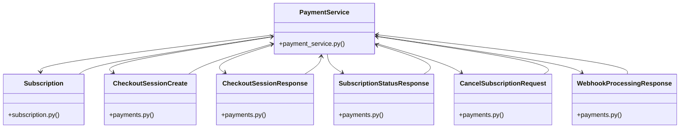

# Community 10

> 47 nodes · cohesion 0.10

## Key Concepts

- [Subscription](file:///E:/Non_Office/Dev_Space/vibe_skool/veltrics/src/backend/app/models/subscription.py#L9) (16 connections)
- [PaymentService](file:///E:/Non_Office/Dev_Space/vibe_skool/veltrics/src/backend/app/services/payment_service.py#L32) (14 connections)
- [test_payments_uc080_085_121.py](file:///E:/Non_Office/Dev_Space/vibe_skool/veltrics/src/tests/unit/test_payments_uc080_085_121.py#L1) (12 connections)
- [create_test_user_and_org()](file:///E:/Non_Office/Dev_Space/vibe_skool/veltrics/src/tests/unit/test_payments_uc080_085_121.py#L72) (12 connections)
- [CheckoutSessionResponse](file:///E:/Non_Office/Dev_Space/vibe_skool/veltrics/src/backend/app/schemas/payments.py#L12) (8 connections)
- [UC-081, UC-082 & UC-121: Safepay Webhook Processing & Reconciliation Engine](file:///E:/Non_Office/Dev_Space/vibe_skool/veltrics/src/backend/app/api/v1/payments.py#L36) (8 connections)
- [UC-083: View Subscription Status & Billing History](file:///E:/Non_Office/Dev_Space/vibe_skool/veltrics/src/backend/app/api/v1/payments.py#L47) (8 connections)
- [UC-084: Cancel Active Subscription](file:///E:/Non_Office/Dev_Space/vibe_skool/veltrics/src/backend/app/api/v1/payments.py#L57) (8 connections)
- [UC-085 & UC-120: Process Pro-to-Free Subscription Downgrades & Preserved Quotas](file:///E:/Non_Office/Dev_Space/vibe_skool/veltrics/src/backend/app/api/v1/payments.py#L65) (8 connections)
- [SubscriptionStatusResponse](file:///E:/Non_Office/Dev_Space/vibe_skool/veltrics/src/backend/app/schemas/payments.py#L18) (8 connections)
- [WebhookProcessingResponse](file:///E:/Non_Office/Dev_Space/vibe_skool/veltrics/src/backend/app/schemas/payments.py#L41) (8 connections)
- [payment_service.py](file:///E:/Non_Office/Dev_Space/vibe_skool/veltrics/src/backend/app/services/payment_service.py#L1) (7 connections)
- [CancelSubscriptionRequest](file:///E:/Non_Office/Dev_Space/vibe_skool/veltrics/src/backend/app/schemas/payments.py#L36) (7 connections)
- [CheckoutSessionCreate](file:///E:/Non_Office/Dev_Space/vibe_skool/veltrics/src/backend/app/schemas/payments.py#L6) (7 connections)
- [reconcile_safepay_webhook()](file:///E:/Non_Office/Dev_Space/vibe_skool/veltrics/src/backend/app/services/payment_service.py#L75) (6 connections)
- [UC-081 & UC-121: Safepay Webhook Processing & Entitlement Activation](file:///E:/Non_Office/Dev_Space/vibe_skool/veltrics/src/tests/unit/test_payments_uc080_085_121.py#L143) (6 connections)
- [UC-082 & UC-121: Handle Payment Checkout Failure & Grace Period](file:///E:/Non_Office/Dev_Space/vibe_skool/veltrics/src/tests/unit/test_payments_uc080_085_121.py#L195) (6 connections)
- [UC-083: View Subscription Status & Billing History](file:///E:/Non_Office/Dev_Space/vibe_skool/veltrics/src/tests/unit/test_payments_uc080_085_121.py#L241) (6 connections)
- [UC-084: Cancel Active Subscription](file:///E:/Non_Office/Dev_Space/vibe_skool/veltrics/src/tests/unit/test_payments_uc080_085_121.py#L256) (6 connections)
- [UC-085 & UC-120: Pro-to-Free Downgrade & Bonus Slot Preservation Protocol](file:///E:/Non_Office/Dev_Space/vibe_skool/veltrics/src/tests/unit/test_payments_uc080_085_121.py#L291) (6 connections)
- [UC-121: Safepay Webhook Idempotency & Unrecognized Event Logging](file:///E:/Non_Office/Dev_Space/vibe_skool/veltrics/src/tests/unit/test_payments_uc080_085_121.py#L331) (6 connections)
- [payments.py](file:///E:/Non_Office/Dev_Space/vibe_skool/veltrics/src/backend/app/api/v1/payments.py#L1) (5 connections)
- [payments.py](file:///E:/Non_Office/Dev_Space/vibe_skool/veltrics/src/backend/app/schemas/payments.py#L1) (5 connections)
- [test_uc080_checkout_session_safepay()](file:///E:/Non_Office/Dev_Space/vibe_skool/veltrics/src/tests/unit/test_payments_uc080_085_121.py#L107) (5 connections)
- [test_uc081_safepay_webhook_entitlement_activation()](file:///E:/Non_Office/Dev_Space/vibe_skool/veltrics/src/tests/unit/test_payments_uc080_085_121.py#L142) (5 connections)
- *... and 22 more nodes in this community*

## Class Diagram

## Relationships

- No strong cross-community connections detected

## Source Files

- [E:\Non_Office\Dev_Space\vibe_skool\veltrics\src\backend\app\api\v1\payments.py](file:///E:/Non_Office/Dev_Space/vibe_skool/veltrics/src/backend/app/api/v1/payments.py)
- [E:\Non_Office\Dev_Space\vibe_skool\veltrics\src\backend\app\models\subscription.py](file:///E:/Non_Office/Dev_Space/vibe_skool/veltrics/src/backend/app/models/subscription.py)
- [E:\Non_Office\Dev_Space\vibe_skool\veltrics\src\backend\app\schemas\payments.py](file:///E:/Non_Office/Dev_Space/vibe_skool/veltrics/src/backend/app/schemas/payments.py)
- [E:\Non_Office\Dev_Space\vibe_skool\veltrics\src\backend\app\services\payment_service.py](file:///E:/Non_Office/Dev_Space/vibe_skool/veltrics/src/backend/app/services/payment_service.py)
- [E:\Non_Office\Dev_Space\vibe_skool\veltrics\src\tests\unit\test_payments_uc080_085_121.py](file:///E:/Non_Office/Dev_Space/vibe_skool/veltrics/src/tests/unit/test_payments_uc080_085_121.py)

## Audit Trail

- EXTRACTED: 118 (47%)
- INFERRED: 134 (53%)
- AMBIGUOUS: 0 (0%)

---

*Part of the graphify knowledge wiki. See [[index]] to navigate.*