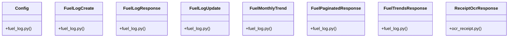

# Community 12

> 43 nodes · cohesion 0.11

## Key Concepts

- [fuel_log.py](file:///E:/Non_Office/Dev_Space/vibe_skool/veltrics/src/backend/app/schemas/fuel_log.py#L1) (12 connections)
- [fuel_service.py](file:///E:/Non_Office/Dev_Space/vibe_skool/veltrics/src/backend/app/services/fuel_service.py#L1) (10 connections)
- [FuelLogCreate](file:///E:/Non_Office/Dev_Space/vibe_skool/veltrics/src/backend/app/schemas/fuel_log.py#L5) (10 connections)
- [FuelLogResponse](file:///E:/Non_Office/Dev_Space/vibe_skool/veltrics/src/backend/app/schemas/fuel_log.py#L71) (10 connections)
- [FuelLogUpdate](file:///E:/Non_Office/Dev_Space/vibe_skool/veltrics/src/backend/app/schemas/fuel_log.py#L49) (10 connections)
- [FuelPaginatedResponse](file:///E:/Non_Office/Dev_Space/vibe_skool/veltrics/src/backend/app/schemas/fuel_log.py#L112) (10 connections)
- [FuelTrendsResponse](file:///E:/Non_Office/Dev_Space/vibe_skool/veltrics/src/backend/app/schemas/fuel_log.py#L103) (10 connections)
- [ReceiptOcrResponse](file:///E:/Non_Office/Dev_Space/vibe_skool/veltrics/src/backend/app/schemas/ocr_receipt.py#L4) (10 connections)
- [fuel.py](file:///E:/Non_Office/Dev_Space/vibe_skool/veltrics/src/backend/app/api/v1/fuel.py#L1) (9 connections)
- [UC-051: Edit Fuel Log Entry.     Updates entry, syncs linked ExpenseLog, and re](file:///E:/Non_Office/Dev_Space/vibe_skool/veltrics/src/backend/app/api/v1/fuel.py#L123) (8 connections)
- [UC-051: Soft Delete Fuel Log Entry.     Soft-deletes entry and linked ExpenseLo](file:///E:/Non_Office/Dev_Space/vibe_skool/veltrics/src/backend/app/api/v1/fuel.py#L138) (8 connections)
- [UC-048: View Fuel Efficiency Trends & Aggregate Metrics.](file:///E:/Non_Office/Dev_Space/vibe_skool/veltrics/src/backend/app/api/v1/fuel.py#L28) (8 connections)
- [UC-050: Detect Fuel Anomaly & Theft Alerts - Fetch anomaly logs.](file:///E:/Non_Office/Dev_Space/vibe_skool/veltrics/src/backend/app/api/v1/fuel.py#L40) (8 connections)
- [UC-050 (A1): Manager clears fuel anomaly flag.](file:///E:/Non_Office/Dev_Space/vibe_skool/veltrics/src/backend/app/api/v1/fuel.py#L51) (8 connections)
- [UC-049: Fuel Receipt OCR Auto-Fill (Pro).](file:///E:/Non_Office/Dev_Space/vibe_skool/veltrics/src/backend/app/api/v1/fuel.py#L60) (8 connections)
- [UC-046: Log Fuel Fill-Up Entry.     Automatically updates vehicle current odome](file:///E:/Non_Office/Dev_Space/vibe_skool/veltrics/src/backend/app/api/v1/fuel.py#L75) (8 connections)
- [UC-047 / UC-048: View Fuel Log History with optional pagination.](file:///E:/Non_Office/Dev_Space/vibe_skool/veltrics/src/backend/app/api/v1/fuel.py#L92) (8 connections)
- [resolve_organization()](file:///E:/Non_Office/Dev_Space/vibe_skool/veltrics/src/backend/app/api/v1/fuel.py#L12) (7 connections)
- [list_fuel_logs()](file:///E:/Non_Office/Dev_Space/vibe_skool/veltrics/src/backend/app/api/v1/fuel.py#L84) (5 connections)
- [create_fuel_log()](file:///E:/Non_Office/Dev_Space/vibe_skool/veltrics/src/backend/app/api/v1/fuel.py#L70) (4 connections)
- [delete_fuel_log()](file:///E:/Non_Office/Dev_Space/vibe_skool/veltrics/src/backend/app/api/v1/fuel.py#L133) (4 connections)
- [get_fuel_trends()](file:///E:/Non_Office/Dev_Space/vibe_skool/veltrics/src/backend/app/api/v1/fuel.py#L23) (4 connections)
- [list_fuel_anomalies()](file:///E:/Non_Office/Dev_Space/vibe_skool/veltrics/src/backend/app/api/v1/fuel.py#L35) (4 connections)
- [update_fuel_log()](file:///E:/Non_Office/Dev_Space/vibe_skool/veltrics/src/backend/app/api/v1/fuel.py#L117) (4 connections)
- [ocr_scan_receipt()](file:///E:/Non_Office/Dev_Space/vibe_skool/veltrics/src/backend/app/api/v1/fuel.py#L57) (3 connections)
- *... and 18 more nodes in this community*

## Class Diagram

## Relationships

- No strong cross-community connections detected

## Source Files

- [E:\Non_Office\Dev_Space\vibe_skool\veltrics\src\backend\app\api\v1\fuel.py](file:///E:/Non_Office/Dev_Space/vibe_skool/veltrics/src/backend/app/api/v1/fuel.py)
- [E:\Non_Office\Dev_Space\vibe_skool\veltrics\src\backend\app\schemas\fuel_log.py](file:///E:/Non_Office/Dev_Space/vibe_skool/veltrics/src/backend/app/schemas/fuel_log.py)
- [E:\Non_Office\Dev_Space\vibe_skool\veltrics\src\backend\app\schemas\ocr_receipt.py](file:///E:/Non_Office/Dev_Space/vibe_skool/veltrics/src/backend/app/schemas/ocr_receipt.py)
- [E:\Non_Office\Dev_Space\vibe_skool\veltrics\src\backend\app\services\fuel_service.py](file:///E:/Non_Office/Dev_Space/vibe_skool/veltrics/src/backend/app/services/fuel_service.py)

## Audit Trail

- EXTRACTED: 104 (47%)
- INFERRED: 119 (53%)
- AMBIGUOUS: 0 (0%)

---

*Part of the graphify knowledge wiki. See [[index]] to navigate.*