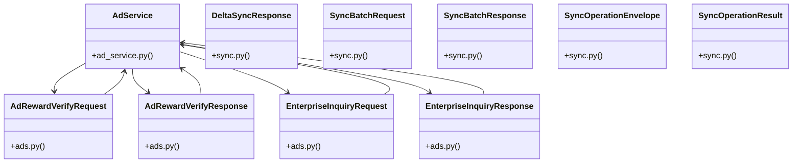

# Community 12

> 31 nodes · cohesion 0.14

## Key Concepts

- [UC-119: Offline Sync Batch Transaction Engine.     Processes operation envelopes](file:///E:/Non_Office/Dev_Space/vibe_skool/veltrics/src/backend/app/api/v1/sync.py#L106) (15 connections)
- [UC-096: Delta Sync Payload Fetching (Incremental Catch-up).     Returns active e](file:///E:/Non_Office/Dev_Space/vibe_skool/veltrics/src/backend/app/api/v1/sync.py#L268) (15 connections)
- [Helper to convert SQLAlchemy model instance to dict.](file:///E:/Non_Office/Dev_Space/vibe_skool/veltrics/src/backend/app/api/v1/sync.py#L95) (15 connections)
- [AdService](file:///E:/Non_Office/Dev_Space/vibe_skool/veltrics/src/backend/app/services/ad_service.py#L21) (9 connections)
- [execute_sync_batch()](file:///E:/Non_Office/Dev_Space/vibe_skool/veltrics/src/backend/app/api/v1/sync.py#L105) (8 connections)
- [UC-100 & UC-120 & UC-122: Verify Rewarded Ad Completion Signature Token & Claim](file:///E:/Non_Office/Dev_Space/vibe_skool/veltrics/src/backend/app/api/v1/ads.py#L24) (7 connections)
- [UC-089: Contact Enterprise Sales Inquiry Form (>25 Fleets).     Submits custom](file:///E:/Non_Office/Dev_Space/vibe_skool/veltrics/src/backend/app/api/v1/ads.py#L37) (7 connections)
- [AdRewardVerifyResponse](file:///E:/Non_Office/Dev_Space/vibe_skool/veltrics/src/backend/app/schemas/ads.py#L13) (6 connections)
- [EnterpriseInquiryResponse](file:///E:/Non_Office/Dev_Space/vibe_skool/veltrics/src/backend/app/schemas/ads.py#L29) (6 connections)
- [DeltaSyncResponse](file:///E:/Non_Office/Dev_Space/vibe_skool/veltrics/src/backend/app/schemas/sync.py#L28) (6 connections)
- [get_delta_sync()](file:///E:/Non_Office/Dev_Space/vibe_skool/veltrics/src/backend/app/api/v1/sync.py#L263) (6 connections)
- [SyncBatchResponse](file:///E:/Non_Office/Dev_Space/vibe_skool/veltrics/src/backend/app/schemas/sync.py#L24) (6 connections)
- [SyncOperationResult](file:///E:/Non_Office/Dev_Space/vibe_skool/veltrics/src/backend/app/schemas/sync.py#L17) (6 connections)
- [utc_now()](file:///E:/Non_Office/Dev_Space/vibe_skool/veltrics/src/backend/app/models/user.py#L10) (6 connections)
- [submit_enterprise_inquiry()](file:///E:/Non_Office/Dev_Space/vibe_skool/veltrics/src/backend/app/services/ad_service.py#L86) (5 connections)
- [AdRewardVerifyRequest](file:///E:/Non_Office/Dev_Space/vibe_skool/veltrics/src/backend/app/schemas/ads.py#L6) (5 connections)
- [EnterpriseInquiryRequest](file:///E:/Non_Office/Dev_Space/vibe_skool/veltrics/src/backend/app/schemas/ads.py#L20) (5 connections)
- [sync.py](file:///E:/Non_Office/Dev_Space/vibe_skool/veltrics/src/backend/app/schemas/sync.py#L1) (5 connections)
- [SyncBatchRequest](file:///E:/Non_Office/Dev_Space/vibe_skool/veltrics/src/backend/app/schemas/sync.py#L13) (5 connections)
- [verify_and_claim_ad_reward()](file:///E:/Non_Office/Dev_Space/vibe_skool/veltrics/src/backend/app/services/ad_service.py#L23) (4 connections)
- [sync.py](file:///E:/Non_Office/Dev_Space/vibe_skool/veltrics/src/backend/app/api/v1/sync.py#L1) (4 connections)
- [ads.py](file:///E:/Non_Office/Dev_Space/vibe_skool/veltrics/src/backend/app/schemas/ads.py#L1) (4 connections)
- [serialize_model()](file:///E:/Non_Office/Dev_Space/vibe_skool/veltrics/src/backend/app/api/v1/sync.py#L94) (4 connections)
- [submit_enterprise_sales_inquiry()](file:///E:/Non_Office/Dev_Space/vibe_skool/veltrics/src/backend/app/api/v1/ads.py#L32) (3 connections)
- [verify_ad_reward()](file:///E:/Non_Office/Dev_Space/vibe_skool/veltrics/src/backend/app/api/v1/ads.py#L19) (3 connections)
- *... and 6 more nodes in this community*

## Class Diagram

## Relationships

- [[Community 18]] (15 shared connections)

## Source Files

- [E:\Non_Office\Dev_Space\vibe_skool\veltrics\src\backend\app\api\v1\ads.py](file:///E:/Non_Office/Dev_Space/vibe_skool/veltrics/src/backend/app/api/v1/ads.py)
- [E:\Non_Office\Dev_Space\vibe_skool\veltrics\src\backend\app\api\v1\sync.py](file:///E:/Non_Office/Dev_Space/vibe_skool/veltrics/src/backend/app/api/v1/sync.py)
- [E:\Non_Office\Dev_Space\vibe_skool\veltrics\src\backend\app\models\user.py](file:///E:/Non_Office/Dev_Space/vibe_skool/veltrics/src/backend/app/models/user.py)
- [E:\Non_Office\Dev_Space\vibe_skool\veltrics\src\backend\app\schemas\ads.py](file:///E:/Non_Office/Dev_Space/vibe_skool/veltrics/src/backend/app/schemas/ads.py)
- [E:\Non_Office\Dev_Space\vibe_skool\veltrics\src\backend\app\schemas\sync.py](file:///E:/Non_Office/Dev_Space/vibe_skool/veltrics/src/backend/app/schemas/sync.py)
- [E:\Non_Office\Dev_Space\vibe_skool\veltrics\src\backend\app\services\ad_service.py](file:///E:/Non_Office/Dev_Space/vibe_skool/veltrics/src/backend/app/services/ad_service.py)

## Audit Trail

- EXTRACTED: 68 (38%)
- INFERRED: 112 (62%)
- AMBIGUOUS: 0 (0%)

---

*Part of the graphify knowledge wiki. See [[index]] to navigate.*