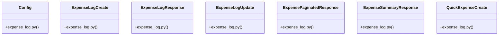

# Community 13

> 29 nodes · cohesion 0.17

## Key Concepts

- [ExpenseLogCreate](file:///E:/Non_Office/Dev_Space/vibe_skool/veltrics/src/backend/app/schemas/expense_log.py#L5) (8 connections)
- [ExpenseLogResponse](file:///E:/Non_Office/Dev_Space/vibe_skool/veltrics/src/backend/app/schemas/expense_log.py#L14) (8 connections)
- [ExpenseLogUpdate](file:///E:/Non_Office/Dev_Space/vibe_skool/veltrics/src/backend/app/schemas/expense_log.py#L44) (8 connections)
- [ExpensePaginatedResponse](file:///E:/Non_Office/Dev_Space/vibe_skool/veltrics/src/backend/app/schemas/expense_log.py#L31) (8 connections)
- [ExpenseSummaryResponse](file:///E:/Non_Office/Dev_Space/vibe_skool/veltrics/src/backend/app/schemas/expense_log.py#L38) (8 connections)
- [QuickExpenseCreate](file:///E:/Non_Office/Dev_Space/vibe_skool/veltrics/src/backend/app/schemas/expense_log.py#L53) (8 connections)
- [UC-061: Soft Delete Expense Entry.](file:///E:/Non_Office/Dev_Space/vibe_skool/veltrics/src/backend/app/api/v1/expenses.py#L110) (8 connections)
- [UC-062: Quick-Log Expense from Dashboard.](file:///E:/Non_Office/Dev_Space/vibe_skool/veltrics/src/backend/app/api/v1/expenses.py#L124) (8 connections)
- [UC-058: Log General Fleet Expense.](file:///E:/Non_Office/Dev_Space/vibe_skool/veltrics/src/backend/app/api/v1/expenses.py#L29) (8 connections)
- [UC-059: Expense Category & Cost Summary Metrics.](file:///E:/Non_Office/Dev_Space/vibe_skool/veltrics/src/backend/app/api/v1/expenses.py#L43) (8 connections)
- [UC-059: View Expense History.](file:///E:/Non_Office/Dev_Space/vibe_skool/veltrics/src/backend/app/api/v1/expenses.py#L66) (8 connections)
- [UC-060: Edit Expense Entry.](file:///E:/Non_Office/Dev_Space/vibe_skool/veltrics/src/backend/app/api/v1/expenses.py#L96) (8 connections)
- [expenses.py](file:///E:/Non_Office/Dev_Space/vibe_skool/veltrics/src/backend/app/api/v1/expenses.py#L1) (7 connections)
- [expense_log.py](file:///E:/Non_Office/Dev_Space/vibe_skool/veltrics/src/backend/app/schemas/expense_log.py#L1) (7 connections)
- [resolve_organization()](file:///E:/Non_Office/Dev_Space/vibe_skool/veltrics/src/backend/app/api/v1/expenses.py#L12) (7 connections)
- [expense_service.py](file:///E:/Non_Office/Dev_Space/vibe_skool/veltrics/src/backend/app/services/expense_service.py#L1) (6 connections)
- [create_expense()](file:///E:/Non_Office/Dev_Space/vibe_skool/veltrics/src/backend/app/api/v1/expenses.py#L24) (4 connections)
- [list_expenses()](file:///E:/Non_Office/Dev_Space/vibe_skool/veltrics/src/backend/app/api/v1/expenses.py#L57) (4 connections)
- [quick_create_expense()](file:///E:/Non_Office/Dev_Space/vibe_skool/veltrics/src/backend/app/api/v1/expenses.py#L119) (4 connections)
- [log_expense()](file:///E:/Non_Office/Dev_Space/vibe_skool/veltrics/src/backend/app/services/expense_service.py#L9) (3 connections)
- [quick_log_expense()](file:///E:/Non_Office/Dev_Space/vibe_skool/veltrics/src/backend/app/services/expense_service.py#L150) (3 connections)
- [delete_expense()](file:///E:/Non_Office/Dev_Space/vibe_skool/veltrics/src/backend/app/api/v1/expenses.py#L105) (3 connections)
- [get_expense_summary()](file:///E:/Non_Office/Dev_Space/vibe_skool/veltrics/src/backend/app/api/v1/expenses.py#L36) (3 connections)
- [update_expense()](file:///E:/Non_Office/Dev_Space/vibe_skool/veltrics/src/backend/app/api/v1/expenses.py#L90) (3 connections)
- [get_expenses()](file:///E:/Non_Office/Dev_Space/vibe_skool/veltrics/src/backend/app/services/expense_service.py#L38) (2 connections)
- *... and 4 more nodes in this community*

## Class Diagram

## Relationships

- [[Community 12]] (42 shared connections)

## Source Files

- [E:\Non_Office\Dev_Space\vibe_skool\veltrics\src\backend\app\api\v1\expenses.py](file:///E:/Non_Office/Dev_Space/vibe_skool/veltrics/src/backend/app/api/v1/expenses.py)
- [E:\Non_Office\Dev_Space\vibe_skool\veltrics\src\backend\app\schemas\expense_log.py](file:///E:/Non_Office/Dev_Space/vibe_skool/veltrics/src/backend/app/schemas/expense_log.py)
- [E:\Non_Office\Dev_Space\vibe_skool\veltrics\src\backend\app\services\expense_service.py](file:///E:/Non_Office/Dev_Space/vibe_skool/veltrics/src/backend/app/services/expense_service.py)

## Audit Trail

- EXTRACTED: 70 (45%)
- INFERRED: 86 (55%)
- AMBIGUOUS: 0 (0%)

---

*Part of the graphify knowledge wiki. See [[index]] to navigate.*