# Community 15

> 33 nodes · cohesion 0.15

## Key Concepts

- [UC-067: Fleet Manager Web Dashboard Layout & Aggregation.](file:///E:/Non_Office/Dev_Space/vibe_skool/veltrics/src/backend/app/api/v1/dashboard.py#L113) (13 connections)
- [UC-068: Fleet Cost Ranking Table & Heatmap.](file:///E:/Non_Office/Dev_Space/vibe_skool/veltrics/src/backend/app/api/v1/dashboard.py#L124) (13 connections)
- [UC-069: Fleet Vehicle Availability Widget.](file:///E:/Non_Office/Dev_Space/vibe_skool/veltrics/src/backend/app/api/v1/dashboard.py#L135) (13 connections)
- [UC-071: Get customized dashboard layout preferences for current user.](file:///E:/Non_Office/Dev_Space/vibe_skool/veltrics/src/backend/app/api/v1/dashboard.py#L145) (13 connections)
- [UC-071: Save customized dashboard layout preferences for current user.](file:///E:/Non_Office/Dev_Space/vibe_skool/veltrics/src/backend/app/api/v1/dashboard.py#L156) (13 connections)
- [UC-064: Get high-level KPI dashboard metrics summary for active organization.](file:///E:/Non_Office/Dev_Space/vibe_skool/veltrics/src/backend/app/api/v1/dashboard.py#L43) (13 connections)
- [DashboardSummaryResponse](file:///E:/Non_Office/Dev_Space/vibe_skool/veltrics/src/backend/app/schemas/dashboard.py#L3) (11 connections)
- [CostBreakdownResponse](file:///E:/Non_Office/Dev_Space/vibe_skool/veltrics/src/backend/app/schemas/cost_breakdown.py#L11) (10 connections)
- [DashboardLayoutConfigResponse](file:///E:/Non_Office/Dev_Space/vibe_skool/veltrics/src/backend/app/schemas/dashboard_manager.py#L48) (10 connections)
- [ManagerDashboardKpiResponse](file:///E:/Non_Office/Dev_Space/vibe_skool/veltrics/src/backend/app/schemas/dashboard_manager.py#L4) (9 connections)
- [VehicleAvailabilityResponse](file:///E:/Non_Office/Dev_Space/vibe_skool/veltrics/src/backend/app/schemas/dashboard_manager.py#L32) (9 connections)
- [VehicleCostRankingResponse](file:///E:/Non_Office/Dev_Space/vibe_skool/veltrics/src/backend/app/schemas/dashboard_manager.py#L27) (9 connections)
- [DashboardLayoutConfigRequest](file:///E:/Non_Office/Dev_Space/vibe_skool/veltrics/src/backend/app/schemas/dashboard_manager.py#L45) (8 connections)
- [dashboard.py](file:///E:/Non_Office/Dev_Space/vibe_skool/veltrics/src/backend/app/api/v1/dashboard.py#L1) (7 connections)
- [dashboard_manager.py](file:///E:/Non_Office/Dev_Space/vibe_skool/veltrics/src/backend/app/schemas/dashboard_manager.py#L1) (7 connections)
- [manager_dashboard_service.py](file:///E:/Non_Office/Dev_Space/vibe_skool/veltrics/src/backend/app/services/manager_dashboard_service.py#L1) (5 connections)
- [WidgetItem](file:///E:/Non_Office/Dev_Space/vibe_skool/veltrics/src/backend/app/schemas/dashboard_manager.py#L40) (4 connections)
- [get_dashboard_summary()](file:///E:/Non_Office/Dev_Space/vibe_skool/veltrics/src/backend/app/api/v1/dashboard.py#L39) (3 connections)
- [get_manager_kpi_dashboard()](file:///E:/Non_Office/Dev_Space/vibe_skool/veltrics/src/backend/app/api/v1/dashboard.py#L109) (3 connections)
- [get_vehicle_availability_widget()](file:///E:/Non_Office/Dev_Space/vibe_skool/veltrics/src/backend/app/api/v1/dashboard.py#L131) (3 connections)
- [VehicleCostRankingItem](file:///E:/Non_Office/Dev_Space/vibe_skool/veltrics/src/backend/app/schemas/dashboard_manager.py#L16) (3 connections)
- [get_cost_ranking_table()](file:///E:/Non_Office/Dev_Space/vibe_skool/veltrics/src/backend/app/services/manager_dashboard_service.py#L75) (3 connections)
- [get_dashboard_layout()](file:///E:/Non_Office/Dev_Space/vibe_skool/veltrics/src/backend/app/services/manager_dashboard_service.py#L157) (3 connections)
- [get_manager_kpis()](file:///E:/Non_Office/Dev_Space/vibe_skool/veltrics/src/backend/app/services/manager_dashboard_service.py#L23) (3 connections)
- [get_vehicle_availability()](file:///E:/Non_Office/Dev_Space/vibe_skool/veltrics/src/backend/app/services/manager_dashboard_service.py#L128) (3 connections)
- *... and 8 more nodes in this community*

## Class Diagram

```mermaid
classDiagram
    class CostBreakdownItem {
        +cost_breakdown.py()
    }
    class CostBreakdownResponse {
        +cost_breakdown.py()
    }
    class DashboardSummaryResponse {
        +dashboard.py()
    }
    class DashboardLayoutConfigRequest {
        +dashboard_manager.py()
    }
    class DashboardLayoutConfigResponse {
        +dashboard_manager.py()
    }
    class ManagerDashboardKpiResponse {
        +dashboard_manager.py()
    }
    class VehicleAvailabilityResponse {
        +dashboard_manager.py()
    }
    class VehicleCostRankingItem {
        +dashboard_manager.py()
    }
    class VehicleCostRankingResponse {
        +dashboard_manager.py()
    }
    class WidgetItem {
        +dashboard_manager.py()
    }
```

## Relationships

- [[Community 2]] (4 shared connections)

## Source Files

- [E:\Non_Office\Dev_Space\vibe_skool\veltrics\src\backend\app\api\v1\dashboard.py](file:///E:/Non_Office/Dev_Space/vibe_skool/veltrics/src/backend/app/api/v1/dashboard.py)
- [E:\Non_Office\Dev_Space\vibe_skool\veltrics\src\backend\app\schemas\cost_breakdown.py](file:///E:/Non_Office/Dev_Space/vibe_skool/veltrics/src/backend/app/schemas/cost_breakdown.py)
- [E:\Non_Office\Dev_Space\vibe_skool\veltrics\src\backend\app\schemas\dashboard.py](file:///E:/Non_Office/Dev_Space/vibe_skool/veltrics/src/backend/app/schemas/dashboard.py)
- [E:\Non_Office\Dev_Space\vibe_skool\veltrics\src\backend\app\schemas\dashboard_manager.py](file:///E:/Non_Office/Dev_Space/vibe_skool/veltrics/src/backend/app/schemas/dashboard_manager.py)
- [E:\Non_Office\Dev_Space\vibe_skool\veltrics\src\backend\app\services\manager_dashboard_service.py](file:///E:/Non_Office/Dev_Space/vibe_skool/veltrics/src/backend/app/services/manager_dashboard_service.py)

## Audit Trail

- EXTRACTED: 66 (32%)
- INFERRED: 140 (68%)
- AMBIGUOUS: 0 (0%)

---

*Part of the graphify knowledge wiki. See [[index]] to navigate.*