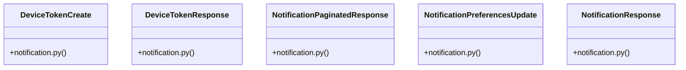

# Community 15

> 24 nodes · cohesion 0.19

## Key Concepts

- [DeviceTokenCreate](file:///E:/Non_Office/Dev_Space/vibe_skool/veltrics/src/backend/app/schemas/notification.py#L5) (7 connections)
- [DeviceTokenResponse](file:///E:/Non_Office/Dev_Space/vibe_skool/veltrics/src/backend/app/schemas/notification.py#L10) (7 connections)
- [NotificationPaginatedResponse](file:///E:/Non_Office/Dev_Space/vibe_skool/veltrics/src/backend/app/schemas/notification.py#L33) (7 connections)
- [NotificationPreferencesUpdate](file:///E:/Non_Office/Dev_Space/vibe_skool/veltrics/src/backend/app/schemas/notification.py#L38) (7 connections)
- [NotificationResponse](file:///E:/Non_Office/Dev_Space/vibe_skool/veltrics/src/backend/app/schemas/notification.py#L19) (7 connections)
- [notifications.py](file:///E:/Non_Office/Dev_Space/vibe_skool/veltrics/src/backend/app/api/v1/notifications.py#L1) (6 connections)
- [UC-072: Register FCM Device Push Token.](file:///E:/Non_Office/Dev_Space/vibe_skool/veltrics/src/backend/app/api/v1/notifications.py#L26) (6 connections)
- [UC-073: In-App Notification Center Directory & Unread Counter.](file:///E:/Non_Office/Dev_Space/vibe_skool/veltrics/src/backend/app/api/v1/notifications.py#L41) (6 connections)
- [UC-074: Mark Notification as Read / Deep Link Routing.](file:///E:/Non_Office/Dev_Space/vibe_skool/veltrics/src/backend/app/api/v1/notifications.py#L55) (6 connections)
- [UC-073 (A1): Mark All Notifications as Read.](file:///E:/Non_Office/Dev_Space/vibe_skool/veltrics/src/backend/app/api/v1/notifications.py#L69) (6 connections)
- [UC-075: Configure Notification Channel Preferences.](file:///E:/Non_Office/Dev_Space/vibe_skool/veltrics/src/backend/app/api/v1/notifications.py#L83) (6 connections)
- [notification.py](file:///E:/Non_Office/Dev_Space/vibe_skool/veltrics/src/backend/app/schemas/notification.py#L1) (5 connections)
- [notification_service.py](file:///E:/Non_Office/Dev_Space/vibe_skool/veltrics/src/backend/app/services/notification_service.py#L1) (5 connections)
- [mark_all_read()](file:///E:/Non_Office/Dev_Space/vibe_skool/veltrics/src/backend/app/api/v1/notifications.py#L64) (4 connections)
- [mark_notification_read()](file:///E:/Non_Office/Dev_Space/vibe_skool/veltrics/src/backend/app/api/v1/notifications.py#L50) (4 connections)
- [resolve_user()](file:///E:/Non_Office/Dev_Space/vibe_skool/veltrics/src/backend/app/api/v1/notifications.py#L17) (4 connections)
- [register_device_token()](file:///E:/Non_Office/Dev_Space/vibe_skool/veltrics/src/backend/app/services/notification_service.py#L10) (3 connections)
- [get_notifications()](file:///E:/Non_Office/Dev_Space/vibe_skool/veltrics/src/backend/app/api/v1/notifications.py#L35) (3 connections)
- [register_device()](file:///E:/Non_Office/Dev_Space/vibe_skool/veltrics/src/backend/app/api/v1/notifications.py#L21) (3 connections)
- [update_preferences()](file:///E:/Non_Office/Dev_Space/vibe_skool/veltrics/src/backend/app/api/v1/notifications.py#L78) (3 connections)
- [mark_all_as_read()](file:///E:/Non_Office/Dev_Space/vibe_skool/veltrics/src/backend/app/services/notification_service.py#L77) (2 connections)
- [mark_as_read()](file:///E:/Non_Office/Dev_Space/vibe_skool/veltrics/src/backend/app/services/notification_service.py#L58) (2 connections)
- [update_notification_preferences()](file:///E:/Non_Office/Dev_Space/vibe_skool/veltrics/src/backend/app/services/notification_service.py#L96) (2 connections)
- [get_notifications()](file:///E:/Non_Office/Dev_Space/vibe_skool/veltrics/src/backend/app/services/notification_service.py#L31) (1 connections)

## Class Diagram

## Relationships

- [[Community 14]] (30 shared connections)

## Source Files

- [E:\Non_Office\Dev_Space\vibe_skool\veltrics\src\backend\app\api\v1\notifications.py](file:///E:/Non_Office/Dev_Space/vibe_skool/veltrics/src/backend/app/api/v1/notifications.py)
- [E:\Non_Office\Dev_Space\vibe_skool\veltrics\src\backend\app\schemas\notification.py](file:///E:/Non_Office/Dev_Space/vibe_skool/veltrics/src/backend/app/schemas/notification.py)
- [E:\Non_Office\Dev_Space\vibe_skool\veltrics\src\backend\app\services\notification_service.py](file:///E:/Non_Office/Dev_Space/vibe_skool/veltrics/src/backend/app/services/notification_service.py)

## Audit Trail

- EXTRACTED: 53 (47%)
- INFERRED: 59 (53%)
- AMBIGUOUS: 0 (0%)

---

*Part of the graphify knowledge wiki. See [[index]] to navigate.*