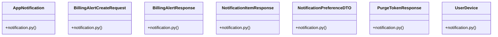

# Community 17

> 28 nodes · cohesion 0.16

## Key Concepts

- [BillingAlertResponse](file:///E:/Non_Office/Dev_Space/vibe_skool/veltrics/src/backend/app/schemas/notification.py#L24) (9 connections)
- [NotificationItemResponse](file:///E:/Non_Office/Dev_Space/vibe_skool/veltrics/src/backend/app/schemas/notification.py#L5) (9 connections)
- [NotificationPreferenceDTO](file:///E:/Non_Office/Dev_Space/vibe_skool/veltrics/src/backend/app/schemas/notification.py#L14) (9 connections)
- [PurgeTokenResponse](file:///E:/Non_Office/Dev_Space/vibe_skool/veltrics/src/backend/app/schemas/notification.py#L30) (9 connections)
- [BillingAlertCreateRequest](file:///E:/Non_Office/Dev_Space/vibe_skool/veltrics/src/backend/app/schemas/notification.py#L20) (8 connections)
- [UC-079: Automatically Purge Stale FCM Tokens (>90 days inactive).](file:///E:/Non_Office/Dev_Space/vibe_skool/veltrics/src/backend/app/api/v1/notifications.py#L104) (7 connections)
- [UC-076: Get In-App Notification Inbox messages.](file:///E:/Non_Office/Dev_Space/vibe_skool/veltrics/src/backend/app/api/v1/notifications.py#L28) (7 connections)
- [UC-076: Mark notification as read.](file:///E:/Non_Office/Dev_Space/vibe_skool/veltrics/src/backend/app/api/v1/notifications.py#L50) (7 connections)
- [UC-077: Get Notification Channel Preferences.](file:///E:/Non_Office/Dev_Space/vibe_skool/veltrics/src/backend/app/api/v1/notifications.py#L65) (7 connections)
- [UC-077: Update Notification Channel Preferences.](file:///E:/Non_Office/Dev_Space/vibe_skool/veltrics/src/backend/app/api/v1/notifications.py#L76) (7 connections)
- [UC-078: Billing & Payment Alert Notifications.](file:///E:/Non_Office/Dev_Space/vibe_skool/veltrics/src/backend/app/api/v1/notifications.py#L88) (7 connections)
- [notifications.py](file:///E:/Non_Office/Dev_Space/vibe_skool/veltrics/src/backend/app/api/v1/notifications.py#L1) (6 connections)
- [notification.py](file:///E:/Non_Office/Dev_Space/vibe_skool/veltrics/src/backend/app/schemas/notification.py#L1) (5 connections)
- [notification_service.py](file:///E:/Non_Office/Dev_Space/vibe_skool/veltrics/src/backend/app/services/notification_service.py#L1) (5 connections)
- [create_billing_alert()](file:///E:/Non_Office/Dev_Space/vibe_skool/veltrics/src/backend/app/api/v1/notifications.py#L84) (4 connections)
- [AppNotification](file:///E:/Non_Office/Dev_Space/vibe_skool/veltrics/src/backend/app/models/notification.py#L18) (3 connections)
- [UserDevice](file:///E:/Non_Office/Dev_Space/vibe_skool/veltrics/src/backend/app/models/notification.py#L6) (3 connections)
- [get_notification_inbox()](file:///E:/Non_Office/Dev_Space/vibe_skool/veltrics/src/backend/app/api/v1/notifications.py#L25) (3 connections)
- [get_notification_preferences()](file:///E:/Non_Office/Dev_Space/vibe_skool/veltrics/src/backend/app/api/v1/notifications.py#L62) (3 connections)
- [mark_notification_read()](file:///E:/Non_Office/Dev_Space/vibe_skool/veltrics/src/backend/app/api/v1/notifications.py#L46) (3 connections)
- [purge_stale_fcm_tokens()](file:///E:/Non_Office/Dev_Space/vibe_skool/veltrics/src/backend/app/api/v1/notifications.py#L101) (3 connections)
- [notification.py](file:///E:/Non_Office/Dev_Space/vibe_skool/veltrics/src/backend/app/models/notification.py#L1) (2 connections)
- [mark_as_read()](file:///E:/Non_Office/Dev_Space/vibe_skool/veltrics/src/backend/app/services/notification_service.py#L58) (2 connections)
- [register_device_token()](file:///E:/Non_Office/Dev_Space/vibe_skool/veltrics/src/backend/app/services/notification_service.py#L10) (2 connections)
- [update_notification_preferences()](file:///E:/Non_Office/Dev_Space/vibe_skool/veltrics/src/backend/app/api/v1/notifications.py#L72) (2 connections)
- *... and 3 more nodes in this community*

## Class Diagram

## Relationships

- No strong cross-community connections detected

## Source Files

- [E:\Non_Office\Dev_Space\vibe_skool\veltrics\src\backend\app\api\v1\notifications.py](file:///E:/Non_Office/Dev_Space/vibe_skool/veltrics/src/backend/app/api/v1/notifications.py)
- [E:\Non_Office\Dev_Space\vibe_skool\veltrics\src\backend\app\models\notification.py](file:///E:/Non_Office/Dev_Space/vibe_skool/veltrics/src/backend/app/models/notification.py)
- [E:\Non_Office\Dev_Space\vibe_skool\veltrics\src\backend\app\schemas\notification.py](file:///E:/Non_Office/Dev_Space/vibe_skool/veltrics/src/backend/app/schemas/notification.py)
- [E:\Non_Office\Dev_Space\vibe_skool\veltrics\src\backend\app\services\notification_service.py](file:///E:/Non_Office/Dev_Space/vibe_skool/veltrics/src/backend/app/services/notification_service.py)

## Audit Trail

- EXTRACTED: 55 (41%)
- INFERRED: 80 (59%)
- AMBIGUOUS: 0 (0%)

---

*Part of the graphify knowledge wiki. See [[index]] to navigate.*