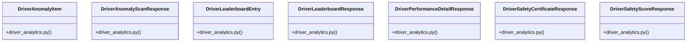

# Community 18

> 20 nodes · cohesion 0.18

## Key Concepts

- [driver_analytics.py](file:///E:/Non_Office/Dev_Space/vibe_skool/veltrics/src/backend/app/schemas/driver_analytics.py#L1) (7 connections)
- [get_user_org_id()](file:///E:/Non_Office/Dev_Space/vibe_skool/veltrics/src/backend/app/api/v1/driver_analytics.py#L19) (5 connections)
- [get_organization_driver_leaderboard()](file:///E:/Non_Office/Dev_Space/vibe_skool/veltrics/src/backend/app/services/driver_analytics_service.py#L196) (5 connections)
- [driver_analytics.py](file:///E:/Non_Office/Dev_Space/vibe_skool/veltrics/src/backend/app/api/v1/driver_analytics.py#L1) (5 connections)
- [driver_analytics_service.py](file:///E:/Non_Office/Dev_Space/vibe_skool/veltrics/src/backend/app/services/driver_analytics_service.py#L1) (5 connections)
- [calculate_driver_metrics()](file:///E:/Non_Office/Dev_Space/vibe_skool/veltrics/src/backend/app/services/driver_analytics_service.py#L19) (4 connections)
- [detect_driver_anomalies()](file:///E:/Non_Office/Dev_Space/vibe_skool/veltrics/src/backend/app/services/driver_analytics_service.py#L108) (4 connections)
- [generate_safety_certificate()](file:///E:/Non_Office/Dev_Space/vibe_skool/veltrics/src/backend/app/services/driver_analytics_service.py#L160) (4 connections)
- [get_driver_performance_detail()](file:///E:/Non_Office/Dev_Space/vibe_skool/veltrics/src/backend/app/services/driver_analytics_service.py#L71) (4 connections)
- [detect_anomalies()](file:///E:/Non_Office/Dev_Space/vibe_skool/veltrics/src/backend/app/api/v1/driver_analytics.py#L42) (3 connections)
- [DriverAnomalyItem](file:///E:/Non_Office/Dev_Space/vibe_skool/veltrics/src/backend/app/schemas/driver_analytics.py#L27) (3 connections)
- [DriverAnomalyScanResponse](file:///E:/Non_Office/Dev_Space/vibe_skool/veltrics/src/backend/app/schemas/driver_analytics.py#L34) (3 connections)
- [DriverLeaderboardEntry](file:///E:/Non_Office/Dev_Space/vibe_skool/veltrics/src/backend/app/schemas/driver_analytics.py#L50) (3 connections)
- [DriverLeaderboardResponse](file:///E:/Non_Office/Dev_Space/vibe_skool/veltrics/src/backend/app/schemas/driver_analytics.py#L59) (3 connections)
- [DriverPerformanceDetailResponse](file:///E:/Non_Office/Dev_Space/vibe_skool/veltrics/src/backend/app/schemas/driver_analytics.py#L14) (3 connections)
- [DriverSafetyCertificateResponse](file:///E:/Non_Office/Dev_Space/vibe_skool/veltrics/src/backend/app/schemas/driver_analytics.py#L40) (3 connections)
- [get_driver_certificate()](file:///E:/Non_Office/Dev_Space/vibe_skool/veltrics/src/backend/app/api/v1/driver_analytics.py#L51) (3 connections)
- [get_driver_leaderboard()](file:///E:/Non_Office/Dev_Space/vibe_skool/veltrics/src/backend/app/api/v1/driver_analytics.py#L61) (3 connections)
- [get_driver_performance()](file:///E:/Non_Office/Dev_Space/vibe_skool/veltrics/src/backend/app/api/v1/driver_analytics.py#L32) (3 connections)
- [DriverSafetyScoreResponse](file:///E:/Non_Office/Dev_Space/vibe_skool/veltrics/src/backend/app/schemas/driver_analytics.py#L5) (2 connections)

## Class Diagram

## Relationships

- No strong cross-community connections detected

## Source Files

- [E:\Non_Office\Dev_Space\vibe_skool\veltrics\src\backend\app\api\v1\driver_analytics.py](file:///E:/Non_Office/Dev_Space/vibe_skool/veltrics/src/backend/app/api/v1/driver_analytics.py)
- [E:\Non_Office\Dev_Space\vibe_skool\veltrics\src\backend\app\schemas\driver_analytics.py](file:///E:/Non_Office/Dev_Space/vibe_skool/veltrics/src/backend/app/schemas/driver_analytics.py)
- [E:\Non_Office\Dev_Space\vibe_skool\veltrics\src\backend\app\services\driver_analytics_service.py](file:///E:/Non_Office/Dev_Space/vibe_skool/veltrics/src/backend/app/services/driver_analytics_service.py)

## Audit Trail

- EXTRACTED: 55 (73%)
- INFERRED: 20 (27%)
- AMBIGUOUS: 0 (0%)

---

*Part of the graphify knowledge wiki. See [[index]] to navigate.*