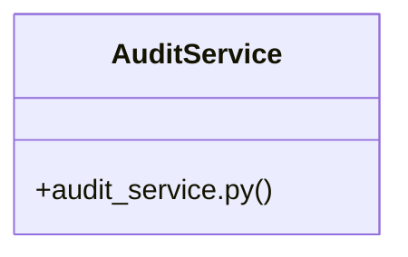

# Community 18

> 19 nodes · cohesion 0.13

## Key Concepts

- [AuditService](file:///E:/Non_Office/Dev_Space/vibe_skool/veltrics/src/backend/app/services/audit_service.py#L10) (10 connections)
- [test_auth_uc012.py](file:///E:/Non_Office/Dev_Space/vibe_skool/veltrics/src/tests/unit/test_auth_uc012.py#L1) (9 connections)
- [AC 3: System records USER_PASSWORD_RESET_REQUEST and USER_PASSWORD_RESET_SUCCESS](file:///E:/Non_Office/Dev_Space/vibe_skool/veltrics/src/tests/unit/test_auth_uc012.py#L116) (5 connections)
- [AC 4: System records USER_LOGOUT audit entry upon session termination.](file:///E:/Non_Office/Dev_Space/vibe_skool/veltrics/src/tests/unit/test_auth_uc012.py#L148) (5 connections)
- [Edge Case: Audit log DB write exception is handled safely and does not block use](file:///E:/Non_Office/Dev_Space/vibe_skool/veltrics/src/tests/unit/test_auth_uc012.py#L170) (5 connections)
- [AC 1: System creates immutable AuditLog entry upon user registration.](file:///E:/Non_Office/Dev_Space/vibe_skool/veltrics/src/tests/unit/test_auth_uc012.py#L47) (5 connections)
- [AC 2: System records USER_LOGIN_SUCCESS audit entry with IP & User-Agent metadat](file:///E:/Non_Office/Dev_Space/vibe_skool/veltrics/src/tests/unit/test_auth_uc012.py#L69) (5 connections)
- [A1: Unauthenticated attempt records USER_LOGIN_FAILURE with actor_id = None.](file:///E:/Non_Office/Dev_Space/vibe_skool/veltrics/src/tests/unit/test_auth_uc012.py#L96) (5 connections)
- [test_uc012_non_blocking_audit_error_handling()](file:///E:/Non_Office/Dev_Space/vibe_skool/veltrics/src/tests/unit/test_auth_uc012.py#L169) (4 connections)
- [audit_service.py](file:///E:/Non_Office/Dev_Space/vibe_skool/veltrics/src/backend/app/services/audit_service.py#L1) (2 connections)
- [Exception](file:///E:/Non_Office/Dev_Space/vibe_skool/veltrics/src/frontend/lib/features/vehicle/data/vehicle_repository.dart) (2 connections)
- [test_uc012_audit_log_login_failure_unauthenticated()](file:///E:/Non_Office/Dev_Space/vibe_skool/veltrics/src/tests/unit/test_auth_uc012.py#L95) (2 connections)
- [test_uc012_audit_log_login_success()](file:///E:/Non_Office/Dev_Space/vibe_skool/veltrics/src/tests/unit/test_auth_uc012.py#L68) (2 connections)
- [test_uc012_audit_log_logout()](file:///E:/Non_Office/Dev_Space/vibe_skool/veltrics/src/tests/unit/test_auth_uc012.py#L147) (2 connections)
- [test_uc012_audit_log_password_reset_flow()](file:///E:/Non_Office/Dev_Space/vibe_skool/veltrics/src/tests/unit/test_auth_uc012.py#L115) (2 connections)
- [test_uc012_audit_log_registration()](file:///E:/Non_Office/Dev_Space/vibe_skool/veltrics/src/tests/unit/test_auth_uc012.py#L46) (2 connections)
- [client()](file:///E:/Non_Office/Dev_Space/vibe_skool/veltrics/src/tests/unit/test_auth_uc012.py#L43) (1 connections)
- [override_get_db()](file:///E:/Non_Office/Dev_Space/vibe_skool/veltrics/src/tests/unit/test_auth_uc012.py#L27) (1 connections)
- [setup_db()](file:///E:/Non_Office/Dev_Space/vibe_skool/veltrics/src/tests/unit/test_auth_uc012.py#L37) (1 connections)

## Class Diagram

## Relationships

- No strong cross-community connections detected

## Source Files

- [E:\Non_Office\Dev_Space\vibe_skool\veltrics\src\backend\app\services\audit_service.py](file:///E:/Non_Office/Dev_Space/vibe_skool/veltrics/src/backend/app/services/audit_service.py)
- [E:\Non_Office\Dev_Space\vibe_skool\veltrics\src\frontend\lib\features\vehicle\data\vehicle_repository.dart](file:///E:/Non_Office/Dev_Space/vibe_skool/veltrics/src/frontend/lib/features/vehicle/data/vehicle_repository.dart)
- [E:\Non_Office\Dev_Space\vibe_skool\veltrics\src\tests\unit\test_auth_uc012.py](file:///E:/Non_Office/Dev_Space/vibe_skool/veltrics/src/tests/unit/test_auth_uc012.py)

## Audit Trail

- EXTRACTED: 34 (49%)
- INFERRED: 36 (51%)
- AMBIGUOUS: 0 (0%)

---

*Part of the graphify knowledge wiki. See [[index]] to navigate.*