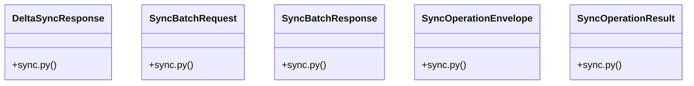

# Community 18

> 17 nodes · cohesion 0.26

## Key Concepts

- [UC-119: Offline Sync Batch Transaction Engine.     Processes operation envelopes](file:///E:/Non_Office/Dev_Space/vibe_skool/veltrics/src/backend/app/api/v1/sync.py#L106) (15 connections)
- [UC-096: Delta Sync Payload Fetching (Incremental Catch-up).     Returns active e](file:///E:/Non_Office/Dev_Space/vibe_skool/veltrics/src/backend/app/api/v1/sync.py#L268) (15 connections)
- [Helper to convert SQLAlchemy model instance to dict.](file:///E:/Non_Office/Dev_Space/vibe_skool/veltrics/src/backend/app/api/v1/sync.py#L95) (15 connections)
- [execute_sync_batch()](file:///E:/Non_Office/Dev_Space/vibe_skool/veltrics/src/backend/app/api/v1/sync.py#L105) (8 connections)
- [DeltaSyncResponse](file:///E:/Non_Office/Dev_Space/vibe_skool/veltrics/src/backend/app/schemas/sync.py#L28) (6 connections)
- [get_delta_sync()](file:///E:/Non_Office/Dev_Space/vibe_skool/veltrics/src/backend/app/api/v1/sync.py#L263) (6 connections)
- [SyncBatchResponse](file:///E:/Non_Office/Dev_Space/vibe_skool/veltrics/src/backend/app/schemas/sync.py#L24) (6 connections)
- [SyncOperationResult](file:///E:/Non_Office/Dev_Space/vibe_skool/veltrics/src/backend/app/schemas/sync.py#L17) (6 connections)
- [utc_now()](file:///E:/Non_Office/Dev_Space/vibe_skool/veltrics/src/backend/app/models/user.py#L10) (6 connections)
- [sync.py](file:///E:/Non_Office/Dev_Space/vibe_skool/veltrics/src/backend/app/schemas/sync.py#L1) (5 connections)
- [SyncBatchRequest](file:///E:/Non_Office/Dev_Space/vibe_skool/veltrics/src/backend/app/schemas/sync.py#L13) (5 connections)
- [sync.py](file:///E:/Non_Office/Dev_Space/vibe_skool/veltrics/src/backend/app/api/v1/sync.py#L1) (4 connections)
- [serialize_model()](file:///E:/Non_Office/Dev_Space/vibe_skool/veltrics/src/backend/app/api/v1/sync.py#L94) (4 connections)
- [user.py](file:///E:/Non_Office/Dev_Space/vibe_skool/veltrics/src/backend/app/models/user.py#L1) (3 connections)
- [parse_iso_datetime()](file:///E:/Non_Office/Dev_Space/vibe_skool/veltrics/src/backend/app/api/v1/sync.py#L74) (3 connections)
- [SyncOperationEnvelope](file:///E:/Non_Office/Dev_Space/vibe_skool/veltrics/src/backend/app/schemas/sync.py#L5) (2 connections)
- [generate_uuid()](file:///E:/Non_Office/Dev_Space/vibe_skool/veltrics/src/backend/app/models/user.py#L7) (1 connections)

## Class Diagram

## Relationships

- No strong cross-community connections detected

## Source Files

- [E:\Non_Office\Dev_Space\vibe_skool\veltrics\src\backend\app\api\v1\sync.py](file:///E:/Non_Office/Dev_Space/vibe_skool/veltrics/src/backend/app/api/v1/sync.py)
- [E:\Non_Office\Dev_Space\vibe_skool\veltrics\src\backend\app\models\user.py](file:///E:/Non_Office/Dev_Space/vibe_skool/veltrics/src/backend/app/models/user.py)
- [E:\Non_Office\Dev_Space\vibe_skool\veltrics\src\backend\app\schemas\sync.py](file:///E:/Non_Office/Dev_Space/vibe_skool/veltrics/src/backend/app/schemas/sync.py)

## Audit Trail

- EXTRACTED: 42 (38%)
- INFERRED: 68 (62%)
- AMBIGUOUS: 0 (0%)

---

*Part of the graphify knowledge wiki. See [[index]] to navigate.*