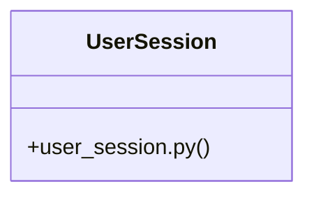

# Community 20

> 14 nodes · cohesion 0.18

## Key Concepts

- [UserSession](file:///E:/Non_Office/Dev_Space/vibe_skool/veltrics/src/backend/app/models/user_session.py#L5) (9 connections)
- [test_auth_uc013.py](file:///E:/Non_Office/Dev_Space/vibe_skool/veltrics/src/tests/unit/test_auth_uc013.py#L1) (7 connections)
- [A1: User can revoke all other active sessions.](file:///E:/Non_Office/Dev_Space/vibe_skool/veltrics/src/tests/unit/test_auth_uc013.py#L122) (3 connections)
- [AC 1: WHEN GET /api/v1/users/me/sessions is called THE SYSTEM SHALL return activ](file:///E:/Non_Office/Dev_Space/vibe_skool/veltrics/src/tests/unit/test_auth_uc013.py#L45) (3 connections)
- [AC 2: User can revoke a specific session.](file:///E:/Non_Office/Dev_Space/vibe_skool/veltrics/src/tests/unit/test_auth_uc013.py#L70) (3 connections)
- [Acceptance Criterion: WHEN a session is revoked via API THE SYSTEM SHALL block a](file:///E:/Non_Office/Dev_Space/vibe_skool/veltrics/src/tests/unit/test_auth_uc013.py#L98) (3 connections)
- [test_uc013_list_active_sessions()](file:///E:/Non_Office/Dev_Space/vibe_skool/veltrics/src/tests/unit/test_auth_uc013.py#L44) (2 connections)
- [test_uc013_revoke_all_other_sessions()](file:///E:/Non_Office/Dev_Space/vibe_skool/veltrics/src/tests/unit/test_auth_uc013.py#L121) (2 connections)
- [test_uc013_revoke_session()](file:///E:/Non_Office/Dev_Space/vibe_skool/veltrics/src/tests/unit/test_auth_uc013.py#L69) (2 connections)
- [test_uc013_revoked_session_blocked_on_refresh()](file:///E:/Non_Office/Dev_Space/vibe_skool/veltrics/src/tests/unit/test_auth_uc013.py#L97) (2 connections)
- [user_session.py](file:///E:/Non_Office/Dev_Space/vibe_skool/veltrics/src/backend/app/models/user_session.py#L1) (1 connections)
- [client()](file:///E:/Non_Office/Dev_Space/vibe_skool/veltrics/src/tests/unit/test_auth_uc013.py#L41) (1 connections)
- [override_get_db()](file:///E:/Non_Office/Dev_Space/vibe_skool/veltrics/src/tests/unit/test_auth_uc013.py#L25) (1 connections)
- [setup_db()](file:///E:/Non_Office/Dev_Space/vibe_skool/veltrics/src/tests/unit/test_auth_uc013.py#L35) (1 connections)

## Class Diagram

## Relationships

- No strong cross-community connections detected

## Source Files

- [E:\Non_Office\Dev_Space\vibe_skool\veltrics\src\backend\app\models\user_session.py](file:///E:/Non_Office/Dev_Space/vibe_skool/veltrics/src/backend/app/models/user_session.py)
- [E:\Non_Office\Dev_Space\vibe_skool\veltrics\src\tests\unit\test_auth_uc013.py](file:///E:/Non_Office/Dev_Space/vibe_skool/veltrics/src/tests/unit/test_auth_uc013.py)

## Audit Trail

- EXTRACTED: 25 (62%)
- INFERRED: 15 (38%)
- AMBIGUOUS: 0 (0%)

---

*Part of the graphify knowledge wiki. See [[index]] to navigate.*