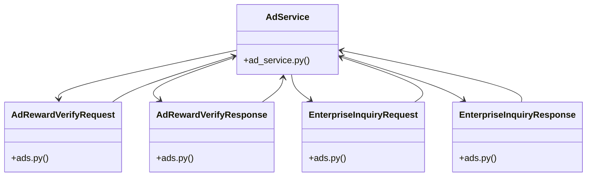

# Community 20

> 16 nodes · cohesion 0.26

## Key Concepts

- [AdService](file:///E:/Non_Office/Dev_Space/vibe_skool/veltrics/src/backend/app/services/ad_service.py#L21) (9 connections)
- [UC-100 & UC-120 & UC-122: Verify Rewarded Ad Completion Signature Token & Claim](file:///E:/Non_Office/Dev_Space/vibe_skool/veltrics/src/backend/app/api/v1/ads.py#L24) (7 connections)
- [UC-089: Contact Enterprise Sales Inquiry Form (>25 Fleets).     Submits custom](file:///E:/Non_Office/Dev_Space/vibe_skool/veltrics/src/backend/app/api/v1/ads.py#L37) (7 connections)
- [AdRewardVerifyResponse](file:///E:/Non_Office/Dev_Space/vibe_skool/veltrics/src/backend/app/schemas/ads.py#L13) (6 connections)
- [EnterpriseInquiryResponse](file:///E:/Non_Office/Dev_Space/vibe_skool/veltrics/src/backend/app/schemas/ads.py#L29) (6 connections)
- [submit_enterprise_inquiry()](file:///E:/Non_Office/Dev_Space/vibe_skool/veltrics/src/backend/app/services/ad_service.py#L86) (5 connections)
- [AdRewardVerifyRequest](file:///E:/Non_Office/Dev_Space/vibe_skool/veltrics/src/backend/app/schemas/ads.py#L6) (5 connections)
- [EnterpriseInquiryRequest](file:///E:/Non_Office/Dev_Space/vibe_skool/veltrics/src/backend/app/schemas/ads.py#L20) (5 connections)
- [verify_and_claim_ad_reward()](file:///E:/Non_Office/Dev_Space/vibe_skool/veltrics/src/backend/app/services/ad_service.py#L23) (4 connections)
- [ads.py](file:///E:/Non_Office/Dev_Space/vibe_skool/veltrics/src/backend/app/schemas/ads.py#L1) (4 connections)
- [submit_enterprise_sales_inquiry()](file:///E:/Non_Office/Dev_Space/vibe_skool/veltrics/src/backend/app/api/v1/ads.py#L32) (3 connections)
- [verify_ad_reward()](file:///E:/Non_Office/Dev_Space/vibe_skool/veltrics/src/backend/app/api/v1/ads.py#L19) (3 connections)
- [user.py](file:///E:/Non_Office/Dev_Space/vibe_skool/veltrics/src/backend/app/models/user.py#L1) (3 connections)
- [ad_service.py](file:///E:/Non_Office/Dev_Space/vibe_skool/veltrics/src/backend/app/services/ad_service.py#L1) (3 connections)
- [generate_uuid()](file:///E:/Non_Office/Dev_Space/vibe_skool/veltrics/src/backend/app/models/user.py#L7) (3 connections)
- [ads.py](file:///E:/Non_Office/Dev_Space/vibe_skool/veltrics/src/backend/app/api/v1/ads.py#L1) (2 connections)

## Class Diagram

## Relationships

- No strong cross-community connections detected

## Source Files

- [E:\Non_Office\Dev_Space\vibe_skool\veltrics\src\backend\app\api\v1\ads.py](file:///E:/Non_Office/Dev_Space/vibe_skool/veltrics/src/backend/app/api/v1/ads.py)
- [E:\Non_Office\Dev_Space\vibe_skool\veltrics\src\backend\app\models\user.py](file:///E:/Non_Office/Dev_Space/vibe_skool/veltrics/src/backend/app/models/user.py)
- [E:\Non_Office\Dev_Space\vibe_skool\veltrics\src\backend\app\schemas\ads.py](file:///E:/Non_Office/Dev_Space/vibe_skool/veltrics/src/backend/app/schemas/ads.py)
- [E:\Non_Office\Dev_Space\vibe_skool\veltrics\src\backend\app\services\ad_service.py](file:///E:/Non_Office/Dev_Space/vibe_skool/veltrics/src/backend/app/services/ad_service.py)

## Audit Trail

- EXTRACTED: 30 (40%)
- INFERRED: 45 (60%)
- AMBIGUOUS: 0 (0%)

---

*Part of the graphify knowledge wiki. See [[index]] to navigate.*