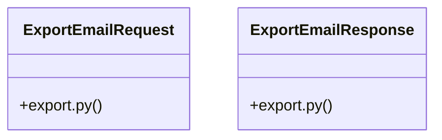

# Community 23

> 15 nodes · cohesion 0.20

## Key Concepts

- [ExportEmailResponse](file:///E:/Non_Office/Dev_Space/vibe_skool/veltrics/src/backend/app/schemas/export.py#L7) (6 connections)
- [ExportEmailRequest](file:///E:/Non_Office/Dev_Space/vibe_skool/veltrics/src/backend/app/schemas/export.py#L4) (5 connections)
- [exports.py](file:///E:/Non_Office/Dev_Space/vibe_skool/veltrics/src/backend/app/api/v1/exports.py#L1) (4 connections)
- [UC-110: Export Maintenance History to PDF.](file:///E:/Non_Office/Dev_Space/vibe_skool/veltrics/src/backend/app/api/v1/exports.py#L26) (4 connections)
- [UC-111: Export Fuel & Expense Logs to CSV.](file:///E:/Non_Office/Dev_Space/vibe_skool/veltrics/src/backend/app/api/v1/exports.py#L43) (4 connections)
- [UC-112: Generate & Email Monthly Fleet Summary PDF.](file:///E:/Non_Office/Dev_Space/vibe_skool/veltrics/src/backend/app/api/v1/exports.py#L61) (4 connections)
- [export_service.py](file:///E:/Non_Office/Dev_Space/vibe_skool/veltrics/src/backend/app/services/export_service.py#L1) (3 connections)
- [export_fuel_expenses_csv()](file:///E:/Non_Office/Dev_Space/vibe_skool/veltrics/src/backend/app/api/v1/exports.py#L38) (3 connections)
- [export_maintenance_pdf()](file:///E:/Non_Office/Dev_Space/vibe_skool/veltrics/src/backend/app/api/v1/exports.py#L21) (3 connections)
- [export.py](file:///E:/Non_Office/Dev_Space/vibe_skool/veltrics/src/backend/app/schemas/export.py#L1) (2 connections)
- [email_monthly_summary()](file:///E:/Non_Office/Dev_Space/vibe_skool/veltrics/src/backend/app/services/export_service.py#L80) (2 connections)
- [generate_fuel_expenses_csv()](file:///E:/Non_Office/Dev_Space/vibe_skool/veltrics/src/backend/app/services/export_service.py#L34) (2 connections)
- [generate_maintenance_pdf()](file:///E:/Non_Office/Dev_Space/vibe_skool/veltrics/src/backend/app/services/export_service.py#L11) (2 connections)
- [email_monthly_summary()](file:///E:/Non_Office/Dev_Space/vibe_skool/veltrics/src/backend/app/api/v1/exports.py#L55) (2 connections)
- [verify_org_header()](file:///E:/Non_Office/Dev_Space/vibe_skool/veltrics/src/backend/app/api/v1/exports.py#L14) (1 connections)

## Class Diagram

## Relationships

- No strong cross-community connections detected

## Source Files

- [E:\Non_Office\Dev_Space\vibe_skool\veltrics\src\backend\app\api\v1\exports.py](file:///E:/Non_Office/Dev_Space/vibe_skool/veltrics/src/backend/app/api/v1/exports.py)
- [E:\Non_Office\Dev_Space\vibe_skool\veltrics\src\backend\app\schemas\export.py](file:///E:/Non_Office/Dev_Space/vibe_skool/veltrics/src/backend/app/schemas/export.py)
- [E:\Non_Office\Dev_Space\vibe_skool\veltrics\src\backend\app\services\export_service.py](file:///E:/Non_Office/Dev_Space/vibe_skool/veltrics/src/backend/app/services/export_service.py)

## Audit Trail

- EXTRACTED: 26 (55%)
- INFERRED: 21 (45%)
- AMBIGUOUS: 0 (0%)

---

*Part of the graphify knowledge wiki. See [[index]] to navigate.*