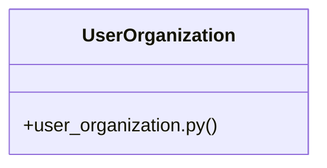

# Community 23

> 12 nodes · cohesion 0.21

## Key Concepts

- [UserOrganization](file:///E:/Non_Office/Dev_Space/vibe_skool/veltrics/src/backend/app/models/user_organization.py#L8) (9 connections)
- [test_auth_uc011.py](file:///E:/Non_Office/Dev_Space/vibe_skool/veltrics/src/tests/unit/test_auth_uc011.py#L1) (6 connections)
- [AC 3: GIVEN a soft-deleted user account     WHEN attempting to authenticate, ac](file:///E:/Non_Office/Dev_Space/vibe_skool/veltrics/src/tests/unit/test_auth_uc011.py#L135) (5 connections)
- [AC 1: GIVEN an authenticated user     WHEN DELETE /api/v1/users/me is invoked](file:///E:/Non_Office/Dev_Space/vibe_skool/veltrics/src/tests/unit/test_auth_uc011.py#L46) (5 connections)
- [AC 2: GIVEN a user who is the sole owner of an active non-personal organization](file:///E:/Non_Office/Dev_Space/vibe_skool/veltrics/src/tests/unit/test_auth_uc011.py#L90) (5 connections)
- [test_uc011_sole_owner_blocking()](file:///E:/Non_Office/Dev_Space/vibe_skool/veltrics/src/tests/unit/test_auth_uc011.py#L89) (5 connections)
- [test_uc011_post_deletion_auth_rejection()](file:///E:/Non_Office/Dev_Space/vibe_skool/veltrics/src/tests/unit/test_auth_uc011.py#L134) (2 connections)
- [test_uc011_successful_account_deletion_and_anonymization()](file:///E:/Non_Office/Dev_Space/vibe_skool/veltrics/src/tests/unit/test_auth_uc011.py#L45) (2 connections)
- [user_organization.py](file:///E:/Non_Office/Dev_Space/vibe_skool/veltrics/src/backend/app/models/user_organization.py#L1) (1 connections)
- [client()](file:///E:/Non_Office/Dev_Space/vibe_skool/veltrics/src/tests/unit/test_auth_uc011.py#L42) (1 connections)
- [override_get_db()](file:///E:/Non_Office/Dev_Space/vibe_skool/veltrics/src/tests/unit/test_auth_uc011.py#L26) (1 connections)
- [setup_db()](file:///E:/Non_Office/Dev_Space/vibe_skool/veltrics/src/tests/unit/test_auth_uc011.py#L36) (1 connections)

## Class Diagram

## Relationships

- No strong cross-community connections detected

## Source Files

- [E:\Non_Office\Dev_Space\vibe_skool\veltrics\src\backend\app\models\user_organization.py](file:///E:/Non_Office/Dev_Space/vibe_skool/veltrics/src/backend/app/models/user_organization.py)
- [E:\Non_Office\Dev_Space\vibe_skool\veltrics\src\tests\unit\test_auth_uc011.py](file:///E:/Non_Office/Dev_Space/vibe_skool/veltrics/src/tests/unit/test_auth_uc011.py)

## Audit Trail

- EXTRACTED: 21 (49%)
- INFERRED: 22 (51%)
- AMBIGUOUS: 0 (0%)

---

*Part of the graphify knowledge wiki. See [[index]] to navigate.*