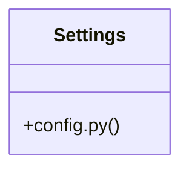

# Community 44

> 3 nodes · cohesion 0.67

## Key Concepts

- [Settings](file:///E:/Non_Office/Dev_Space/vibe_skool/veltrics/src/backend/app/core/config.py#L4) (2 connections)
- **BaseSettings** (1 connections)
- [config.py](file:///E:/Non_Office/Dev_Space/vibe_skool/veltrics/src/backend/app/core/config.py#L1) (1 connections)

## Class Diagram

## Relationships

- No strong cross-community connections detected

## Source Files

- [E:\Non_Office\Dev_Space\vibe_skool\veltrics\src\backend\app\core\config.py](file:///E:/Non_Office/Dev_Space/vibe_skool/veltrics/src/backend/app/core/config.py)

## Audit Trail

- EXTRACTED: 4 (100%)
- INFERRED: 0 (0%)
- AMBIGUOUS: 0 (0%)

---

*Part of the graphify knowledge wiki. See [[index]] to navigate.*