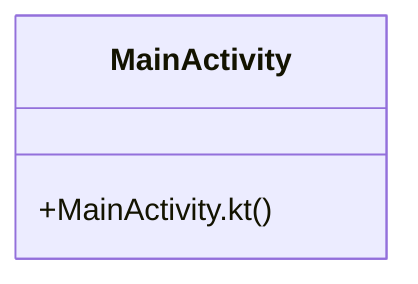

# Community 61

> 2 nodes · cohesion 1.00

## Key Concepts

- [MainActivity.kt](file:///E:/Non_Office/Dev_Space/vibe_skool/veltrics/src/frontend/android/app/src/main/kotlin/com/veltrics/frontend/MainActivity.kt#L1) (1 connections)
- [MainActivity](file:///E:/Non_Office/Dev_Space/vibe_skool/veltrics/src/frontend/android/app/src/main/kotlin/com/veltrics/frontend/MainActivity.kt#L5) (1 connections)

## Class Diagram

## Relationships

- No strong cross-community connections detected

## Source Files

- [E:\Non_Office\Dev_Space\vibe_skool\veltrics\src\frontend\android\app\src\main\kotlin\com\veltrics\frontend\MainActivity.kt](file:///E:/Non_Office/Dev_Space/vibe_skool/veltrics/src/frontend/android/app/src/main/kotlin/com/veltrics/frontend/MainActivity.kt)

## Audit Trail

- EXTRACTED: 2 (100%)
- INFERRED: 0 (0%)
- AMBIGUOUS: 0 (0%)

---

*Part of the graphify knowledge wiki. See [[index]] to navigate.*