# Community 9

> 48 nodes · cohesion 0.12

## Key Concepts

- [UC-119: Offline Sync Batch Transaction Engine.     Processes operation envelopes](file:///E:/Non_Office/Dev_Space/vibe_skool/veltrics/src/backend/app/api/v1/sync.py#L106) (15 connections)
- [UC-096: Delta Sync Payload Fetching (Incremental Catch-up).     Returns active e](file:///E:/Non_Office/Dev_Space/vibe_skool/veltrics/src/backend/app/api/v1/sync.py#L268) (15 connections)
- [Helper to convert SQLAlchemy model instance to dict.](file:///E:/Non_Office/Dev_Space/vibe_skool/veltrics/src/backend/app/api/v1/sync.py#L95) (15 connections)
- [BulkAcceptSchedulesRequest](file:///E:/Non_Office/Dev_Space/vibe_skool/veltrics/src/backend/app/schemas/maintenance.py#L54) (13 connections)
- [MaintenanceScheduleCreate](file:///E:/Non_Office/Dev_Space/vibe_skool/veltrics/src/backend/app/schemas/maintenance.py#L22) (13 connections)
- [MaintenanceScheduleResponse](file:///E:/Non_Office/Dev_Space/vibe_skool/veltrics/src/backend/app/schemas/maintenance.py#L5) (13 connections)
- [MaintenanceScheduleUpdate](file:///E:/Non_Office/Dev_Space/vibe_skool/veltrics/src/backend/app/schemas/maintenance.py#L38) (13 connections)
- [ServiceRecordCreate](file:///E:/Non_Office/Dev_Space/vibe_skool/veltrics/src/backend/app/schemas/maintenance.py#L59) (13 connections)
- [ServiceRecordResponse](file:///E:/Non_Office/Dev_Space/vibe_skool/veltrics/src/backend/app/schemas/maintenance.py#L78) (13 connections)
- [maintenance.py](file:///E:/Non_Office/Dev_Space/vibe_skool/veltrics/src/backend/app/api/v1/maintenance.py#L1) (12 connections)
- [UC-035: Create custom maintenance schedule task item for a vehicle.](file:///E:/Non_Office/Dev_Space/vibe_skool/veltrics/src/backend/app/api/v1/maintenance.py#L160) (10 connections)
- [UC-035: Update schedule parameters (intervals, task name, active status) and rec](file:///E:/Non_Office/Dev_Space/vibe_skool/veltrics/src/backend/app/api/v1/maintenance.py#L207) (10 connections)
- [UC-035: Soft-delete schedule item.](file:///E:/Non_Office/Dev_Space/vibe_skool/veltrics/src/backend/app/api/v1/maintenance.py#L255) (10 connections)
- [UC-039: Add Custom Maintenance Service Item.](file:///E:/Non_Office/Dev_Space/vibe_skool/veltrics/src/backend/app/api/v1/maintenance.py#L283) (10 connections)
- [UC-040: Edit existing service record.](file:///E:/Non_Office/Dev_Space/vibe_skool/veltrics/src/backend/app/api/v1/maintenance.py#L322) (10 connections)
- [UC-041: Delete service record (soft delete).](file:///E:/Non_Office/Dev_Space/vibe_skool/veltrics/src/backend/app/api/v1/maintenance.py#L352) (10 connections)
- [UC-037 & UC-042: Retrieve & filter service records.](file:///E:/Non_Office/Dev_Space/vibe_skool/veltrics/src/backend/app/api/v1/maintenance.py#L376) (10 connections)
- [UC-045: Snooze / Defer Maintenance Alert.](file:///E:/Non_Office/Dev_Space/vibe_skool/veltrics/src/backend/app/api/v1/maintenance.py#L408) (10 connections)
- [UC-038: Bulk accept/acknowledge default maintenance schedules for a vehicle.](file:///E:/Non_Office/Dev_Space/vibe_skool/veltrics/src/backend/app/api/v1/maintenance.py#L443) (10 connections)
- [UC-037: Retrieve chronological service records for a vehicle within the active o](file:///E:/Non_Office/Dev_Space/vibe_skool/veltrics/src/backend/app/api/v1/maintenance.py#L285) (9 connections)
- [UC-038: Bulk accept/acknowledge default maintenance schedules for a vehicle.](file:///E:/Non_Office/Dev_Space/vibe_skool/veltrics/src/backend/app/api/v1/maintenance.py#L320) (9 connections)
- [maintenance.py](file:///E:/Non_Office/Dev_Space/vibe_skool/veltrics/src/backend/app/schemas/maintenance.py#L1) (8 connections)
- [execute_sync_batch()](file:///E:/Non_Office/Dev_Space/vibe_skool/veltrics/src/backend/app/api/v1/sync.py#L105) (8 connections)
- [verify_organization_header()](file:///E:/Non_Office/Dev_Space/vibe_skool/veltrics/src/backend/app/api/v1/maintenance.py#L22) (7 connections)
- [utc_now()](file:///E:/Non_Office/Dev_Space/vibe_skool/veltrics/src/backend/app/models/user.py#L10) (7 connections)
- *... and 23 more nodes in this community*

## Class Diagram

```mermaid
classDiagram
    class BulkAcceptSchedulesRequest {
        +maintenance.py()
    }
    class MaintenanceScheduleCreate {
        +maintenance.py()
    }
    class MaintenanceScheduleResponse {
        +maintenance.py()
    }
    class MaintenanceScheduleUpdate {
        +maintenance.py()
    }
    class ServiceRecordCreate {
        +maintenance.py()
    }
    class ServiceRecordResponse {
        +maintenance.py()
    }
    class DeltaSyncResponse {
        +sync.py()
    }
    class SyncBatchRequest {
        +sync.py()
    }
    class SyncBatchResponse {
        +sync.py()
    }
    class SyncOperationEnvelope {
        +sync.py()
    }
    class SyncOperationResult {
        +sync.py()
    }
```

## Relationships

- No strong cross-community connections detected

## Source Files

- [E:\Non_Office\Dev_Space\vibe_skool\veltrics\src\backend\app\api\v1\maintenance.py](file:///E:/Non_Office/Dev_Space/vibe_skool/veltrics/src/backend/app/api/v1/maintenance.py)
- [E:\Non_Office\Dev_Space\vibe_skool\veltrics\src\backend\app\api\v1\sync.py](file:///E:/Non_Office/Dev_Space/vibe_skool/veltrics/src/backend/app/api/v1/sync.py)
- [E:\Non_Office\Dev_Space\vibe_skool\veltrics\src\backend\app\models\user.py](file:///E:/Non_Office/Dev_Space/vibe_skool/veltrics/src/backend/app/models/user.py)
- [E:\Non_Office\Dev_Space\vibe_skool\veltrics\src\backend\app\schemas\maintenance.py](file:///E:/Non_Office/Dev_Space/vibe_skool/veltrics/src/backend/app/schemas/maintenance.py)
- [E:\Non_Office\Dev_Space\vibe_skool\veltrics\src\backend\app\schemas\sync.py](file:///E:/Non_Office/Dev_Space/vibe_skool/veltrics/src/backend/app/schemas/sync.py)

## Audit Trail

- EXTRACTED: 114 (32%)
- INFERRED: 241 (68%)
- AMBIGUOUS: 0 (0%)

---

*Part of the graphify knowledge wiki. See [[index]] to navigate.*