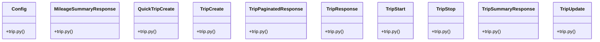

# Community 9

> 41 nodes · cohesion 0.16

## Key Concepts

- [MileageSummaryResponse](file:///E:/Non_Office/Dev_Space/vibe_skool/veltrics/src/backend/app/schemas/trip.py#L95) (11 connections)
- [QuickTripCreate](file:///E:/Non_Office/Dev_Space/vibe_skool/veltrics/src/backend/app/schemas/trip.py#L86) (11 connections)
- [TripCreate](file:///E:/Non_Office/Dev_Space/vibe_skool/veltrics/src/backend/app/schemas/trip.py#L20) (11 connections)
- [TripPaginatedResponse](file:///E:/Non_Office/Dev_Space/vibe_skool/veltrics/src/backend/app/schemas/trip.py#L71) (11 connections)
- [TripResponse](file:///E:/Non_Office/Dev_Space/vibe_skool/veltrics/src/backend/app/schemas/trip.py#L48) (11 connections)
- [TripStart](file:///E:/Non_Office/Dev_Space/vibe_skool/veltrics/src/backend/app/schemas/trip.py#L5) (11 connections)
- [TripStop](file:///E:/Non_Office/Dev_Space/vibe_skool/veltrics/src/backend/app/schemas/trip.py#L13) (11 connections)
- [TripSummaryResponse](file:///E:/Non_Office/Dev_Space/vibe_skool/veltrics/src/backend/app/schemas/trip.py#L78) (11 connections)
- [TripUpdate](file:///E:/Non_Office/Dev_Space/vibe_skool/veltrics/src/backend/app/schemas/trip.py#L34) (11 connections)
- [UC-054: Edit Trip Entry & Classification.](file:///E:/Non_Office/Dev_Space/vibe_skool/veltrics/src/backend/app/api/v1/trips.py#L116) (11 connections)
- [UC-055: Soft Delete Trip Entry.](file:///E:/Non_Office/Dev_Space/vibe_skool/veltrics/src/backend/app/api/v1/trips.py#L130) (11 connections)
- [UC-056: Quick-Log Trip from Dashboard.](file:///E:/Non_Office/Dev_Space/vibe_skool/veltrics/src/backend/app/api/v1/trips.py#L144) (11 connections)
- [UC-057: View Distance & Mileage Summary Analytics.](file:///E:/Non_Office/Dev_Space/vibe_skool/veltrics/src/backend/app/api/v1/trips.py#L160) (11 connections)
- [UC-053: Get Trip Summary & Tax Deduction Metrics.](file:///E:/Non_Office/Dev_Space/vibe_skool/veltrics/src/backend/app/api/v1/trips.py#L29) (11 connections)
- [UC-052: Start GPS Trip Tracking session.](file:///E:/Non_Office/Dev_Space/vibe_skool/veltrics/src/backend/app/api/v1/trips.py#L43) (11 connections)
- [UC-052: Stop active GPS Trip Tracking session and calculate distance.](file:///E:/Non_Office/Dev_Space/vibe_skool/veltrics/src/backend/app/api/v1/trips.py#L56) (11 connections)
- [UC-052 / UC-053: Create trip entry (Manual or completed GPS trip).](file:///E:/Non_Office/Dev_Space/vibe_skool/veltrics/src/backend/app/api/v1/trips.py#L69) (11 connections)
- [UC-053: View Trip History.](file:///E:/Non_Office/Dev_Space/vibe_skool/veltrics/src/backend/app/api/v1/trips.py#L86) (11 connections)
- [trips.py](file:///E:/Non_Office/Dev_Space/vibe_skool/veltrics/src/backend/app/api/v1/trips.py#L1) (10 connections)
- [trip.py](file:///E:/Non_Office/Dev_Space/vibe_skool/veltrics/src/backend/app/schemas/trip.py#L1) (10 connections)
- [resolve_organization()](file:///E:/Non_Office/Dev_Space/vibe_skool/veltrics/src/backend/app/api/v1/trips.py#L12) (10 connections)
- [trip_service.py](file:///E:/Non_Office/Dev_Space/vibe_skool/veltrics/src/backend/app/services/trip_service.py#L1) (9 connections)
- [list_trips()](file:///E:/Non_Office/Dev_Space/vibe_skool/veltrics/src/backend/app/api/v1/trips.py#L77) (4 connections)
- [quick_create_trip()](file:///E:/Non_Office/Dev_Space/vibe_skool/veltrics/src/backend/app/api/v1/trips.py#L139) (4 connections)
- [quick_log_trip()](file:///E:/Non_Office/Dev_Space/vibe_skool/veltrics/src/backend/app/services/trip_service.py#L271) (3 connections)
- *... and 16 more nodes in this community*

## Class Diagram

## Relationships

- [[Community 7]] (90 shared connections)

## Source Files

- [E:\Non_Office\Dev_Space\vibe_skool\veltrics\src\backend\app\api\v1\trips.py](file:///E:/Non_Office/Dev_Space/vibe_skool/veltrics/src/backend/app/api/v1/trips.py)
- [E:\Non_Office\Dev_Space\vibe_skool\veltrics\src\backend\app\schemas\trip.py](file:///E:/Non_Office/Dev_Space/vibe_skool/veltrics/src/backend/app/schemas/trip.py)
- [E:\Non_Office\Dev_Space\vibe_skool\veltrics\src\backend\app\services\trip_service.py](file:///E:/Non_Office/Dev_Space/vibe_skool/veltrics/src/backend/app/services/trip_service.py)

## Audit Trail

- EXTRACTED: 103 (37%)
- INFERRED: 178 (63%)
- AMBIGUOUS: 0 (0%)

---

*Part of the graphify knowledge wiki. See [[index]] to navigate.*