# Knowledge Graph Index

> Auto-generated by graphify. Start here — read community articles for context, then drill into god nodes for detail.

**1536 nodes · 3421 edges · 69 communities**

---

## System Architecture Flowchart

```mermaid
flowchart TD
    C0["Community 0 (222 nodes)"]
    C1["Community 1 (180 nodes)"]
    C2["Community 2 (127 nodes)"]
    C3["Community 3 (109 nodes)"]
    C4["Community 4 (86 nodes)"]
    C5["Community 5 (79 nodes)"]
    C6["Community 6 (52 nodes)"]
    C7["Community 7 (46 nodes)"]
    C8["Community 8 (43 nodes)"]
    C9["Community 9 (41 nodes)"]
    C10["Community 10 (34 nodes)"]
    C11["Community 11 (34 nodes)"]
    C12["Community 12 (30 nodes)"]
    C13["Community 13 (29 nodes)"]
    C14["Community 14 (27 nodes)"]
    C15["Community 15 (23 nodes)"]
    C16["Community 16 (20 nodes)"]
    C17["Community 17 (18 nodes)"]
    C18["Community 18 (17 nodes)"]
    C19["Community 19 (16 nodes)"]
    C20["Community 20 (16 nodes)"]
    C21["Community 21 (15 nodes)"]
    C22["Community 22 (15 nodes)"]
    C23["Community 23 (14 nodes)"]
    C24["Community 24 (14 nodes)"]
    C25["Community 25 (12 nodes)"]
    C26["Community 26 (12 nodes)"]
    C27["unknown (12 nodes)"]
    C28["unknown (12 nodes)"]
    C29["unknown (12 nodes)"]
    C30["unknown (10 nodes)"]
    C31["unknown (10 nodes)"]
    C32["unknown (8 nodes)"]
    C33["unknown (8 nodes)"]
    C34["unknown (7 nodes)"]
    C35["unknown (7 nodes)"]
    C36["unknown (7 nodes)"]
    C37["unknown (7 nodes)"]
    C38["Community 38 (7 nodes)"]
    C39["Community 39 (7 nodes)"]
    C40["Community 40 (6 nodes)"]
    C41["Community 41 (6 nodes)"]
    C42["unknown (6 nodes)"]
    C43["Community 43 (6 nodes)"]
    C44["Community 44 (5 nodes)"]
    C45["Plugin registration (5 nodes)"]
    C46["Community 46 (4 nodes)"]
    C47["Community 47 (4 nodes)"]
    C48["Community 48 (4 nodes)"]
    C49["Community 49 (3 nodes)"]
    C50["unknown (3 nodes)"]
    C51["unknown (3 nodes)"]
    C52["unknown (3 nodes)"]
    C53["User Interface (3 nodes)"]
    C54["Community 54 (3 nodes)"]
    C55["Community 55 (3 nodes)"]
    C56["Community 56 (3 nodes)"]
    C57["unknown (3 nodes)"]
    C58["unknown (2 nodes)"]
    C59["unknown (2 nodes)"]
    C60["unknown (2 nodes)"]
    C61["Community 61 (2 nodes)"]
    C62["Community 62 (2 nodes)"]
    C63["Community 63 (2 nodes)"]
    C64["Community 64 (2 nodes)"]
    C65["unknown (1 nodes)"]
    C66["unknown (1 nodes)"]
    C67["unknown (1 nodes)"]
    C68["unknown (1 nodes)"]
    C2 -->|107 edges| C1
    C1 -->|80 edges| C2
    C5 -->|40 edges| C1
    C1 -->|24 edges| C3
    C15 -->|19 edges| C1
    C18 -->|19 edges| C1
    C3 -->|19 edges| C1
    C3 -->|18 edges| C2
    C2 -->|16 edges| C3
    C18 -->|13 edges| C2
    C0 -->|12 edges| C4
    C9 -->|9 edges| C1
    C3 -->|9 edges| C9
    C8 -->|8 edges| C1
    C1 -->|8 edges| C16
    C2 -->|8 edges| C16
    C0 -->|8 edges| C7
    C3 -->|7 edges| C8
    C13 -->|6 edges| C1
    C1 -->|6 edges| C5
    C1 -->|6 edges| C22
    C2 -->|6 edges| C21
    C2 -->|6 edges| C22
    C3 -->|6 edges| C13
    C3 -->|6 edges| C15
    C0 -->|6 edges| C10
    C5 -->|5 edges| C2
    C1 -->|5 edges| C23
    C1 -->|5 edges| C21
    C2 -->|5 edges| C23
    C2 -->|5 edges| C24
    C3 -->|5 edges| C14
    C3 -->|5 edges| C18
    C0 -->|5 edges| C6
    C1 -->|4 edges| C29
    C1 -->|4 edges| C25
    C1 -->|4 edges| C26
    C1 -->|4 edges| C19
    C2 -->|4 edges| C25
    C2 -->|4 edges| C26
    C2 -->|4 edges| C27
    C2 -->|4 edges| C28
    C2 -->|4 edges| C29
    C0 -->|4 edges| C12
    C2 -->|3 edges| C5
    C1 -->|3 edges| C30
    C2 -->|3 edges| C9
    C2 -->|3 edges| C30
    C8 -->|2 edges| C2
    C1 -->|2 edges| C14
    C2 -->|2 edges| C13
    C1 -->|2 edges| C32
    C18 -->|2 edges| C3
    C2 -->|2 edges| C32
    C6 -->|2 edges| C0
    C15 -->|1 edges| C18
    C5 -->|1 edges| C21
    C5 -->|1 edges| C22
    C14 -->|1 edges| C2
    C1 -->|1 edges| C31
    C2 -->|1 edges| C17
    C2 -->|1 edges| C31
    C2 -->|1 edges| C19
    C1 -->|1 edges| C20
    C0 -->|1 edges| C11
    C0 -->|1 edges| C19
    C4 -->|1 edges| C3
    C40 -->|1 edges| C1
    C34 -->|1 edges| C1
    C41 -->|1 edges| C1
    C35 -->|1 edges| C1
    C36 -->|1 edges| C1
    C17 -->|1 edges| C2
    C42 -->|1 edges| C1
    C37 -->|1 edges| C1
    C33 -->|1 edges| C1
    C38 -->|1 edges| C1
    C39 -->|1 edges| C1
    C43 -->|1 edges| C1
    C20 -->|1 edges| C1
```

## Communities
(sorted by size, largest first)

- [[Community 0]] — 222 nodes
- [[Community 1]] — 180 nodes
- [[Community 2]] — 127 nodes
- [[Community 3]] — 109 nodes
- [[Community 4]] — 86 nodes
- [[Community 5]] — 79 nodes
- [[Community 6]] — 52 nodes
- [[Community 7]] — 46 nodes
- [[Community 8]] — 43 nodes
- [[Community 9]] — 41 nodes
- [[Community 10]] — 34 nodes
- [[Community 11]] — 34 nodes
- [[Community 12]] — 30 nodes
- [[Community 13]] — 29 nodes
- [[Community 14]] — 27 nodes
- [[Community 15]] — 23 nodes
- [[Community 16]] — 20 nodes
- [[Community 17]] — 18 nodes
- [[Community 18]] — 17 nodes
- [[Community 19]] — 16 nodes
- [[Community 20]] — 16 nodes
- [[Community 21]] — 15 nodes
- [[Community 22]] — 15 nodes
- [[Community 23]] — 14 nodes
- [[Community 24]] — 14 nodes
- [[Community 25]] — 12 nodes
- [[Community 26]] — 12 nodes
- [[unknown]] — 12 nodes
- [[unknown]] — 12 nodes
- [[unknown]] — 12 nodes
- [[unknown]] — 10 nodes
- [[unknown]] — 10 nodes
- [[unknown]] — 8 nodes
- [[unknown]] — 8 nodes
- [[unknown]] — 7 nodes
- [[unknown]] — 7 nodes
- [[unknown]] — 7 nodes
- [[unknown]] — 7 nodes
- [[Community 38]] — 7 nodes
- [[Community 39]] — 7 nodes
- [[Community 40]] — 6 nodes
- [[Community 41]] — 6 nodes
- [[unknown]] — 6 nodes
- [[Community 43]] — 6 nodes
- [[Community 44]] — 5 nodes
- [[Plugin registration]] — 5 nodes
- [[Community 46]] — 4 nodes
- [[Community 47]] — 4 nodes
- [[Community 48]] — 4 nodes
- [[Community 49]] — 3 nodes
- [[unknown]] — 3 nodes
- [[unknown]] — 3 nodes
- [[unknown]] — 3 nodes
- [[User Interface]] — 3 nodes
- [[Community 54]] — 3 nodes
- [[Community 55]] — 3 nodes
- [[Community 56]] — 3 nodes
- [[unknown]] — 3 nodes
- [[unknown]] — 2 nodes
- [[unknown]] — 2 nodes
- [[unknown]] — 2 nodes
- [[Community 61]] — 2 nodes
- [[Community 62]] — 2 nodes
- [[Community 63]] — 2 nodes
- [[Community 64]] — 2 nodes
- [[unknown]] — 1 nodes
- [[unknown]] — 1 nodes
- [[unknown]] — 1 nodes
- [[unknown]] — 1 nodes

## God Nodes
(most connected concepts — the load-bearing abstractions)

- [[Organization]] — 233 connections
- [[User]] — 149 connections
- [[Vehicle]] — 136 connections
- [[MaintenanceSchedule]] — 82 connections
- [[AuditLog]] — 76 connections
- [[ServiceRecord]] — 68 connections
- [[Driver]] — 48 connections
- [[UserOrganization]] — 42 connections
- [[AuthService]] — 35 connections
- [[OrganizationInvitation]] — 34 connections

---

*Generated by [graphify](https://github.com/safishamsi/graphify)*