# Knowledge Graph Index

> Auto-generated by graphify. Start here — read community articles for context, then drill into god nodes for detail.

**1862 nodes · 4273 edges · 75 communities**

---

## System Architecture Flowchart

```mermaid
flowchart TD
    C0["Community 0 (243 nodes)"]
    C1["Community 1 (211 nodes)"]
    C2["Community 2 (189 nodes)"]
    C3["Community 3 (113 nodes)"]
    C4["Community 4 (98 nodes)"]
    C5["Community 5 (96 nodes)"]
    C6["Community 6 (86 nodes)"]
    C7["Community 7 (66 nodes)"]
    C8["Community 8 (52 nodes)"]
    C9["Community 9 (48 nodes)"]
    C10["Community 10 (47 nodes)"]
    C11["Community 11 (46 nodes)"]
    C12["Community 12 (43 nodes)"]
    C13["Community 13 (41 nodes)"]
    C14["Community 14 (34 nodes)"]
    C15["Community 15 (33 nodes)"]
    C16["Community 16 (29 nodes)"]
    C17["Community 17 (28 nodes)"]
    C18["Community 18 (20 nodes)"]
    C19["Community 19 (18 nodes)"]
    C20["Community 20 (16 nodes)"]
    C21["Community 21 (16 nodes)"]
    C22["Community 22 (15 nodes)"]
    C23["Community 23 (15 nodes)"]
    C24["Community 24 (14 nodes)"]
    C25["Community 25 (12 nodes)"]
    C26["Community 26 (12 nodes)"]
    C27["unknown (12 nodes)"]
    C28["unknown (12 nodes)"]
    C29["unknown (10 nodes)"]
    C30["unknown (10 nodes)"]
    C31["unknown (9 nodes)"]
    C32["unknown (9 nodes)"]
    C33["unknown (8 nodes)"]
    C34["unknown (8 nodes)"]
    C35["unknown (8 nodes)"]
    C36["unknown (8 nodes)"]
    C37["unknown (8 nodes)"]
    C38["Community 38 (7 nodes)"]
    C39["Community 39 (7 nodes)"]
    C40["Community 40 (7 nodes)"]
    C41["Community 41 (7 nodes)"]
    C42["unknown (7 nodes)"]
    C43["Community 43 (6 nodes)"]
    C44["Community 44 (6 nodes)"]
    C45["Plugin registration (5 nodes)"]
    C46["Community 46 (5 nodes)"]
    C47["Community 47 (4 nodes)"]
    C48["Community 48 (4 nodes)"]
    C49["Community 49 (4 nodes)"]
    C50["unknown (3 nodes)"]
    C51["unknown (3 nodes)"]
    C52["unknown (3 nodes)"]
    C53["User Interface (3 nodes)"]
    C54["Community 54 (3 nodes)"]
    C55["Community 55 (3 nodes)"]
    C56["Community 56 (3 nodes)"]
    C57["unknown (3 nodes)"]
    C58["unknown (3 nodes)"]
    C59["unknown (2 nodes)"]
    C60["unknown (2 nodes)"]
    C61["Community 61 (2 nodes)"]
    C62["Community 62 (2 nodes)"]
    C63["Community 63 (2 nodes)"]
    C64["Community 64 (2 nodes)"]
    C65["unknown (2 nodes)"]
    C66["unknown (1 nodes)"]
    C67["unknown (1 nodes)"]
    C68["unknown (1 nodes)"]
    C69["unknown (1 nodes)"]
    C70["Community 70 (1 nodes)"]
    C71["Community 71 (1 nodes)"]
    C72["Community 72 (1 nodes)"]
    C73["Community 73 (1 nodes)"]
    C74["Community 74 (1 nodes)"]
    C0 -->|167 edges| C2
    C2 -->|103 edges| C0
    C9 -->|48 edges| C2
    C3 -->|29 edges| C0
    C15 -->|28 edges| C2
    C0 -->|28 edges| C4
    C0 -->|27 edges| C3
    C2 -->|25 edges| C4
    C0 -->|24 edges| C10
    C4 -->|18 edges| C0
    C9 -->|15 edges| C0
    C4 -->|12 edges| C2
    C3 -->|11 edges| C2
    C2 -->|11 edges| C3
    C2 -->|11 edges| C10
    C3 -->|11 edges| C9
    C12 -->|10 edges| C0
    C3 -->|10 edges| C15
    C1 -->|10 edges| C6
    C13 -->|9 edges| C0
    C3 -->|9 edges| C13
    C1 -->|8 edges| C5
    C17 -->|7 edges| C0
    C3 -->|7 edges| C18
    C3 -->|7 edges| C12
    C15 -->|6 edges| C0
    C16 -->|6 edges| C0
    C2 -->|6 edges| C9
    C3 -->|6 edges| C16
    C1 -->|6 edges| C11
    C0 -->|5 edges| C24
    C3 -->|5 edges| C17
    C3 -->|5 edges| C10
    C1 -->|5 edges| C8
    C5 -->|5 edges| C1
    C29 -->|4 edges| C0
    C10 -->|4 edges| C0
    C30 -->|4 edges| C0
    C2 -->|4 edges| C28
    C0 -->|4 edges| C26
    C0 -->|4 edges| C27
    C0 -->|4 edges| C28
    C1 -->|4 edges| C14
    C25 -->|4 edges| C2
    C20 -->|3 edges| C0
    C23 -->|3 edges| C0
    C2 -->|3 edges| C20
    C0 -->|3 edges| C25
    C0 -->|3 edges| C13
    C2 -->|3 edges| C22
    C3 -->|3 edges| C20
    C1 -->|3 edges| C7
    C38 -->|3 edges| C0
    C2 -->|2 edges| C30
    C2 -->|2 edges| C29
    C2 -->|2 edges| C17
    C0 -->|2 edges| C16
    C9 -->|2 edges| C3
    C3 -->|2 edges| C23
    C3 -->|2 edges| C29
    C3 -->|2 edges| C30
    C8 -->|2 edges| C5
    C5 -->|2 edges| C14
    C5 -->|2 edges| C11
    C5 -->|2 edges| C6
    C43 -->|2 edges| C0
    C17 -->|1 edges| C20
    C0 -->|1 edges| C20
    C0 -->|1 edges| C33
    C0 -->|1 edges| C39
    C0 -->|1 edges| C34
    C0 -->|1 edges| C41
    C0 -->|1 edges| C35
    C0 -->|1 edges| C32
    C0 -->|1 edges| C36
    C0 -->|1 edges| C37
    C0 -->|1 edges| C42
    C0 -->|1 edges| C19
    C20 -->|1 edges| C9
    C2 -->|1 edges| C33
    C2 -->|1 edges| C39
    C2 -->|1 edges| C34
    C2 -->|1 edges| C41
    C2 -->|1 edges| C35
    C2 -->|1 edges| C32
    C2 -->|1 edges| C36
    C2 -->|1 edges| C37
    C2 -->|1 edges| C42
    C2 -->|1 edges| C21
    C20 -->|1 edges| C3
    C1 -->|1 edges| C22
    C6 -->|1 edges| C3
    C44 -->|1 edges| C0
    C40 -->|1 edges| C0
    C31 -->|1 edges| C0
    C19 -->|1 edges| C0
    C22 -->|1 edges| C0
    C21 -->|1 edges| C2
```

## Communities
(sorted by size, largest first)

- [[Community 0]] — 243 nodes
- [[Community 1]] — 211 nodes
- [[Community 2]] — 189 nodes
- [[Community 3]] — 113 nodes
- [[Community 4]] — 98 nodes
- [[Community 5]] — 96 nodes
- [[Community 6]] — 86 nodes
- [[Community 7]] — 66 nodes
- [[Community 8]] — 52 nodes
- [[Community 9]] — 48 nodes
- [[Community 10]] — 47 nodes
- [[Community 11]] — 46 nodes
- [[Community 12]] — 43 nodes
- [[Community 13]] — 41 nodes
- [[Community 14]] — 34 nodes
- [[Community 15]] — 33 nodes
- [[Community 16]] — 29 nodes
- [[Community 17]] — 28 nodes
- [[Community 18]] — 20 nodes
- [[Community 19]] — 18 nodes
- [[Community 20]] — 16 nodes
- [[Community 21]] — 16 nodes
- [[Community 22]] — 15 nodes
- [[Community 23]] — 15 nodes
- [[Community 24]] — 14 nodes
- [[Community 25]] — 12 nodes
- [[Community 26]] — 12 nodes
- [[unknown]] — 12 nodes
- [[unknown]] — 12 nodes
- [[unknown]] — 10 nodes
- [[unknown]] — 10 nodes
- [[unknown]] — 9 nodes
- [[unknown]] — 9 nodes
- [[unknown]] — 8 nodes
- [[unknown]] — 8 nodes
- [[unknown]] — 8 nodes
- [[unknown]] — 8 nodes
- [[unknown]] — 8 nodes
- [[Community 38]] — 7 nodes
- [[Community 39]] — 7 nodes
- [[Community 40]] — 7 nodes
- [[Community 41]] — 7 nodes
- [[unknown]] — 7 nodes
- [[Community 43]] — 6 nodes
- [[Community 44]] — 6 nodes
- [[Plugin registration]] — 5 nodes
- [[Community 46]] — 5 nodes
- [[Community 47]] — 4 nodes
- [[Community 48]] — 4 nodes
- [[Community 49]] — 4 nodes
- [[unknown]] — 3 nodes
- [[unknown]] — 3 nodes
- [[unknown]] — 3 nodes
- [[User Interface]] — 3 nodes
- [[Community 54]] — 3 nodes
- [[Community 55]] — 3 nodes
- [[Community 56]] — 3 nodes
- [[unknown]] — 3 nodes
- [[unknown]] — 3 nodes
- [[unknown]] — 2 nodes
- [[unknown]] — 2 nodes
- [[Community 61]] — 2 nodes
- [[Community 62]] — 2 nodes
- [[Community 63]] — 2 nodes
- [[Community 64]] — 2 nodes
- [[unknown]] — 2 nodes
- [[unknown]] — 1 nodes
- [[unknown]] — 1 nodes
- [[unknown]] — 1 nodes
- [[unknown]] — 1 nodes
- [[Community 70]] — 1 nodes
- [[Community 71]] — 1 nodes
- [[Community 72]] — 1 nodes
- [[Community 73]] — 1 nodes
- [[Community 74]] — 1 nodes

## God Nodes
(most connected concepts — the load-bearing abstractions)

- [[Organization]] — 274 connections
- [[User]] — 214 connections
- [[Vehicle]] — 178 connections
- [[MaintenanceSchedule]] — 103 connections
- [[ServiceRecord]] — 101 connections
- [[AuditLog]] — 93 connections
- [[UserOrganization]] — 85 connections
- [[Driver]] — 65 connections
- [[FuelLog]] — 45 connections
- [[package:flutter/material.dart]] — 40 connections

---

*Generated by [graphify](https://github.com/safishamsi/graphify)*